# Design Doc: 代码库教程生成 Agent 📄🤖

> 请勿移除 AI 提示

## 📝 摘要

本设计文档描述了一个利用 AI 技术自动分析代码库并生成教程的智能 Agent 系统。该系统以大型语言模型(LLM)为核心，结合代码分析工具和检索增强生成(RAG)技术，能够生成结构化、多语言、富有洞察力的代码库教程，并支持交互式问答和多种发布方式。系统设计遵循模块化原则，强调错误处理、可扩展性和用户反馈机制。

**核心理念**: 本设计强调利用 AI (大型语言模型, LLM) 作为核心引擎来 **理解** 代码库并 **生成** 富有洞察力的文档内容，而非仅仅提取和格式化现有信息。代码分析工具主要为 AI 提供上下文，RAG 用于确保生成内容的准确性并支持交互问答。 **实现代码应追求简洁、高效。** ✨

## 🌟 需求 (Requirements)

> AI 提示: 保持简洁明了。
> 如果需求抽象，请编写具体的用户故事，并确保需求与后续设计（如 AI 核心、层级结构、多语言）保持一致。

该 Agent 旨在利用 AI 深入理解代码库，并为多种用户角色自动生成和定制富有洞察力的教程。需求按优先级分为核心需求、增强需求和可选需求：

### 核心需求（P0）

1.  **开源项目维护者**: **AI 自动分析并理解项目架构**，生成**结构清晰、从整体到模块细节逐层展开**的教程，帮助新贡献者快速上手。
    - _验收标准_: 能够识别并解释项目的核心模块、架构和关键组件，生成层次分明的文档结构。

2.  **新手开发者**: 通过交互式问答（**由 AI Agent 基于 RAG 理解并回答**）定制个性化学习路径，快速定位关键模块与核心功能的实现。
    - _验收标准_: 能够准确回答关于代码库结构、功能和实现细节的问题，提供相关代码引用。

3.  **统一输入源**: 为方便使用，Agent 应能接受**统一的代码库来源**（本地文件路径或远程 Git URL）。
    - _验收标准_: 系统能够处理本地路径和远程 Git URL，自动进行必要的克隆和验证。

4.  **便捷分发与富文本呈现**: 支持多文件 Markdown (**适配 GitHub/GitLab 文档规范，包含清晰的内部链接以便于 GitHub Pages 等网页浏览**) 和 PDF 导出，文件间具有便捷导航，代码引用可直接链接到源码。
    - _验收标准_:
      - 生成的文档被拆分为多个 Markdown 文件，包括主文档和各模块/功能的子文档
      - 文件间具有清晰的导航链接（上一页/下一页/目录）
      - 代码引用部分包含到源代码文件的直接链接
      - 所有文档符合 Markdown 规范，可以导出为 PDF

### 增强需求（P1）

5.  **技术教育者**: **AI 根据代码逻辑生成**包含代码片段、流程图示（及其解释）和用法示例的教程，辅助学生实践掌握开发思维。
    - _验收标准_: 生成的教程包含有意义的代码示例和可视化图表，能够清晰解释代码逻辑。

6.  **技术团队负责人**: **AI 结合代码分析与版本历史理解**，生成能自动关联最新代码设计思路的教程，确保新成员高效同步。
    - _验收标准_: 教程能够反映代码库的最新状态，并解释关键设计决策。

7.  **国际化社区**: 支持**根据用户指定语言（如中、英文）直接生成**教程内容，同时保持代码和技术术语的准确性。
    - _验收标准_: 能够生成指定语言的教程，技术术语保持一致性和准确性。

8.  **开发者体验**: **AI 基于代码理解生成** API 功能说明，并结合代码上下文生成或提取可运行的测试用例作为功能演示。
    - _验收标准_: 生成的 API 文档准确反映代码功能，提供的测试用例可以运行并演示功能。

9.  **架构演变理解**: **AI 解读 Commit 历史**，生成动态的代码演变时间轴或关键节点叙述，展示架构迭代决策过程。
    - _验收标准_: 能够从 Git 历史中提取并解释关键的架构变更，形成有意义的演变叙述。

### 可选需求（P2）

10. **非技术背景贡献者**: **AI 生成**可视化的依赖关系图（及其解释）和通俗易懂的术语表，降低理解代码逻辑的门槛。
    - _验收标准_: 生成的依赖图和术语表易于理解，适合非技术背景人员阅读。

11. **快速概览**: **AI 提炼核心设计思想**，生成包含高亮注释和架构图解释的"五分钟速览"模式。
    - _验收标准_: 能够生成简洁的项目概览，突出核心设计理念和关键组件。

12. **GitHub Pages 发布**: 支持将生成的 Markdown 教程直接构建或配置以便发布为 GitHub Pages 站点。
    - _验收标准_: 能够自动配置并发布文档到 GitHub Pages，生成可访问的网站。

### 非功能性需求

1. **性能要求**: 系统应能处理中大型代码库（10万行代码以上），生成过程的响应时间应在可接受范围内（初始分析可能需要较长时间，但交互式问答应在秒级响应）。

2. **安全性**: 系统应提供安全机制处理私有代码库，包括但不限于认证、授权和敏感信息保护。

3. **可靠性**: 系统应具备错误处理和恢复机制，在处理过程中出现问题时能够提供有意义的错误信息并尽可能恢复。

## 🌊 流程设计 (Flow Design)

> AI 提示:
>
> 1. 考虑 Agent、MapReduce、RAG、Workflow 等设计模式，并在适用的地方应用。
> 2. 呈现简洁、高层次的工作流描述，强调 AI 在分析和生成中的核心作用。

### 适用的设计模式:

1.  **Workflow**: 整个教程生成过程是一个多阶段的流水线，由 AI 理解和生成驱动。
2.  **MapReduce**:
    - _Map_: 并行分析代码库中的每个文件（提取基础结构供 AI 理解）或每个 Commit（分析变更）。
    - _Reduce_: 汇总分析结果，可能利用 AI 生成统一的概览或总结。
3.  **Agent/RAG**: Agent 利用 LLM 理解用户问题，并通过 RAG 从代码库及 AI 初步分析结果中检索信息，动态生成答案或定制教程。
4.  **错误处理与恢复**: 在各个阶段实现错误检测、日志记录和恢复机制，确保系统的稳定性和可靠性。
5.  **用户反馈循环**: 收集用户对生成内容的反馈，用于改进后续生成过程和结果质量。

### 流程高层设计:

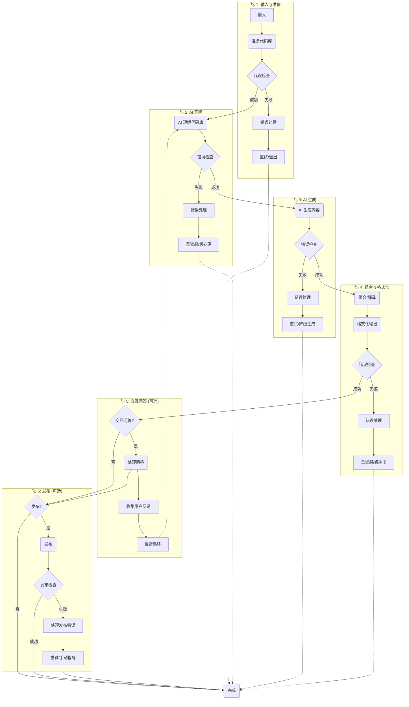

**分阶段详解**

#### `🏷️ 1`: 输入与代码库准备

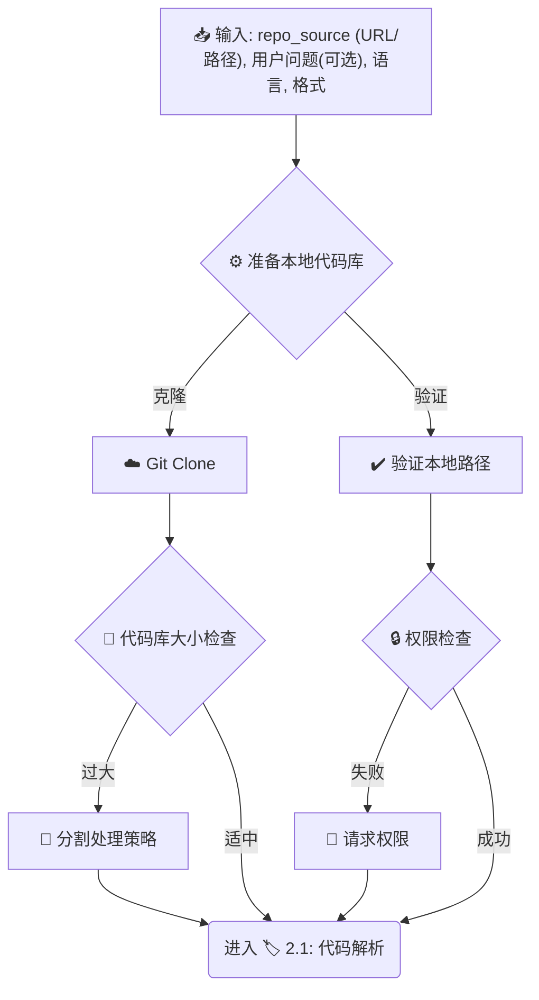

> _此阶段确保我们有一个有效的本地代码库路径 (`local_repo_path`) 供后续使用，并处理大型代码库和权限问题。_

#### `🏷️ 2`: 代码库 AI 理解

##### `🏷️ 2.1`: 代码解析 (并行)

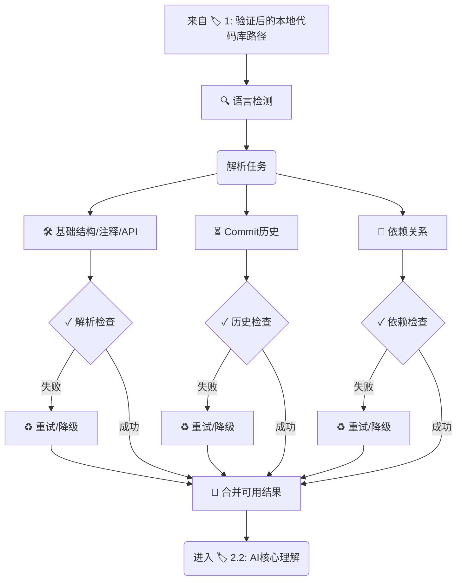

> _并行解析代码库，提取基础信息，包含错误处理和语言检测。_

##### `🏷️ 2.2`: AI 核心理解

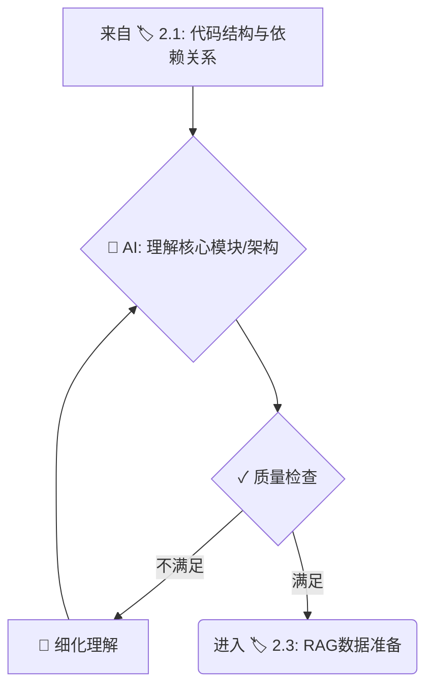

> _AI 基于解析结果进行核心理解，包含质量检查和迭代细化。_

##### `🏷️ 2.3`: RAG 数据准备

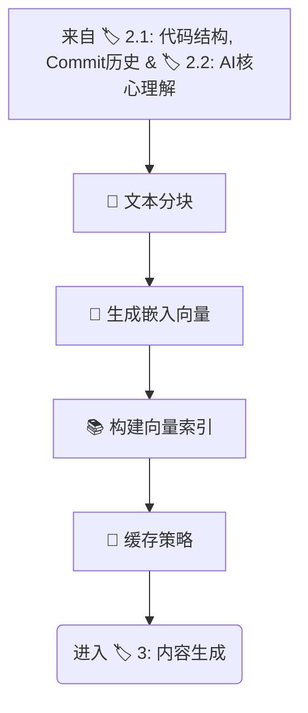

> _结合代码解析、历史信息和 AI 理解结果准备 RAG 数据，包含分块策略和缓存机制。_

#### `🏷️ 3`: AI 内容生成

##### `🏷️ 3.1`: 生成整体内容 (并行)

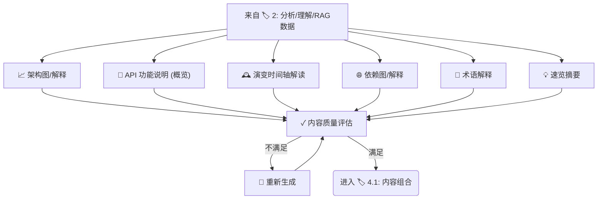

> _并行生成教程的整体性内容，包含质量评估和重新生成机制。_

##### `🏷️ 3.2`: 生成模块细节 (Batch/Loop)

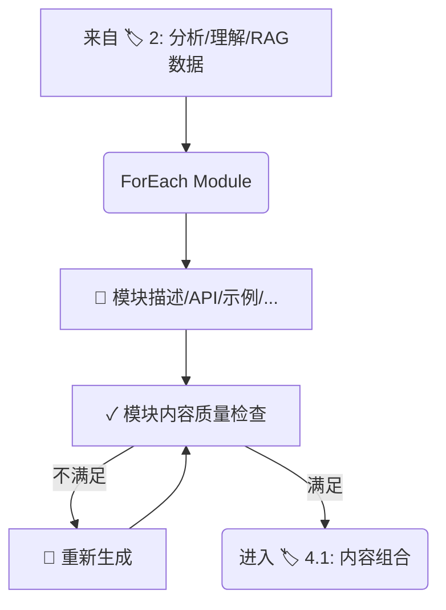

> _遍历核心模块，为每个模块生成详细信息，包含质量检查和重新生成机制。_

#### `🏷️ 4`: 组合、格式化与输出

##### `🏷️ 4.1`: 内容组合

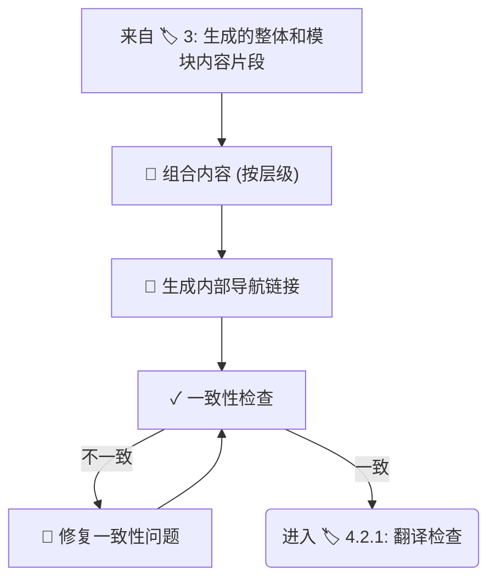

> _按层级顺序组合所有生成的内容，生成内部导航链接，并进行一致性检查。_

##### `🏷️ 4.2.1`: 翻译检查 (可选)

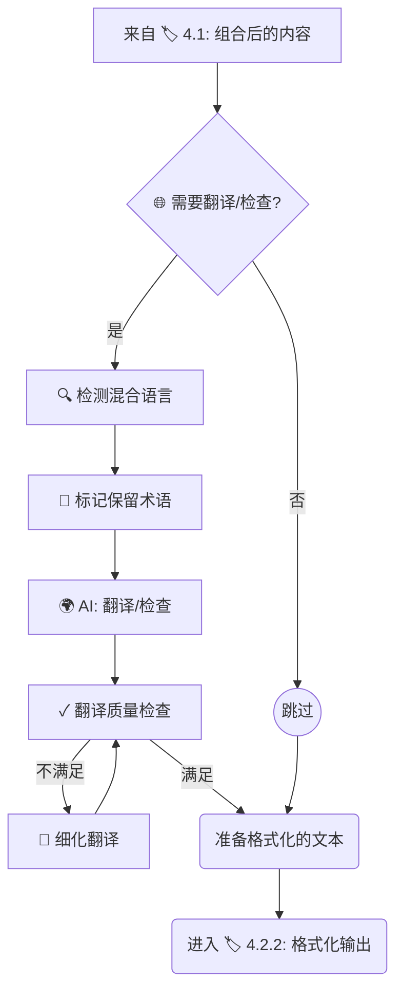

> _此子阶段处理可选的最终翻译检查，包含混合语言检测、术语保留和翻译质量评估。_

##### `🏷️ 4.2.2`: 格式化输出

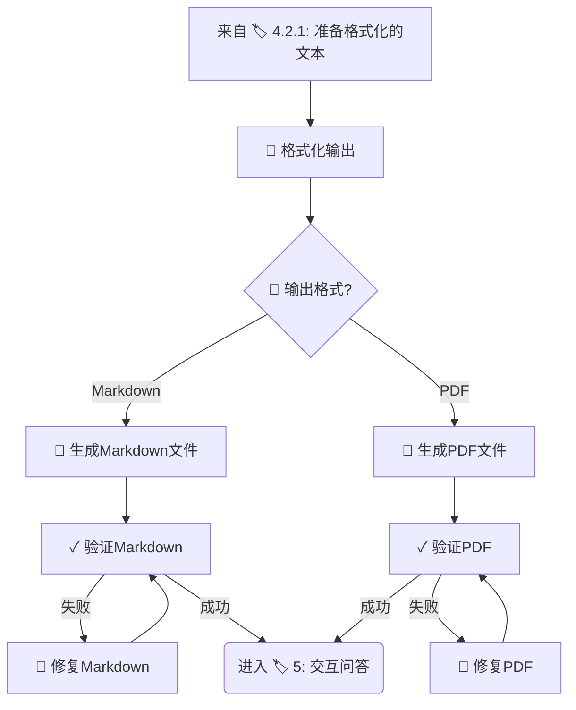

> _此子阶段根据用户选择的格式生成最终的输出文件，并验证输出质量。_

#### `🏷️ 5`: 处理交互式问答 (可选)

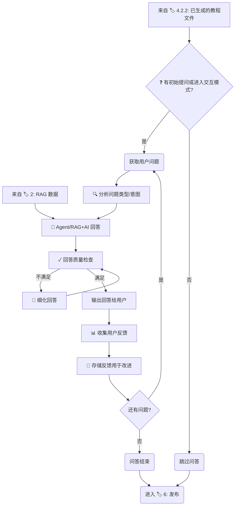

> _在生成主教程后，此可选阶段处理用户的交互式提问，包含问题分析、质量检查和用户反馈收集。_

#### `🏷️ 6`: 发布 (可选)

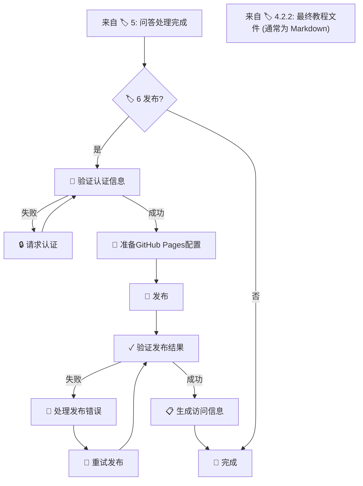

> _如果用户指定，将结果发布到平台，特别支持 GitHub Pages 配置，包含认证验证、发布验证和错误处理。_

## 🛠️ 工具函数 (Utility Functions)

> AI 提示:
>
> 1. 仔细回顾文档，理解工具函数的定义。
> 2. 仅包含流程中节点所必需的工具函数，强调 `call_llm` 的核心地位。

### 核心 AI 函数

1.  **`call_llm(prompt, context=None, task_type=None, target_language='en', retry_count=3, config=None)`** (`utils/llm_wrapper.py`) - **核心 🧠**
    - _输入_: 主要提示 (str), 上下文信息 (代码片段, 结构, 历史等) (str), 可选的任务类型标识 (str, 如 'summarize', 'explain_code', 'translate'), **目标语言 (str, 默认 'en')**, 重试次数 (int, 默认 3), 配置 (dict, 默认从环境变量加载)
    - _输出_: LLM 生成的文本 (str), 成功/失败状态 (bool), 元数据 (dict, 包含模型信息、延迟、token 使用等)
    - _必要性_: **驱动几乎所有的内容理解和生成任务**。需要在 prompt 中结合 target_language 指示 AI 输出语言，并强调不翻译代码/技术术语。
    - _错误处理_: 实现指数退避重试机制，处理 API 超时、限流等问题。记录详细错误日志。
    - _缓存机制_: 对相同或相似的提示实现本地缓存，避免重复调用，提高效率和降低成本。
    - _推荐实现_: **使用 `litellm` 库** 统一调用不同的 LLM API。
    - _默认支持的 LLM 提供商_:
      - **OpenRouter**: 提供多种模型访问，包括 Claude、Llama 等
      - **阿里百炼 (Alibaba Tongyi)**: 支持通义千问等模型
      - **火山引擎 (Volcengine)**: 支持火山方舟等模型
      - **硅基流动 (Moonshot AI)**: 支持 Moonshot 系列模型
      - 以及 OpenAI、Anthropic Claude 等常见模型
    - _配置加载_: 默认从环境变量加载配置，支持运行时覆盖。
    - _智能模型选择_: 根据任务类型和复杂度自动选择最合适的模型。
    - _模型回退链_: 定义模型回退顺序，当首选模型失败时自动尝试备选模型。

    ```python
    # 增强的 LLM 调用实现示例
    def call_llm(prompt, context=None, task_type=None, target_language='en',
                retry_count=3, config=None):
        """增强的 LLM 调用函数，支持智能模型选择和回退机制"""
        # 加载配置
        llm_config = config or get_llm_config()

        # 构建完整提示
        full_prompt = _build_prompt(prompt, context, task_type, target_language)

        # 检查缓存
        cache_key = _generate_cache_key(full_prompt)
        cached_result = get_from_cache(cache_key)
        if cached_result:
            return cached_result["response"], True, {"from_cache": True, **cached_result["metadata"]}

        # 智能模型选择
        selected_model, provider = _select_model_for_task(task_type, llm_config)

        # 定义模型回退链
        fallback_chain = _get_fallback_chain(selected_model, provider, task_type, llm_config)

        # 尝试主模型和回退模型
        for model_info in [{"model": selected_model, "provider": provider}] + fallback_chain:
            current_model = model_info["model"]
            current_provider = model_info["provider"]

            # 准备 API 调用参数
            params = _prepare_api_params(current_model, current_provider, full_prompt, llm_config)

            # 重试机制
            for attempt in range(retry_count):
                try:
                    # 记录开始时间
                    start_time = time.time()

                    # 调用 API
                    response = completion(**params)

                    # 计算延迟
                    latency = time.time() - start_time

                    # 提取结果
                    result = response.choices[0].message.content

                    # 收集元数据
                    metadata = {
                        "model": current_model,
                        "provider": current_provider,
                        "latency": latency,
                        "tokens": {
                            "prompt": response.usage.prompt_tokens,
                            "completion": response.usage.completion_tokens,
                            "total": response.usage.total_tokens
                        },
                        "attempt": attempt + 1,
                        "timestamp": datetime.now().isoformat()
                    }

                    # 缓存结果
                    save_to_cache(cache_key, {
                        "response": result,
                        "metadata": metadata
                    })

                    # 记录模型性能
                    _record_model_performance(current_model, task_type, latency,
                                            response.usage.total_tokens, True)

                    return result, True, metadata

                except Exception as e:
                    # 记录错误
                    log_and_notify(
                        f"模型 {current_model} 调用失败 (尝试 {attempt+1}/{retry_count}): {str(e)}",
                        "warning"
                    )

                    # 记录模型性能 (失败)
                    _record_model_performance(current_model, task_type,
                                            time.time() - start_time, 0, False)

                    # 最后一次尝试失败，尝试下一个模型
                    if attempt == retry_count - 1:
                        break

                    # 指数退避
                    backoff_time = 2 ** attempt
                    time.sleep(backoff_time)

        # 所有模型都失败
        return f"所有模型调用失败，请稍后重试", False, {"error": "all_models_failed"}

    def _select_model_for_task(task_type, config):
        """根据任务类型智能选择最合适的模型"""
        # 任务类型到模型能力的映射
        task_model_mapping = {
            # 代码理解任务优先使用擅长代码的模型
            "understand_code": ["gpt-4", "claude-3-opus", "qwen-max", "glm-4", "moonshot-v1"],
            # 内容生成任务可以使用更多样的模型
            "generate_content": ["claude-3-opus", "gpt-4", "qwen-max", "glm-4", "moonshot-v1"],
            # 翻译任务优先使用多语言能力强的模型
            "translate": ["qwen-max", "gpt-4", "claude-3-opus", "glm-4"],
            # 问答任务优先使用上下文理解能力强的模型
            "answer_question": ["claude-3-opus", "gpt-4", "qwen-max", "glm-4"],
            # 默认任务配置
            "default": ["gpt-4", "claude-3-opus", "qwen-max", "glm-4"]
        }

        # 获取任务对应的模型优先级列表
        priority_models = task_model_mapping.get(task_type, task_model_mapping["default"])

        # 获取配置中可用的模型和提供商
        available_models = _get_available_models(config)

        # 按优先级选择第一个可用的模型
        for model_name in priority_models:
            for provider, models in available_models.items():
                if model_name in models:
                    return model_name, provider

        # 如果没有找到匹配的模型，使用配置中的默认模型
        default_model = config.get("model", "gpt-4")
        default_provider = config.get("provider", "openai")

        return default_model, default_provider

    def _get_fallback_chain(primary_model, primary_provider, task_type, config):
        """获取模型回退链"""
        # 构建回退链，排除主模型
        fallback_chain = []

        # 任务类型到模型能力的映射
        task_model_mapping = {
            "understand_code": ["gpt-4", "claude-3-opus", "qwen-max", "glm-4", "moonshot-v1"],
            "generate_content": ["claude-3-opus", "gpt-4", "qwen-max", "glm-4", "moonshot-v1"],
            "translate": ["qwen-max", "gpt-4", "claude-3-opus", "glm-4"],
            "answer_question": ["claude-3-opus", "gpt-4", "qwen-max", "glm-4"],
            "default": ["gpt-4", "claude-3-opus", "qwen-max", "glm-4"]
        }

        # 获取任务对应的模型优先级列表
        priority_models = task_model_mapping.get(task_type, task_model_mapping["default"])

        # 获取配置中可用的模型和提供商
        available_models = _get_available_models(config)

        # 按优先级构建回退链，排除主模型
        for model_name in priority_models:
            if model_name == primary_model:
                continue

            for provider, models in available_models.items():
                if model_name in models:
                    fallback_chain.append({"model": model_name, "provider": provider})

        # 限制回退链长度，避免尝试过多模型
        max_fallbacks = config.get("max_fallbacks", 2)
        return fallback_chain[:max_fallbacks]

    def _get_available_models(config):
        """获取配置中可用的模型和提供商"""
        available_models = {}

        # 检查 OpenAI 配置
        if config.get("openai_api_key"):
            available_models["openai"] = ["gpt-4", "gpt-4-turbo", "gpt-3.5-turbo"]

        # 检查 Anthropic 配置
        if config.get("anthropic_api_key"):
            available_models["anthropic"] = ["claude-3-opus", "claude-3-sonnet", "claude-3-haiku"]

        # 检查阿里百炼配置
        if config.get("alibaba_api_key"):
            available_models["alibaba"] = ["qwen-max", "qwen-plus", "qwen-turbo"]

        # 检查智谱配置
        if config.get("zhipu_api_key"):
            available_models["zhipu"] = ["glm-4", "glm-3-turbo"]

        # 检查 Moonshot 配置
        if config.get("moonshot_api_key"):
            available_models["moonshot"] = ["moonshot-v1"]

        # 检查 OpenRouter 配置 (可以访问多种模型)
        if config.get("openrouter_api_key"):
            available_models["openrouter"] = [
                "gpt-4", "claude-3-opus", "claude-3-sonnet",
                "mistral-large", "llama-3-70b"
            ]

        return available_models

    def _record_model_performance(model, task_type, latency, tokens, success):
        """记录模型性能，用于优化未来的模型选择"""
        # 获取性能记录文件路径
        performance_file = "data/model_performance.json"

        # 确保目录存在
        os.makedirs(os.path.dirname(performance_file), exist_ok=True)

        # 读取现有记录
        performance_data = {}
        if os.path.exists(performance_file):
            try:
                with open(performance_file, "r") as f:
                    performance_data = json.load(f)
            except:
                pass

        # 初始化模型记录
        if model not in performance_data:
            performance_data[model] = {}

        # 初始化任务类型记录
        if task_type not in performance_data[model]:
            performance_data[model][task_type] = {
                "calls": 0,
                "success": 0,
                "failures": 0,
                "total_latency": 0,
                "total_tokens": 0,
                "avg_latency": 0,
                "avg_tokens": 0,
                "success_rate": 0
            }

        # 更新统计信息
        stats = performance_data[model][task_type]
        stats["calls"] += 1

        if success:
            stats["success"] += 1
            stats["total_latency"] += latency
            stats["total_tokens"] += tokens
        else:
            stats["failures"] += 1

        # 计算平均值
        if stats["success"] > 0:
            stats["avg_latency"] = stats["total_latency"] / stats["success"]
            stats["avg_tokens"] = stats["total_tokens"] / stats["success"]

        # 计算成功率
        stats["success_rate"] = stats["success"] / stats["calls"]

        # 保存更新后的记录
        with open(performance_file, "w") as f:
            json.dump(performance_data, f, indent=2)
    ```

    ```python
    # 实现示例
    from litellm import completion
    import time
    import hashlib
    import json
    import os
    from .env_manager import get_llm_config
    from .cache_manager import get_from_cache, save_to_cache

    def call_llm(prompt, context=None, task_type=None, target_language='en',
                retry_count=3, config=None):
        """调用 LLM API 生成文本"""
        # 加载配置，优先使用传入的配置，否则从环境变量加载
        llm_config = config or get_llm_config()

        # 构建完整提示
        full_prompt = _build_prompt(prompt, context, task_type, target_language)

        # 检查缓存
        cache_key = _generate_cache_key(full_prompt)
        cached_result = get_from_cache(cache_key)
        if cached_result:
            return cached_result, True

        # 获取 LLM 提供商
        provider = llm_config.get("provider", "openai").lower()

        # 准备 API 调用参数
        params = {
            "model": llm_config["model"],
            "messages": [{"role": "user", "content": full_prompt}],
            "max_tokens": llm_config["max_tokens"],
            "temperature": 0.2 if task_type in ["explain_code", "summarize"] else 0.7,
            "api_key": llm_config["api_key"]
        }

        # 根据不同提供商配置特定参数
        if provider == "openrouter":
            params["api_base"] = llm_config.get("base_url", "https://openrouter.ai/api/v1")
            # OpenRouter 需要添加 HTTP 头以识别应用
            params["headers"] = {
                "HTTP-Referer": llm_config.get("app_url", "https://your-app-url.com"),
                "X-Title": llm_config.get("app_name", "Code Tutorial Generator")
            }
        elif provider == "alibaba" or provider == "tongyi":
            params["api_base"] = llm_config.get("base_url", "https://dashscope.aliyuncs.com/api/v1")
            # 阿里百炼模型映射
            if "qwen" in params["model"].lower() and not params["model"].startswith("qwen-"):
                params["model"] = f"qwen-{params['model']}"
        elif provider == "volcengine":
            params["api_base"] = llm_config.get("base_url", "https://api.volcengine.com/ml/api/v1/services")
            # 火山引擎需要额外的认证参数
            params["extra_body"] = {
                "service_id": llm_config.get("service_id", "")
            }
        elif provider == "moonshot":
            params["api_base"] = llm_config.get("base_url", "https://api.moonshot.cn/v1")
        else:
            # 其他提供商（如 OpenAI、Anthropic 等）
            if llm_config.get("base_url"):
                params["api_base"] = llm_config["base_url"]

        # 重试机制
        for attempt in range(retry_count):
            try:
                response = completion(**params)
                result = response.choices[0].message.content

                # 缓存结果
                save_to_cache(cache_key, result)

                return result, True
            except Exception as e:
                # 记录错误
                log_and_notify(f"LLM API 调用失败 (尝试 {attempt+1}/{retry_count}): {str(e)}",
                              "error")

                # 最后一次尝试失败，返回错误
                if attempt == retry_count - 1:
                    return f"LLM API 调用失败: {str(e)}", False

                # 指数退避
                time.sleep(2 ** attempt)

    def get_llm_config():
        """从环境变量加载 LLM 配置"""
        # 默认配置
        default_config = {
            "provider": "openai",
            "model": "gpt-3.5-turbo",
            "max_tokens": 4000,
            "temperature": 0.7
        }

        # 从环境变量加载
        config = {
            "provider": os.getenv("LLM_PROVIDER", default_config["provider"]),
            "model": os.getenv("LLM_MODEL", default_config["model"]),
            "max_tokens": int(os.getenv("LLM_MAX_TOKENS", default_config["max_tokens"])),
            "temperature": float(os.getenv("LLM_TEMPERATURE", default_config["temperature"])),
            "api_key": os.getenv("LLM_API_KEY", "")
        }

        # 加载提供商特定配置
        if config["provider"] == "openrouter":
            config["base_url"] = os.getenv("OPENROUTER_BASE_URL", "https://openrouter.ai/api/v1")
            config["app_url"] = os.getenv("APP_URL", "")
            config["app_name"] = os.getenv("APP_NAME", "Code Tutorial Generator")
        elif config["provider"] in ["alibaba", "tongyi"]:
            config["base_url"] = os.getenv("ALIBABA_BASE_URL", "https://dashscope.aliyuncs.com/api/v1")
        elif config["provider"] == "volcengine":
            config["base_url"] = os.getenv("VOLCENGINE_BASE_URL", "https://api.volcengine.com/ml/api/v1/services")
            config["service_id"] = os.getenv("VOLCENGINE_SERVICE_ID", "")
        elif config["provider"] == "moonshot":
            config["base_url"] = os.getenv("MOONSHOT_BASE_URL", "https://api.moonshot.cn/v1")
        else:
            # OpenAI 或其他提供商
            config["base_url"] = os.getenv("LLM_BASE_URL", "")

        return config
    ```

2.  **`evaluate_llm_output(output, task_type, criteria=None)`** (`utils/llm_evaluator.py`) - **质量保证**
    - _输入_: LLM 输出 (str), 任务类型 (str), 可选的评估标准 (dict)
    - _输出_: 质量评分 (float), 问题标记 (list), 改进建议 (str)
    - _必要性_: 评估 LLM 生成内容的质量，确保满足预期标准。
    - _实现建议_: 可使用规则基础检查或另一个 LLM 调用进行评估。

### 代码分析函数

3.  **`parse_code(code_path, language=None, max_file_size=10*1024*1024)`** (`utils/code_parser.py`) - **AI 输入提供者**
    - _输入_: 代码文件或目录路径 (str), 编程语言 (str, 可选自动检测), 最大文件大小限制 (int)
    - _输出_: 代码基础结构 (AST, 函数/类签名, 原始注释) (dict/object), 依赖关系 (dict)
    - _必要性_: 为 `call_llm` 提供准确、结构化的代码上下文。
    - _错误处理_: 处理不支持的语言、过大文件、解析错误等情况，提供降级解析选项。
    - _语言支持_: 实现对多种常见编程语言的支持，包括混合语言项目的处理策略。

4.  **`detect_programming_language(file_path)`** (`utils/code_parser.py`)
    - _输入_: 文件路径 (str)
    - _输出_: 检测到的编程语言 (str), 置信度 (float)
    - _必要性_: 自动识别代码文件的编程语言，支持混合语言项目。
    - _实现建议_: 结合文件扩展名、shebang 行和内容特征进行检测。

5.  **`analyze_code_size(repo_path)`** (`utils/code_parser.py`)
    - _输入_: 代码库路径 (str)
    - _输出_: 代码库大小统计 (dict)，包含总大小、文件数、各语言代码行数等
    - _必要性_: 评估代码库规模，决定是否需要分割处理。
    - _实现建议_: 使用文件系统操作和简单的代码行计数。

### Git 相关函数

6.  **`get_commit_history(repo_path, max_commits=1000, filter_criteria=None)`** (`utils/git_utils.py`) - **AI 输入提供者**
    - _输入_: 本地仓库路径 (str), 最大提交数 (int), 过滤条件 (dict)
    - _输出_: Commit 历史列表 (list of dicts)
    - _必要性_: 为 `call_llm` 提供代码演变历史上下文。
    - _错误处理_: 处理 Git 操作失败、空仓库等情况。
    - _优化_: 实现智能过滤，只提取关键的架构变更提交。

7.  **`git_clone(repo_url, local_path, depth=None, branch=None, auth=None, use_cache=True, cache_ttl=86400)`** (`utils/git_utils.py`)
    - _输入_: 仓库 URL (str), 本地目标路径 (str), 克隆深度 (int), 分支 (str), 认证信息 (dict), 是否使用缓存 (bool), 缓存有效期 (int, 秒)
    - _输出_: 克隆是否成功 (bool), 详细信息 (dict), 是否使用了缓存 (bool)
    - _必要性_: 从远程 URL 获取代码库。
    - _错误处理_: 处理网络问题、认证失败、权限问题等。
    - _安全性_: 安全处理认证信息，支持多种认证方式。
    - _缓存机制_: 默认启用24小时缓存，避免重复下载相同仓库。

    ```python
    # 实现示例
    import os
    import time
    import hashlib
    import shutil
    import git
    from pathlib import Path

    def git_clone(repo_url, local_path, depth=None, branch=None, auth=None,
                 use_cache=True, cache_ttl=None):
        """克隆或使用缓存的Git仓库"""
        # 从环境变量获取缓存有效期，默认为24小时（86400秒）
        if cache_ttl is None:
            cache_ttl = int(os.getenv("REPO_CACHE_TTL", "86400"))
        # 生成仓库唯一标识
        repo_hash = hashlib.md5(repo_url.encode()).hexdigest()

        # 从环境变量获取缓存目录，默认为 ~/.repo_cache
        cache_dir = os.getenv("REPO_CACHE_DIR", os.path.join(os.path.expanduser("~"), ".repo_cache"))
        os.makedirs(cache_dir, exist_ok=True)

        # 缓存的仓库路径
        cached_repo_path = os.path.join(cache_dir, repo_hash)
        cache_meta_path = f"{cached_repo_path}.meta"

        # 检查缓存
        if use_cache and os.path.exists(cached_repo_path) and os.path.exists(cache_meta_path):
            # 读取缓存元数据
            with open(cache_meta_path, "r") as f:
                meta = json.load(f)

            # 检查缓存是否有效
            if time.time() - meta["timestamp"] < cache_ttl:
                # 缓存有效，复制到目标路径
                if os.path.exists(local_path):
                    shutil.rmtree(local_path)

                shutil.copytree(cached_repo_path, local_path)

                return {
                    "success": True,
                    "path": local_path,
                    "from_cache": True,
                    "branch": meta.get("branch", "main")
                }

        # 缓存无效或不使用缓存，执行克隆
        try:
            # 准备克隆参数
            clone_args = {
                "to_path": local_path,
                "multi_options": []
            }

            # 添加深度参数
            if depth:
                clone_args["multi_options"].append(f"--depth={depth}")

            # 添加分支参数
            if branch:
                clone_args["branch"] = branch

            # 处理认证信息
            if auth:
                if "token" in auth:
                    # 使用令牌认证
                    auth_url = repo_url.replace("https://", f"https://{auth['token']}@")
                    clone_args["url"] = auth_url
                elif "username" in auth and "password" in auth:
                    # 使用用户名密码认证
                    auth_url = repo_url.replace(
                        "https://",
                        f"https://{auth['username']}:{auth['password']}@"
                    )
                    clone_args["url"] = auth_url
            else:
                clone_args["url"] = repo_url

            # 执行克隆
            repo = git.Repo.clone_from(**clone_args)
            actual_branch = repo.active_branch.name

            # 更新缓存
            if use_cache:
                # 如果缓存目录存在，先删除
                if os.path.exists(cached_repo_path):
                    shutil.rmtree(cached_repo_path)

                # 复制到缓存目录
                shutil.copytree(local_path, cached_repo_path)

                # 保存元数据
                meta = {
                    "url": repo_url,
                    "timestamp": time.time(),
                    "branch": actual_branch
                }

                with open(cache_meta_path, "w") as f:
                    json.dump(meta, f)

            return {
                "success": True,
                "path": local_path,
                "from_cache": False,
                "branch": actual_branch
            }

        except Exception as e:
            return {
                "success": False,
                "error": str(e),
                "from_cache": False
            }
    ```

### 可视化函数

8.  **`generate_mermaid(data, type, theme=None, config=None)`** (`utils/viz_generator.py`)
    - _输入_: 结构化数据 (dict/list), 图表类型 ('flowchart', 'graph' 等) (str), 主题 (str), 配置 (dict)
    - _输出_: Mermaid 语法的字符串 (str)
    - _必要性_: 生成架构图、依赖关系图等可视化内容。
    - _错误处理_: 处理复杂或无效的输入数据。
    - _增强_: 支持多种图表类型和自定义样式。

### RAG 相关函数

9.  **`chunk_text(text, chunk_size=1000, overlap=200, smart_chunking=True)`** (`utils/rag_utils.py`)
    - _输入_: 文本 (str), 块大小 (int), 重叠大小 (int), 智能分块标志 (bool)
    - _输出_: 文本块列表 (list of str)
    - _必要性_: 将代码和文档分割成适合嵌入和检索的块。
    - _智能分块_: 如果启用，尊重代码和文档的自然边界（如函数、类、段落）。

10. **`get_embedding(text, model='default', batch=False)`** (`utils/embedding.py`)
    - _输入_: 文本 (str 或 list of str), 模型名称 (str), 批处理标志 (bool)
    - _输出_: 文本的向量表示 (list of float 或 list of list of float)
    - _必要性_: 用于 RAG 中的文本嵌入，以便进行相似度搜索。
    - _错误处理_: 处理 API 错误、超长文本等情况。
    - _批处理_: 支持批量处理多个文本，提高效率。

11. **`vector_search(query_embedding, index, top_k=5, similarity_threshold=0.7)`** (`utils/vector_db.py`)
    - _输入_: 查询向量 (list of float), 向量索引 (object), 返回数量 (int), 相似度阈值 (float)
    - _输出_: 最相似的文档片段 ID 和相似度 (list of tuples)
    - _必要性_: 用于 RAG 中根据用户问题检索相关代码或文档片段。
    - _过滤_: 根据相似度阈值过滤结果，确保只返回相关内容。

12. **`create_vector_index(embeddings, metadata=None, index_type='flat')`** (`utils/vector_db.py`)
    - _输入_: 嵌入向量列表 (list of list of float), 元数据 (list of dict), 索引类型 (str)
    - _输出_: 向量索引对象 (object)
    - _必要性_: 构建 RAG 所需的向量数据库索引。
    - _索引类型_: 支持多种索引类型，如平面索引、HNSW 等，根据数据规模选择合适的类型。
    - _持久化_: 支持索引的保存和加载，避免重复构建。

### 格式化与发布函数

13. **`split_content_into_files(content_dict, output_dir, file_structure=None, repo_structure=None, justdoc_compatible=True)`** (`utils/formatter.py`)
    - _输入_: 包含教程各部分内容的字典 (dict), 输出目录 (str), 文件结构配置 (dict), 代码仓库结构 (dict), 是否生成 JustDoc 兼容文档 (bool)
    - _输出_: 生成的文件路径列表 (list of str)
    - _必要性_: 将生成的内容拆分为多个 Markdown 文件，便于导航和阅读。
    - _文件结构_: 采用概览-模块方式组织文件，文件放置在与代码仓库结构对应的目录中。
    - _JustDoc 命名约定_:
      - 使用 `index.md` 作为目录索引文件
      - 目录和文件名使用小写字母
      - 多单词名称使用连字符（-）分隔，而非下划线
      - 每个文件包含 JustDoc 兼容的元数据（title, category, order 等）
    - _文档放置_: 生成的文档统一放置到代码仓库对应的目录结构中，与源代码保持一致，便于查找和通过 JustDoc 输出线上文档。
    - _路径映射实现_:
      ```python
      def map_module_to_docs_path(module_name, repo_structure):
          """将模块名映射到文档路径，符合 JustDoc 命名约定"""
          # 查找模块在代码仓库中的位置
          module_path = repo_structure.get(module_name, {}).get("path")

          if not module_path:
              # 如果找不到对应路径，放在根目录
              # 将下划线转换为连字符，符合 JustDoc 命名约定
              justdoc_name = module_name.replace("_", "-").lower()
              return f"docs/{justdoc_name}.md"

          # 将源代码路径转换为文档路径
          # 例如: src/auth/service.py -> docs/auth/service.md
          # 例如: src/data_processor/main.py -> docs/data-processor/main.md
          parts = os.path.normpath(module_path).split(os.sep)

          # 移除 src/ 前缀（如果存在）
          if parts and parts[0] == "src":
              parts = parts[1:]

          # 处理目录名和文件名，将下划线转换为连字符
          justdoc_parts = []
          for i, part in enumerate(parts):
              # 最后一部分是文件名，移除扩展名
              if i == len(parts) - 1 and "." in part:
                  part = os.path.splitext(part)[0]

              # 将下划线转换为连字符
              justdoc_part = part.replace("_", "-").lower()
              justdoc_parts.append(justdoc_part)

          # 创建文档目录结构
          doc_path = os.path.join("docs", *justdoc_parts[:-1])

          # 返回完整的文档路径
          return os.path.join(doc_path, f"{justdoc_parts[-1]}.md")

      def create_index_files(module_dirs, module_info_dict=None, repo_structure=None):
          """为每个模块目录创建更加组织化的 index.md 文件

          Args:
              module_dirs: 模块目录列表
              module_info_dict: 模块信息字典，包含模块描述和功能
              repo_structure: 代码仓库结构信息

          Returns:
              索引文件列表 [(文件路径, 文件内容), ...]
          """
          index_files = []

          for dir_path in module_dirs:
              # 创建目录的索引文件
              index_path = os.path.join(dir_path, "index.md")

              # 获取目录名作为标题
              dir_name = os.path.basename(dir_path)
              title = dir_name.replace("-", " ").title()

              # 获取该目录下的所有模块
              dir_modules = []
              if module_info_dict and repo_structure:
                  for module_name, info in module_info_dict.items():
                      module_path = repo_structure.get(module_name, {}).get("path", "")
                      if module_path and dir_name in module_path.split(os.sep):
                          dir_modules.append((module_name, info))

              # 创建索引文件内容 - 更加流畅的组织方式，添加 emoji 突出重点
              content = f"# 📚 {title} 模块\n\n## 📋 概述\n\n"
              content += f"本目录包含 {title} 模块的相关文档，这些模块共同实现了系统的{title.lower()}功能。\n\n"

              # 添加模块列表，带有简短描述
              if dir_modules:
                  content += "## 📦 模块列表\n\n"

                  for module_name, info in dir_modules:
                      module_file = module_name.replace("_", "-").lower()
                      module_title = module_name.replace("_", " ").title()
                      description = info.get("short_description", "").split(".")[0]  # 只取第一句

                      # 创建带有简短描述的链接，添加 emoji 突出重点
                      content += f"- 🔹 [{module_title}]({module_file}.md) - {description}\n"

                  # 添加功能概览部分
                  content += "\n## ⚙️ 功能概览\n\n"
                  content += f"{title} 模块提供以下核心功能：\n\n"

                  # 提取并组织主要功能点
                  functions = set()
                  for _, info in dir_modules:
                      for function in info.get("functions", []):
                          functions.add(function)

                  for function in sorted(functions):
                      content += f"- ✅ {function}\n"
              else:
                  # 如果没有模块信息，使用简单的内容列表
                  content += "## 📑 内容\n\n"
                  content += "本目录包含以下文档：\n\n"

              # 添加到索引文件列表
              index_files.append((index_path, content))

          return index_files
      ```
    - _文件结构示例_:
      ```python
      # 文件结构示例 - 符合 JustDoc 的命名约定
      default_structure = {
          # 概览文件固定位置
          "README.md": {"title": "项目概览", "sections": ["introduction", "quick_look"]},
          "docs/index.md": {"title": "文档首页", "sections": ["introduction", "navigation"]},
          "docs/overview.md": {"title": "系统架构", "sections": ["overall_architecture", "core_modules_summary"]},
          "docs/glossary.md": {"title": "术语表", "sections": ["glossary"]},
          "docs/evolution.md": {"title": "演变历史", "sections": ["evolution_narrative"]},

          # 模块文档放置在与代码仓库结构对应的目录中，使用 JustDoc 兼容的命名
          # 目录使用小写，单词间用连字符分隔
          # 文件名使用小写，单词间用连字符分隔
          "docs/{module_dir}/{module_file}.md": {"title": "{module_title}", "sections": ["description", "api", "examples"]}
      }

      # 模块文件生成示例 - 符合 JustDoc 命名约定
      # 源代码: src/auth/service.py -> 文档: docs/auth/service.md
      # 源代码: src/data_processor/main.py -> 文档: docs/data-processor/main.md
      # 源代码: utils/helpers/string_utils.py -> 文档: docs/utils/helpers/string-utils.md

      # JustDoc 兼容的目录结构
      # docs/
      # ├── index.md                # 文档首页
      # ├── overview.md            # 系统架构概览
      # ├── auth/                  # 与源码目录结构对应
      # │   ├── index.md           # 模块索引页
      # │   ├── service.md         # 具体服务文档
      # │   └── models.md          # 模型文档
      # ├── data-processor/        # 注意使用连字符而非下划线
      # │   ├── index.md           # 模块索引页
      # │   └── main.md            # 主要功能文档
      # └── utils/
      #     ├── index.md           # 工具模块索引
      #     └── helpers/
      #         ├── index.md       # 辅助工具索引
      #         └── string-utils.md # 字符串工具文档

      # 代码仓库结构示例
      repo_structure = {
          "auth_service": {
              "path": "src/auth/service.py",
              "type": "class"
          },
          "data_processor": {
              "path": "src/data/processor.py",
              "type": "class"
          },
          "helpers": {
              "path": "utils/helpers.py",
              "type": "module"
          }
      }
      ```

14. **`generate_navigation_links(files_info, current_file, related_content=None)`** (`utils/formatter.py`)
    - _输入_: 文件信息列表 (list of dict), 当前文件路径 (str), 相关内容信息 (list of dict, 可选)
    - _输出_: 导航链接 HTML/Markdown 代码 (str)
    - _必要性_: 在多文件文档中生成导航链接，便于用户浏览。
    - _导航类型_: 包括上一页/下一页链接、目录链接、面包屑导航等。
    - _上下文相关_: 根据当前页面内容和相关模块，生成更加上下文相关的导航链接。
    - _实现示例_:
      ```python
      def generate_navigation_links(files_info, current_file, related_content=None):
          """生成更加上下文相关的导航链接"""
          # 找到当前文件在文件列表中的位置
          current_index = -1
          for i, file_info in enumerate(files_info):
              if file_info["path"] == current_file:
                  current_index = i
                  break

          if current_index == -1:
              return ""

          # 获取上一页和下一页
          prev_file = files_info[current_index - 1] if current_index > 0 else None
          next_file = files_info[current_index + 1] if current_index < len(files_info) - 1 else None

          # 创建导航链接
          nav_links = []

          if prev_file:
              prev_title = prev_file.get("title", os.path.basename(prev_file["path"]))
              nav_links.append(f"[← {prev_title}]({os.path.relpath(prev_file['path'], os.path.dirname(current_file))})")

          # 添加首页链接
          index_path = find_index_path(files_info, current_file)
          if index_path:
              nav_links.append(f"[🏠 首页]({os.path.relpath(index_path, os.path.dirname(current_file))})")

          if next_file:
              next_title = next_file.get("title", os.path.basename(next_file["path"]))
              nav_links.append(f"[{next_title} →]({os.path.relpath(next_file['path'], os.path.dirname(current_file))})")

          nav_html = " | ".join(nav_links)

          # 添加面包屑导航
          breadcrumb = generate_breadcrumb(files_info, current_file)

          # 添加相关内容导航（如果有）
          related_html = ""
          if related_content:
              related_html = "\n\n### 相关内容\n\n"

              # 按相关性分组
              by_category = {}
              for item in related_content:
                  category = item.get("category", "其他")
                  if category not in by_category:
                      by_category[category] = []
                  by_category[category].append(item)

              # 为每个分类创建链接组
              for category, items in by_category.items():
                  related_html += f"**{category}:** "
                  category_links = []

                  for item in items:
                      title = item.get("title", "")
                      path = item.get("path", "")
                      if title and path:
                          rel_path = os.path.relpath(path, os.path.dirname(current_file))
                          category_links.append(f"[{title}]({rel_path})")

                  related_html += ", ".join(category_links) + "\n\n"

          # 组合所有导航元素
          return f"{nav_html}\n\n{breadcrumb}\n{related_html}\n---\n"
      ```
    - _Markdown 输出示例_:
      ```markdown
      <!-- 上下文相关导航链接 - 符合 JustDoc 命名约定 -->
      [← 系统架构](../overview.md) | [🏠 首页](../index.md) | [数据处理器 →](../data-processor/main.md)

      > 当前位置: [首页](../index.md) > [Auth 模块](index.md) > Service

      ### 相关内容

      **核心服务:** [认证服务](../auth/service.md), [用户管理](../auth/users.md)
      **依赖模块:** [数据存储](../storage/manager.md), [日志系统](../utils/logger.md)

      ---
      title: 认证服务
      category: Auth
      order: 2
      ---
      ```

15. **`create_code_links(code_references, repo_url=None, branch='main', context_text=None)`** (`utils/formatter.py`)
    - _输入_: 代码引用信息 (dict), 仓库 URL (str), 分支名 (str), 上下文文本 (str, 可选)
    - _输出_: 带有源码链接的代码引用 Markdown (str) 或嵌入了链接的上下文文本
    - _必要性_: 为代码引用创建直接链接到源代码的链接，便于用户查看完整代码。
    - _链接类型_: 支持 GitHub/GitLab 风格的源码链接，包括行号范围。
    - _嵌入模式_: 当提供上下文文本时，将模块和函数引用自然地嵌入到文本中，而非单独列出。
    - _实现示例_:
      ```python
      # 代码引用示例
      def create_github_link(repo_url, file_path, line_start=None, line_end=None):
          link = f"{repo_url}/blob/{branch}/{file_path}"
          if line_start:
              link += f"#L{line_start}"
              if line_end and line_end > line_start:
                  link += f"-L{line_end}"
          return link

      # 使用示例 - 与代码仓库结构对应
      code_ref = {
          "file_path": "src/utils/formatter.py",  # 与代码仓库中的实际路径一致
          "line_start": 10,
          "line_end": 20,
          "code": "def format_markdown(...):\n    ...",
          "description": "格式化 Markdown 的核心函数",
          "module_name": "formatter",  # 对应的模块名，用于生成文档链接
          "function_name": "format_markdown"  # 函数名，用于在文本中查找引用
      }

      # 生成文档链接 - 链接到对应模块的文档，符合 JustDoc 命名约定
      doc_link = f"[查看详细文档](../utils/formatter.md#format-markdown)"

      # 嵌入模式 - 在上下文文本中自然嵌入链接
      context = "系统使用 `formatter` 模块中的 `format_markdown` 函数处理文档格式化。"
      context_with_links = create_code_links([code_ref], repo_url, branch, context)
      # 结果: "系统使用 [`formatter`](../utils/formatter.md) 模块中的 [`format_markdown`](https://github.com/user/repo/blob/main/src/utils/formatter.py#L10-L20) 函数处理文档格式化。"
      ```
    - _标准模式 Markdown 输出_:
      ```markdown
      **格式化 Markdown 的核心函数** [查看源码](https://github.com/user/repo/blob/main/src/utils/formatter.py#L10-L20) | [查看详细文档](../utils/formatter.md#format-markdown)

      ```python
      def format_markdown(...):\n    ...
      ```

      > 此函数位于 `src/utils/formatter.py` 模块中，负责将生成的内容转换为格式化的 Markdown。

      <!-- JustDoc 兼容的代码引用元数据 -->
      ```yaml
      source:
        file: src/utils/formatter.py
        line_start: 10
        line_end: 20
      ```
      ```

    - _嵌入模式实现_:
      ```python
      def embed_code_references(content, code_references, repo_url=None, branch='main'):
          """在内容中自然嵌入代码引用"""
          if not code_references or not content:
              return content

          # 创建函数名和模块名到引用信息的映射
          function_map = {}
          module_map = {}

          for ref in code_references:
              if "function_name" in ref:
                  function_map[ref["function_name"]] = ref
              if "module_name" in ref:
                  module_map[ref["module_name"]] = ref

          # 分割内容为段落，逐段处理
          paragraphs = content.split("\n\n")
          result_paragraphs = []

          for para in paragraphs:
              modified_para = para

              # 处理函数引用 - 将纯文本引用替换为链接
              for func_name, ref in function_map.items():
                  source_link = create_github_link(
                      repo_url, ref["file_path"], ref["line_start"], ref["line_end"]
                  )

                  patterns = [
                      (f"`{func_name}`", f"[`{func_name}`]({source_link})"),
                      (f" {func_name}(", f" [{func_name}]({source_link})("),
                      (f"函数 {func_name}", f"函数 [{func_name}]({source_link})")
                  ]

                  for pattern, replacement in patterns:
                      if pattern in modified_para:
                          # 只替换第一次出现，避免过度链接
                          modified_para = modified_para.replace(pattern, replacement, 1)
                          break

              # 处理模块引用
              for module_name, ref in module_map.items():
                  doc_path = f"../utils/{module_name.replace('_', '-').lower()}.md"

                  patterns = [
                      (f"`{module_name}`", f"[`{module_name}`]({doc_path})"),
                      (f" {module_name} 模块", f" [{module_name}]({doc_path}) 模块"),
                      (f"模块 {module_name}", f"模块 [{module_name}]({doc_path})")
                  ]

                  for pattern, replacement in patterns:
                      if pattern in modified_para:
                          modified_para = modified_para.replace(pattern, replacement, 1)
                          break

              result_paragraphs.append(modified_para)

          return "\n\n".join(result_paragraphs)
      ```

16. **`generate_module_detail_page(module_name, module_info, related_modules, code_references, repo_url)`** (`utils/formatter.py`)
    - _输入_: 模块名称 (str), 模块信息 (dict), 相关模块列表 (list), 代码引用信息 (list), 仓库 URL (str)
    - _输出_: 模块详情页面的 Markdown 内容 (str)
    - _必要性_: 生成模块详情页面，将相关模块链接自然嵌入到文本中，使文档更加流畅。
    - _链接嵌入_: 在描述、API 文档和示例中自然嵌入相关模块和函数链接，而非单独列出。
    - _实现示例_:
      ```python
      def generate_module_detail_page(module_name, module_info, related_modules, code_references, repo_url):
          """
          生成模块详情页面，将相关模块链接自然嵌入到文本中

          Args:
              module_name: 模块名称
              module_info: 模块信息
              related_modules: 相关模块列表
              code_references: 代码引用信息
              repo_url: 仓库URL

          Returns:
              模块详情页面的Markdown内容
          """
          # 基本信息
          title = module_name.replace("_", " ").title()
          content = f"# 📦 {title}\n\n"

          # 模块描述
          description = module_info.get("description", "")
          # 在描述中嵌入相关模块链接
          description_with_links = create_code_links(
              code_references,
              repo_url=repo_url,
              context_text=description
          )
          content += f"## 📋 概述\n\n{description_with_links}\n\n"

          # API 部分
          if "api_description" in module_info:
              api_desc = module_info["api_description"]
              # 在API描述中嵌入相关函数链接
              api_with_links = create_code_links(
                  code_references,
                  repo_url=repo_url,
                  context_text=api_desc
              )
              content += f"## 🔌 API\n\n{api_with_links}\n\n"

          # 代码示例部分
          if "code_examples" in module_info and module_info["code_examples"]:
              content += "## 💻 示例\n\n"
              for i, example in enumerate(module_info["code_examples"]):
                  snippet = example.get("snippet", "")
                  explanation = example.get("explanation", "")

                  # 在解释中嵌入相关链接
                  explanation_with_links = create_code_links(
                      code_references,
                      repo_url=repo_url,
                      context_text=explanation
                  )

                  content += f"### 🔍 示例 {i+1}\n\n"
                  content += f"```python\n{snippet}\n```\n\n"
                  content += f"{explanation_with_links}\n\n"

          # 内部依赖部分 - 自然嵌入相关模块链接
          if "internal_dependencies" in module_info:
              deps_text = module_info["internal_dependencies"]
              # 在依赖描述中嵌入相关模块链接
              deps_with_links = create_code_links(
                  code_references,
                  repo_url=repo_url,
                  context_text=deps_text
              )
              content += f"## 🔗 依赖关系\n\n{deps_with_links}\n\n"

          # 添加导航链接
          content += "\n\n---\n\n"
          content += "**相关模块:** "

          # 将相关模块作为行内链接
          related_links = []
          for related in related_modules:
              related_name = related.replace("_", "-").lower()
              related_title = related.replace("_", " ").title()
              related_links.append(f"[{related_title}](../utils/{related_name}.md)")

          content += " | ".join(related_links)

          return content
      ```
    - _Markdown 输出示例_:
      ```markdown
      # 📦 String Utils

      ## 📋 概述

      [`string_utils`](../utils/string-utils.md) 模块提供了一系列字符串处理函数，用于在 [`formatter`](../utils/formatter.md) 模块中进行文本格式化。

      ## 🔌 API

      ### [`clean_text`](https://github.com/user/repo/blob/main/src/utils/string_utils.py#L10-L25)

      清理文本中的特殊字符和多余空白。

      ### [`format_code_block`](https://github.com/user/repo/blob/main/src/utils/string_utils.py#L28-L45)

      格式化代码块，确保正确的缩进和语法高亮。

      ## 💻 示例

      ### 🔍 示例 1

      ```python
      from utils.string_utils import clean_text

      text = "  多余的空格   和特殊\t字符\n\n"
      cleaned = clean_text(text)
      print(cleaned)  # 输出: "多余的空格 和特殊 字符"
      ```

      这个示例展示了如何使用 [`clean_text`](https://github.com/user/repo/blob/main/src/utils/string_utils.py#L10-L25) 函数清理文本中的多余空格和特殊字符。

      ## 🔗 依赖关系

      本模块被 [`formatter`](../utils/formatter.md) 模块依赖，用于处理文本格式化前的预处理工作。

      ---

      **相关模块:** [Formatter](../utils/formatter.md) | [Text Processor](../utils/text-processor.md)
      ```

17. **`format_markdown(content_dict, template=None, toc=True, nav_links=True, add_emojis=True)`** (`utils/formatter.py`)
    - _输入_: 包含教程各部分内容的字典 (dict), 模板 (str), 是否生成目录 (bool), 是否生成导航链接 (bool), 是否添加 emoji (bool)
    - _输出_: 格式化后的完整 Markdown 文本 (str), **包含内部导航链接和适用于 Web 文档（如 GitHub Pages）的结构**
    - _必要性_: 组合所有生成的内容并应用适合 GitHub Pages 等平台的 Markdown 格式。
    - _模板支持_: 允许使用自定义模板定制输出格式。
    - _验证_: 验证生成的 Markdown 是否符合规范，检查链接有效性。
    - _与多文件集成_: 与 `split_content_into_files` 和 `generate_navigation_links` 配合使用，生成完整的多文件文档。
    - _Emoji 支持_: 自动为标题添加适当的 emoji，使文档重点更加突出。
    - _实现示例_:
      ```python
      def format_markdown(content_dict, template=None, toc=True, nav_links=True, add_emojis=True):
          """格式化 Markdown 内容

          Args:
              content_dict: 包含教程各部分内容的字典
              template: 可选的模板字符串
              toc: 是否生成目录
              nav_links: 是否生成导航链接
              add_emojis: 是否添加 emoji 到标题

          Returns:
              格式化后的完整 Markdown 文本
          """
          # 使用默认模板或自定义模板
          if template is None:
              template = """
              # {title}

              {toc}

              ## 简介

              {introduction}

              ## 系统架构

              {architecture}

              ## 核心模块

              {core_modules}

              ## 使用示例

              {examples}

              ## 常见问题

              {faq}

              ## 参考资料

              {references}
              """

          # 填充模板
          content = template.format(**content_dict)

          # 生成目录
          if toc:
              toc_content = generate_toc(content)
              content = content.replace("{toc}", toc_content)
          else:
              content = content.replace("{toc}", "")

          # 添加导航链接
          if nav_links:
              nav_content = generate_navigation_links(content_dict.get("files_info", []),
                                                     content_dict.get("current_file", ""),
                                                     content_dict.get("related_content", []))
              content = nav_content + content

          # 添加 emoji 到标题
          if add_emojis:
              content = add_emojis_to_headings(content)

          # 验证 Markdown 格式
          validation_result = validate_markdown(content)
          if not validation_result["valid"]:
              log_and_notify(f"Markdown 验证失败: {validation_result['errors']}", "warning")

          return content


      def add_emojis_to_headings(markdown_text):
          """为 Markdown 标题添加 emoji，使文档重点更加突出

          Args:
              markdown_text: 原始 Markdown 文本

          Returns:
              添加了 emoji 的 Markdown 文本
          """
          # 定义标题级别对应的 emoji
          heading_emojis = {
              "# ": "📚 ",  # 一级标题: 书籍
              "## ": "📋 ",  # 二级标题: 文档
              "### ": "🔍 ",  # 三级标题: 放大镜
              "#### ": "🔹 ",  # 四级标题: 蓝色小菱形
              "##### ": "✏️ ",  # 五级标题: 铅笔
              "###### ": "📎 "  # 六级标题: 回形针
          }

          # 特定内容的 emoji 映射
          content_emojis = {
              "概述": "📋",
              "简介": "📝",
              "介绍": "📝",
              "安装": "⚙️",
              "配置": "🔧",
              "使用方法": "📘",
              "示例": "💻",
              "API": "🔌",
              "函数": "⚡",
              "类": "🧩",
              "模块": "📦",
              "依赖": "🔗",
              "架构": "🏗️",
              "流程": "🔄",
              "数据结构": "📊",
              "算法": "🧮",
              "性能": "⚡",
              "优化": "🚀",
              "测试": "🧪",
              "部署": "🚢",
              "常见问题": "❓",
              "故障排除": "🔧",
              "贡献": "👥",
              "许可证": "📜",
              "参考": "📚",
              "结论": "🎯",
              "总结": "📝",
              "附录": "📎"
          }

          lines = markdown_text.split("\n")
          result_lines = []

          for line in lines:
              # 检查是否是标题行
              is_heading = False
              for heading_prefix, emoji in heading_emojis.items():
                  if line.startswith(heading_prefix):
                      # 检查标题内容是否有特定的 emoji 映射
                      title_text = line[len(heading_prefix):].strip()
                      custom_emoji = None

                      for content_key, content_emoji in content_emojis.items():
                          if content_key in title_text.lower():
                              custom_emoji = content_emoji
                              break

                      # 如果标题已经包含 emoji，不再添加
                      if any(char in title_text for char in "🔍📚📋🔹✏️📎📝⚙️🔧📘💻🔌⚡🧩📦🔗🏗️🔄📊🧮⚡🚀🧪🚢❓👥📜🎯"):
                          result_lines.append(line)
                      else:
                          # 使用特定内容的 emoji 或默认的标题级别 emoji
                          emoji_to_use = custom_emoji or emoji.strip()
                          result_lines.append(f"{heading_prefix}{emoji_to_use} {title_text}")

                      is_heading = True
                      break

              # 如果不是标题行，直接添加
              if not is_heading:
                  result_lines.append(line)

          return "\n".join(result_lines)
      ```

18. **`convert_to_pdf(markdown_files, output_path, style=None, toc=True, cover_page=True)`** (`utils/formatter.py`)
    - _输入_: Markdown 文件路径列表 (list of str), 输出 PDF 路径 (str), 样式配置 (dict), 是否包含目录 (bool), 是否包含封面 (bool)
    - _输出_: PDF 文件路径 (str) 或二进制内容
    - _必要性_: 提供 PDF 格式的教程输出，支持多文件合并。
    - _样式定制_: 支持自定义 PDF 样式，如字体、颜色、页眉页脚等。
    - _错误处理_: 处理转换过程中的错误，如特殊字符、复杂表格等。
    - _多文件合并_: 将多个 Markdown 文件合并为单个 PDF，保持目录结构和内部链接。

19. **`publish_to_platform(content_dir, platform, target_repo, auth, config=None)`** (`utils/publisher.py`)
    - _输入_: 内容目录 (str), 平台 (str), 目标仓库信息 (str), 认证信息 (dict), 平台特定配置 (dict)
    - _输出_: 发布 URL 或成功状态 (str/bool), 详细信息 (dict)
    - _必要性_: 实现将教程自动发布到多种文档平台的功能。
    - _支持的平台_:
      - **GitHub Pages**: 配置和触发 GitHub Pages 构建
      - **GitLab Pages**: 支持 GitLab CI/CD 自动部署
      - **ReadTheDocs**: 集成 ReadTheDocs 文档托管
      - **Netlify**: 支持 Netlify 静态网站托管
      - **Vercel**: 支持 Vercel 部署
      - **Gitbook**: 支持发布到 Gitbook 平台
      - **Docsify**: 生成 Docsify 配置文件
      - **VuePress**: 生成 VuePress 配置文件
      - **MkDocs**: 生成 MkDocs 配置文件
      - **JustDoc**: 支持 JustDoc 文档系统
    - _错误处理_: 处理认证失败、权限问题、网络错误等情况。
    - _验证_: 发布后验证内容是否正确显示，链接是否有效。
    - _多文件支持_: 保持目录结构和文件间链接关系，确保发布后的导航正常工作。
    - _实现示例_:
      ```python
      def publish_to_platform(content_dir, platform, target_repo, auth, config=None):
          """将文档发布到指定平台"""
          platform = platform.lower()
          config = config or {}

          # 选择合适的发布器
          if platform == "github":
              publisher = GitHubPublisher(auth, config.get("github_pages", {}))
          elif platform == "gitlab":
              publisher = GitLabPublisher(auth, config.get("gitlab_pages", {}))
          elif platform == "readthedocs":
              publisher = ReadTheDocsPublisher(auth, config.get("rtd", {}))
          elif platform == "netlify":
              publisher = NetlifyPublisher(auth, config.get("netlify", {}))
          elif platform == "vercel":
              publisher = VercelPublisher(auth, config.get("vercel", {}))
          elif platform == "gitbook":
              publisher = GitbookPublisher(auth, config.get("gitbook", {}))
          elif platform == "docsify":
              publisher = DocsifyPublisher(config.get("docsify", {}))
          elif platform == "vuepress":
              publisher = VuePressPublisher(config.get("vuepress", {}))
          elif platform == "mkdocs":
              publisher = MkDocsPublisher(config.get("mkdocs", {}))
          elif platform == "justdoc":
              publisher = JustDocPublisher(auth, config.get("justdoc", {}))
          else:
              raise ValueError(f"不支持的平台: {platform}")

          # 准备发布
          prepare_result = publisher.prepare(content_dir, target_repo)
          if not prepare_result["success"]:
              return {
                  "success": False,
                  "error": prepare_result["error"],
                  "details": prepare_result.get("details", {})
              }

          # 执行发布
          publish_result = publisher.publish()
          if not publish_result["success"]:
              return {
                  "success": False,
                  "error": publish_result["error"],
                  "details": publish_result.get("details", {})
              }

          # 验证发布结果
          verify_result = publisher.verify()

          return {
              "success": True,
              "url": publish_result["url"],
              "details": {
                  "platform": platform,
                  "target": target_repo,
                  "verification": verify_result
              }
          }
      ```

### 辅助函数

20. **`detect_natural_language(text)`** (`utils/language_utils.py`)
    - _输入_: 文本 (str)
    - _输出_: 检测到的自然语言 (str), 置信度 (float)
    - _必要性_: 检测注释、文档等中使用的自然语言，支持多语言处理。
    - _实现建议_: 使用语言检测库如 langdetect 或 fastText。

21. **`generate_visualization(data, vis_type, options=None)`** (`utils/visualizer.py`)
    - _输入_: 数据 (dict/list), 可视化类型 (str), 选项 (dict)
    - _输出_: 可视化代码 (str), 格式 (str)
    - _必要性_: 生成丰富的可视化图表，提高文档的可读性和理解性。
    - _支持的可视化类型_:
      - **架构图**: 使用 Mermaid 生成架构图
      - **依赖关系图**: 使用 Mermaid 或 D3.js 生成依赖关系图
      - **时序图**: 展示代码执行流程或系统交互
      - **状态图**: 展示状态转换和生命周期
      - **类图**: 展示类之间的关系
      - **流程图**: 展示算法或业务流程
      - **甘特图**: 展示项目时间线和里程碑
      - **交互式图表**: 使用 Plotly 或 Vega-Lite 生成交互式图表
    - _实现示例_:
      ```python
      def generate_visualization(data, vis_type, options=None):
          """生成可视化图表

          Args:
              data: 可视化数据
              vis_type: 可视化类型，如 "architecture", "dependency", "sequence", "state", "class", "flow", "gantt", "interactive"
              options: 可视化选项

          Returns:
              (visualization_code, format): 可视化代码和格式
          """
          options = options or {}

          # 设置默认选项
          default_options = {
              "theme": "default",
              "direction": "TB",  # 方向: TB, BT, LR, RL
              "include_legend": True,
              "max_depth": 3,  # 依赖图最大深度
              "highlight_nodes": [],  # 高亮节点
              "width": 800,
              "height": 600
          }

          # 合并选项
          for key, value in default_options.items():
              if key not in options:
                  options[key] = value

          # 根据可视化类型生成代码
          if vis_type == "architecture":
              return generate_architecture_diagram(data, options), "mermaid"

          elif vis_type == "dependency":
              if options.get("interactive", False):
                  return generate_interactive_dependency(data, options), "html"
              else:
                  return generate_mermaid_dependency(data, options), "mermaid"

          elif vis_type == "sequence":
              return generate_sequence_diagram(data, options), "mermaid"

          elif vis_type == "state":
              return generate_state_diagram(data, options), "mermaid"

          elif vis_type == "class":
              return generate_class_diagram(data, options), "mermaid"

          elif vis_type == "flow":
              return generate_flow_diagram(data, options), "mermaid"

          elif vis_type == "gantt":
              return generate_gantt_chart(data, options), "mermaid"

          elif vis_type == "interactive":
              chart_type = options.get("chart_type", "bar")
              if chart_type in ["bar", "line", "pie", "scatter"]:
                  return generate_plotly_chart(data, chart_type, options), "html"
              else:
                  return generate_vega_lite_chart(data, chart_type, options), "html"

          else:
              raise ValueError(f"不支持的可视化类型: {vis_type}")

      def generate_architecture_diagram(architecture_data, options):
          """生成架构图"""
          direction = options.get("direction", "TB")
          theme = options.get("theme", "default")

          # 生成 Mermaid 代码
          mermaid_code = [f"graph {direction}"]

          # 添加主题
          if theme != "default":
              mermaid_code.append(f"    %% theme: {theme}")

          # 添加节点
          for node in architecture_data.get("nodes", []):
              node_id = node.get("id")
              node_label = node.get("label", node_id)
              node_type = node.get("type", "default")

              # 根据节点类型设置形状
              if node_type == "service":
                  shape = "([{label}])"
              elif node_type == "database":
                  shape = "[({label})]"
              elif node_type == "external":
                  shape = ">{label}]"
              elif node_type == "component":
                  shape = "{{{label}}}"
              else:
                  shape = "[{label}]"

              # 替换标签
              shape = shape.replace("{label}", node_label)

              # 添加节点定义
              mermaid_code.append(f"    {node_id}{shape}")

              # 添加样式
              if node.get("style"):
                  mermaid_code.append(f"    style {node_id} {node.get('style')}")

              # 高亮节点
              if node_id in options.get("highlight_nodes", []):
                  mermaid_code.append(f"    style {node_id} fill:#f96,stroke:#333,stroke-width:2px")

          # 添加连接
          for edge in architecture_data.get("edges", []):
              source = edge.get("source")
              target = edge.get("target")
              label = edge.get("label", "")
              edge_type = edge.get("type", "default")

              # 根据边类型设置线条样式
              if edge_type == "async":
                  line = "-.->"
              elif edge_type == "bidirectional":
                  line = "<-->"
              elif edge_type == "dependency":
                  line = "-..->"
              else:
                  line = "-->"

              # 添加边定义
              if label:
                  mermaid_code.append(f"    {source} {line}|{label}| {target}")
              else:
                  mermaid_code.append(f"    {source} {line} {target}")

          # 添加图例
          if options.get("include_legend", True):
              mermaid_code.append("    %% 图例")
              mermaid_code.append("    subgraph 图例")
              mermaid_code.append("        legend_service([服务])")
              mermaid_code.append("        legend_db[(数据库)]")
              mermaid_code.append("        legend_component{{组件}}")
              mermaid_code.append("        legend_external>外部系统]")
              mermaid_code.append("    end")

          return "\n".join(mermaid_code)
      ```

22. **`extract_technical_terms(text, domain=None, language=None)`** (`utils/language_utils.py`)
    - _输入_: 文本 (str), 领域 (str), 语言 (str)
    - _输出_: 提取的技术术语列表 (list of str)
    - _必要性_: 识别需要在翻译过程中保留的技术术语。
    - _实现建议_: 结合规则和 NLP 技术识别专业术语。
    - _多语言支持_: 支持多种语言的术语识别，包括英文、中文等。
    - _实现示例_:
      ```python
      def extract_technical_terms(text, domain=None, language=None):
          """提取技术术语

          Args:
              text: 输入文本
              domain: 领域，如 "python", "web", "machine_learning" 等
              language: 语言，如 "en", "zh" 等，如果为 None 则自动检测

          Returns:
              技术术语列表
          """
          # 自动检测语言
          if language is None:
              language, _ = detect_natural_language(text)

          # 加载领域特定的术语库
          domain_terms = []
          if domain:
              domain_file = os.path.join(
                  os.path.dirname(__file__),
                  "data",
                  "terms",
                  f"{domain}_{language}.txt"
              )
              if os.path.exists(domain_file):
                  with open(domain_file, "r", encoding="utf-8") as f:
                      domain_terms = [line.strip() for line in f if line.strip()]

          # 基于规则的术语提取
          terms = []

          # 英文术语提取
          if language == "en":
              # 提取大写缩写词
              abbr_pattern = r'\b[A-Z][A-Z0-9]{1,5}\b'
              abbreviations = re.findall(abbr_pattern, text)
              terms.extend(abbreviations)

              # 提取驼峰命名的术语
              camel_pattern = r'\b[A-Z][a-z]+(?:[A-Z][a-z]+)+\b'
              camel_terms = re.findall(camel_pattern, text)
              terms.extend(camel_terms)

              # 提取下划线连接的术语
              underscore_pattern = r'\b[a-z]+(?:_[a-z]+)+\b'
              underscore_terms = re.findall(underscore_pattern, text)
              terms.extend(underscore_terms)

          # 中文术语提取
          elif language == "zh":
              # 提取英文术语（在中文文本中）
              en_pattern = r'[a-zA-Z][a-zA-Z0-9_]*(?:\.[a-zA-Z][a-zA-Z0-9_]*)*'
              en_terms = re.findall(en_pattern, text)
              terms.extend(en_terms)

              # 提取中文术语（基于常见模式）
              zh_patterns = [
                  r'[\u4e00-\u9fa5]+框架',
                  r'[\u4e00-\u9fa5]+库',
                  r'[\u4e00-\u9fa5]+算法',
                  r'[\u4e00-\u9fa5]+模型',
                  r'[\u4e00-\u9fa5]+协议'
              ]
              for pattern in zh_patterns:
                  zh_terms = re.findall(pattern, text)
                  terms.extend(zh_terms)

          # 添加领域特定术语
          for term in domain_terms:
              if term in text and term not in terms:
                  terms.append(term)

          # 去重并排序
          unique_terms = list(set(terms))
          unique_terms.sort(key=len, reverse=True)

          return unique_terms
      ```

23. **`log_and_notify(message, level='info', notify=False)`** (`utils/logger.py`)
    - _输入_: 消息 (str), 日志级别 (str), 是否通知用户 (bool)
    - _输出_: 无
    - _必要性_: 统一的日志记录和用户通知机制。
    - _实现建议_: 使用标准日志库，结合用户界面通知功能。

24. **`parallel_process(items, process_func, max_workers=None, chunk_size=1, show_progress=True)`** (`utils/performance.py`)
    - _输入_: 待处理项列表 (list), 处理函数 (callable), 最大工作线程数 (int), 分块大小 (int), 是否显示进度 (bool)
    - _输出_: 处理结果列表 (list)
    - _必要性_: 提供高效的并行处理能力，加速大型代码库的分析和内容生成。
    - _实现建议_: 使用 `concurrent.futures` 库实现线程池或进程池。
    - _错误处理_: 捕获并记录单个项处理失败，不影响整体流程。
    - _进度跟踪_: 支持实时进度显示，提供 ETA 估计。
    - _实现示例_:
      ```python
      def parallel_process(items, process_func, max_workers=None, chunk_size=1, show_progress=True):
          """并行处理项目列表

          Args:
              items: 待处理项列表
              process_func: 处理函数，接受单个项作为输入
              max_workers: 最大工作线程/进程数，默认为 CPU 核心数 * 2
              chunk_size: 每个工作单元的项目数
              show_progress: 是否显示进度条

          Returns:
              处理结果列表
          """
          if max_workers is None:
              max_workers = min(32, os.cpu_count() * 2)

          results = []
          total = len(items)
          processed = 0
          errors = []

          # 创建进度条
          if show_progress:
              from tqdm import tqdm
              progress_bar = tqdm(total=total, desc="Processing", unit="item")

          # 使用线程池并行处理
          with concurrent.futures.ThreadPoolExecutor(max_workers=max_workers) as executor:
              # 提交所有任务
              future_to_item = {
                  executor.submit(process_func, item): i
                  for i, item in enumerate(items)
              }

              # 处理完成的任务
              for future in concurrent.futures.as_completed(future_to_item):
                  item_index = future_to_item[future]
                  try:
                      result = future.result()
                      results.append((item_index, result))
                  except Exception as e:
                      errors.append((item_index, str(e)))
                      log_and_notify(
                          f"处理项 {item_index} 失败: {str(e)}",
                          level="error"
                      )

                  # 更新进度
                  processed += 1
                  if show_progress:
                      progress_bar.update(1)

          # 关闭进度条
          if show_progress:
              progress_bar.close()

          # 记录错误统计
          if errors:
              log_and_notify(
                  f"并行处理完成，共 {len(errors)}/{total} 项失败",
                  level="warning"
              )

          # 按原始顺序排序结果
          sorted_results = [r[1] for r in sorted(results, key=lambda x: x[0])]
          return sorted_results
      ```

25. **`optimize_cache_strategy(cache_dir, ttl=86400, max_size_gb=5, priority_func=None)`** (`utils/cache_manager.py`)
    - _输入_: 缓存目录 (str), 缓存有效期 (int, 秒), 最大缓存大小 (float, GB), 优先级函数 (callable)
    - _输出_: 优化后的缓存统计信息 (dict)
    - _必要性_: 智能管理缓存，提高系统性能，避免重复计算和 API 调用。
    - _实现建议_: 使用 LRU (最近最少使用) 策略结合自定义优先级。
    - _缓存类型_: 支持多种缓存类型 (LLM 调用、嵌入向量、解析结果等)。
    - _实现示例_:
      ```python
      def optimize_cache_strategy(cache_dir, ttl=86400, max_size_gb=5, priority_func=None):
          """优化缓存策略

          Args:
              cache_dir: 缓存目录
              ttl: 缓存有效期（秒）
              max_size_gb: 最大缓存大小（GB）
              priority_func: 自定义优先级函数，接受缓存项元数据，返回优先级分数

          Returns:
              优化后的缓存统计信息
          """
          # 确保缓存目录存在
          os.makedirs(cache_dir, exist_ok=True)

          # 默认优先级函数 - 基于访问时间和使用频率
          if priority_func is None:
              def priority_func(metadata):
                  # 计算基于时间的优先级 (0-1)
                  age = time.time() - metadata.get("last_access", 0)
                  age_factor = min(1.0, age / ttl)

                  # 使用频率因子 (0-1)
                  freq = metadata.get("access_count", 0)
                  freq_factor = 1.0 / (1.0 + math.log(1 + freq))

                  # 大小因子 (0-1)
                  size = metadata.get("size", 0) / (1024 * 1024)  # MB
                  size_factor = min(1.0, size / 100)  # 100MB 作为参考点

                  # 综合优先级 (越高越先被清除)
                  return 0.5 * age_factor + 0.3 * freq_factor + 0.2 * size_factor

          # 扫描缓存目录
          cache_items = []
          total_size = 0

          for root, _, files in os.walk(cache_dir):
              for file in files:
                  if file.endswith(".metadata"):
                      continue

                  file_path = os.path.join(root, file)
                  metadata_path = file_path + ".metadata"

                  # 获取文件大小
                  try:
                      size = os.path.getsize(file_path)
                      total_size += size

                      # 读取元数据
                      metadata = {}
                      if os.path.exists(metadata_path):
                          with open(metadata_path, "r") as f:
                              metadata = json.load(f)

                      # 添加文件信息
                      metadata["path"] = file_path
                      metadata["size"] = size

                      # 检查是否过期
                      is_expired = False
                      if "created_at" in metadata:
                          age = time.time() - metadata["created_at"]
                          is_expired = age > ttl

                      cache_items.append({
                          "path": file_path,
                          "metadata": metadata,
                          "is_expired": is_expired,
                          "priority": priority_func(metadata)
                      })
                  except Exception as e:
                      log_and_notify(f"处理缓存项 {file_path} 失败: {str(e)}", "warning")

          # 转换为 GB
          total_size_gb = total_size / (1024 * 1024 * 1024)

          # 清理过期项
          expired_items = [item for item in cache_items if item["is_expired"]]
          for item in expired_items:
              try:
                  os.remove(item["path"])
                  metadata_path = item["path"] + ".metadata"
                  if os.path.exists(metadata_path):
                      os.remove(metadata_path)
              except Exception as e:
                  log_and_notify(f"删除过期缓存项 {item['path']} 失败: {str(e)}", "warning")

          # 如果缓存仍然超过最大大小，清理优先级最高的项
          if total_size_gb > max_size_gb:
              # 按优先级排序（降序）
              remaining_items = [item for item in cache_items if not item["is_expired"]]
              remaining_items.sort(key=lambda x: x["priority"], reverse=True)

              # 计算需要清理的大小
              size_to_free = total_size - (max_size_gb * 1024 * 1024 * 1024)
              freed_size = 0

              for item in remaining_items:
                  if freed_size >= size_to_free:
                      break

                  try:
                      os.remove(item["path"])
                      metadata_path = item["path"] + ".metadata"
                      if os.path.exists(metadata_path):
                          os.remove(metadata_path)

                      freed_size += item["metadata"]["size"]
                  except Exception as e:
                      log_and_notify(f"删除缓存项 {item['path']} 失败: {str(e)}", "warning")

          # 返回优化后的统计信息
          return {
              "total_items_before": len(cache_items),
              "expired_items_removed": len(expired_items),
              "size_before_gb": total_size_gb,
              "size_after_gb": (total_size - freed_size) / (1024 * 1024 * 1024),
              "ttl_seconds": ttl,
              "max_size_gb": max_size_gb
          }
      ```

## 🧠 节点设计 (Node Design)

> AI 提示: 节点实现应力求**简洁高效**！

### 💾 共享内存 (Shared Memory)

> AI 提示: 尽量减少数据冗余，可增加 AI 中间结果字段。

共享内存结构组织如下:

```python
shared = {
    # 输入参数
    "repo_source": None,        # 统一的代码库来源 (URL 或本地路径) (str)
    "user_query": None,         # 用户交互式问题 (str, 可选)
    "target_language": "en",    # 目标教程语言 ('en', 'zh') (str)
    "output_format": "markdown", # 输出格式 ('markdown', 'pdf') (str)
    "publish_target": None,     # 发布目标平台 ('github', 'gitlab', None) (str)
    "publish_repo": None,       # 发布目标仓库信息 (str, 可选)
    "auth_info": None,          # 发布所需的认证信息 (dict/object, 可选)

    # 处理后的代码库路径和基本信息
    "local_repo_path": None,    # 经过处理和验证的本地代码库路径 (str)
    "repo_size_info": None,     # 代码库大小统计信息 (dict)
    "detected_languages": None, # 检测到的编程语言 {file_path: {"language": lang, "confidence": conf}}

    # 处理状态和错误跟踪
    "process_status": {
        "current_stage": None,  # 当前处理阶段 (str)
        "progress": 0.0,        # 总体进度 (float, 0.0-1.0)
        "stage_progress": {},   # 各阶段进度 {stage_name: progress_float}
        "errors": [],           # 错误记录 [{"stage": stage, "error": err, "timestamp": time}]
        "warnings": []          # 警告记录 [{"stage": stage, "warning": warn, "timestamp": time}]
    },

    # 分析阶段产出
    "code_structure": None,     # 解析: 基础代码结构 (AST, 签名, 原始注释)
    "dependencies": None,       # 解析: 文件/模块间依赖
    "raw_comments": None,       # 解析: 提取的原始注释
    "commit_history": None,     # 解析: Commit 历史记录
    "text_chunks": None,        # RAG: 文本块 (代码, 注释, 可能含 AI 摘要)
    "embeddings": None,         # RAG: 嵌入向量
    "vector_index": None,       # RAG: 向量索引
    "cache": {                  # 缓存数据
        "llm_calls": {},        # LLM 调用缓存 {hash(prompt+context): response}
        "embeddings": {},       # 嵌入缓存 {hash(text): embedding}
        "parsed_files": {}      # 解析缓存 {file_path: parsed_result}
    },

    # AI 分析/理解产出 (新增或整合)
    "ai_analysis": {
        "core_modules_explanation": None, # AI: 对核心模块的识别和解释
        "function_summaries": {},       # AI: (可选) 对关键函数的摘要 {func_id: summary}
        "overall_architecture_summary": None, # AI: 对整体架构的理解摘要
        "quality_metrics": {            # AI 生成内容的质量评估
            "architecture_understanding": None, # 架构理解质量评分 (float)
            "code_coverage": None,      # 代码覆盖率评分 (float)
            "explanation_clarity": None # 解释清晰度评分 (float)
        },
        "technical_terms": [],          # 识别的技术术语列表
        # ... 其他 AI 理解的中间结果
    },

    # AI 内容生成阶段产出 (更依赖 AI, 需体现层级结构)
    "generated_content": {
        # 整体部分
        "overall_architecture_diagram": None, # 可视化: Mermaid 架构图
        "overall_architecture_explanation": None,# AI: 对整体架构的解释
        "core_modules_summary": None,      # AI: 核心模块列表及职责概览
        "evolution_narrative": None, # AI: 对代码演变历史的解读和叙述
        "dependency_overview_graph": None, # 可视化: 顶层依赖图
        "dependency_overview_explanation": None,# AI: 对顶层依赖的解释
        "glossary": None,           # AI: 生成的术语解释
        "quick_look": None,         # AI: 生成的五分钟速览内容

        # 分模块细节 (例如，使用字典存储，键为模块名)
        "module_details": {
            # "module_name_A": {
            #    "description": "AI生成的模块详细描述",
            #    "api_description": "AI生成的该模块API说明",
            #    "code_examples": [{"snippet": "...", "explanation": "..."}],
            #    "internal_dependencies": "AI解释的模块内部依赖或与其他模块关系",
            #    "quality_score": 0.0  # 内容质量评分 (float, 0.0-1.0)
            # },
            # "module_name_B": { ... }
        },

        # 交互式问答结果
        "custom_answers": [],       # Agent/RAG + AI: 回答用户问题的结果
        "user_feedback": [],        # 用户对回答的反馈 [{"question_id": id, "rating": rating, "comment": comment}]
    },

    # 输出阶段产出
    "final_tutorial_markdown": None, # 最终组合和翻译后的 Markdown 文本 (str)
    "output_file_path": None,      # 生成的本地文件路径 (str)
    "publish_url": None,           # 发布后的 URL (str, 可选)
    "gh_pages_config": None,       # GitHub Pages 配置信息 (dict)
    "validation_results": {        # 输出验证结果
        "markdown_validation": None, # Markdown 验证结果 (dict)
        "link_validation": None,   # 链接验证结果 (dict)
        "publish_validation": None # 发布验证结果 (dict)
    }
}
```

### 📝 节点设计与实现阶段

#### 节点依赖关系图

下图展示了主要节点之间的依赖关系和数据流动：

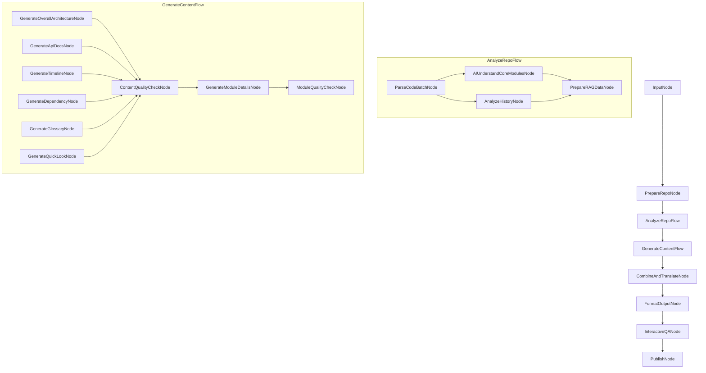

#### 节点阶段划分概览 (Node Allocation Overview)

下表概述了主要节点/流程在各实现阶段中的引入或关键增强：

| 节点/流程 (Node/Flow)           | 主要实现阶段 | 对应流程阶段 | 错误处理策略 | 可扩展性设计 |
| :------------------------------ | :------------ | :------------ | :----------- | :----------- |
| `InputNode`                     | 阶段 1        | 🏷️ 1: 输入与准备 | 输入验证，提供默认值 | 支持自定义参数扩展 |
| `PrepareRepoNode`               | 阶段 1        | 🏷️ 1: 输入与准备 | 处理网络错误，权限问题 | 支持多种代码库来源 |
| `AnalyzeRepoFlow`               | 阶段 2        | 🏷️ 2: AI 理解 | 合并可用分析结果 | 模块化设计，支持新分析器 |
| ↳ `ParseCodeBatchNode`          | 阶段 2        | 🏷️ 2.1: 代码解析 | 降级解析，跳过问题文件 | 支持多种编程语言 |
| ↳ `AIUnderstandCoreModulesNode` | 阶段 2        | 🏷️ 2.2: AI 核心理解 | LLM 调用重试，结果验证 | 可配置理解深度，支持多语言 |
| ↳ `AnalyzeHistoryNode`          | 阶段 2        | 🏷️ 2.1: 代码解析 | 处理空仓库，历史截断 | 支持过滤和聚焦 |
| ↳ `PrepareRAGDataNode`          | 阶段 2        | 🏷️ 2.3: RAG 数据准备 | 处理大文件，优化分块 | 可配置索引类型和参数 |
| `GenerateContentFlow`           | 阶段 3        | 🏷️ 3: AI 生成 | 内容质量检查，重新生成 | 插件式内容生成器 |
| ↳ `GenerateOverallArchitectureNode` | 阶段 3    | 🏷️ 3.1: 生成整体内容 | 结构验证，降级生成 | 支持多种架构表示，增强可视化 |
| ↳ `GenerateApiDocsNode`         | 阶段 3        | 🏷️ 3.1: 生成整体内容 | API 提取失败处理 | 支持多种 API 风格 |
| ↳ `ContentQualityCheckNode`     | 阶段 3        | 🏷️ 3.1: 生成整体内容 | 质量评估反馈 | 可配置质量标准 |
| ↳ `GenerateModuleDetailsNode`   | 阶段 3        | 🏷️ 3.2: 生成模块细节 | 模块缺失处理 | 支持自定义模块模板 |
| ↳ `ModuleQualityCheckNode`      | 阶段 3        | 🏷️ 3.2: 生成模块细节 | 质量评估反馈 | 可配置质量标准 |
| ↳ `GenerateTimelineNode`        | 阶段 3        | 🏷️ 3.1: 生成整体内容 | 历史数据不足处理 | 支持多种时间线格式 |
| ↳ `GenerateDependencyNode`      | 阶段 3        | 🏷️ 3.1: 生成整体内容 | 依赖分析失败处理 | 支持多种依赖图表示 |
| ↳ `GenerateGlossaryNode`        | 阶段 3        | 🏷️ 3.1: 生成整体内容 | 术语提取失败处理 | 支持领域特定术语 |
| ↳ `GenerateQuickLookNode`       | 阶段 3        | 🏷️ 3.1: 生成整体内容 | 内容不足处理 | 可配置概览深度 |
| `CombineAndTranslateNode`       | 阶段 4        | 🏷️ 4.1: 内容组合 & 4.2.1: 翻译检查 | 内容缺失处理，翻译错误 | 支持多语言和自定义模板，增强术语处理 |
| `FormatOutputNode`              | 阶段 4        | 🏷️ 4.2.2: 格式化输出 | 格式转换错误处理 | 支持多种输出格式 |
| `InteractiveQANode`             | 阶段 5        | 🏷️ 5: 交互问答 | 问题理解失败，RAG 检索失败 | 支持多轮对话和反馈 |
| `PublishNode`                   | 阶段 6        | 🏷️ 6: 发布 | 认证失败，网络错误 | 支持多平台发布，包括 GitHub Pages、GitLab Pages、ReadTheDocs、Netlify、Vercel、Gitbook、Docsify、VuePress、MkDocs 和 JustDoc |

#### 核心节点详细设计

##### 1. `PrepareRepoNode`

- **目的**: 准备本地代码库，处理 URL 或本地路径，验证权限，分析代码库大小。
- **输入**: `shared["repo_source"]`
- **输出**: `shared["local_repo_path"]`, `shared["repo_size_info"]`
- **错误处理**:
  - 处理无效 URL/路径: 提供详细错误信息，建议修复步骤
  - 处理权限问题: 请求必要权限，提供替代方案
  - 处理超大代码库: 实现分割策略，或提供部分分析选项
- **实现细节 (使用 Pydantic)**:
  ```python
  from pydantic import BaseModel, Field, validator, ConfigDict
  from typing import Dict, Optional, Any, List
  from datetime import datetime
  import os
  import re

  # 使用 Pydantic 定义输入模型
  class PrepareRepoInput(BaseModel):
      """PrepareRepoNode 的输入模型"""
      repo_source: str = Field(..., description="代码库来源 (URL 或本地路径)")

      @validator("repo_source")
      def validate_repo_source(cls, v):
          """验证代码库来源格式"""
          # 验证 URL 格式
          url_pattern = r'^(https?://|git@)[\w.-]+(/[\w.-]+)+(.git)?$'
          # 验证本地路径格式
          path_pattern = r'^(/[\w.-]+)+$|^([A-Za-z]:\\[\w.-]+)+$'

          if re.match(url_pattern, v) or re.match(path_pattern, v):
              return v
          raise ValueError("无效的代码库来源格式，必须是有效的 URL 或本地路径")

  # 使用 Pydantic 定义输出模型
  class RepoSizeInfo(BaseModel):
      """代码库大小信息模型"""
      total_size: int = Field(..., description="总大小（字节）")
      file_count: int = Field(..., description="文件数量")
      language_stats: Dict[str, int] = Field(default_factory=dict, description="各语言代码行数")

      @validator("total_size")
      def validate_total_size(cls, v):
          """验证总大小在合理范围内"""
          if v < 0:
              raise ValueError("总大小不能为负数")
          return v

  class PrepareRepoOutput(BaseModel):
      """PrepareRepoNode 的输出模型"""
      success: bool = Field(..., description="操作是否成功")
      local_path: Optional[str] = Field(None, description="本地代码库路径")
      size_info: Optional[RepoSizeInfo] = Field(None, description="代码库大小信息")
      error: Optional[str] = Field(None, description="错误信息")
      from_cache: bool = Field(False, description="是否使用了缓存")

      @validator("local_path")
      def validate_local_path(cls, v, values):
          """验证本地路径在成功时必须存在"""
          if values.get("success") and (v is None or not os.path.exists(v)):
              raise ValueError("成功状态下必须提供有效的本地路径")
          return v

      @validator("error")
      def validate_error(cls, v, values):
          """验证失败时必须提供错误信息"""
          if not values.get("success") and not v:
              raise ValueError("失败状态下必须提供错误信息")
          return v

  # 节点实现
  class PrepareRepoNode:
      """准备代码库节点，使用 Pydantic 进行输入/输出验证"""

      def __init__(self, config=None):
          self.config = config or {}
          self.max_repo_size = self.config.get("max_repo_size", 100_000_000)  # 100MB
          self.split_threshold = self.config.get("split_threshold", 50_000_000)  # 50MB

      def prep(self, shared):
          """准备阶段，从共享内存中提取输入并验证"""
          try:
              # 使用 Pydantic 模型验证输入
              input_model = PrepareRepoInput(repo_source=shared["repo_source"])
              return input_model.repo_source
          except Exception as e:
              # 输入验证失败，记录错误
              log_and_notify(f"输入验证失败: {str(e)}", "error")
              return None

      def validate_source(self, repo_source):
          """验证源类型并获取本地路径"""
          if is_url(repo_source):
              # 克隆远程仓库，使用缓存机制
              temp_path = temp_dir()
              # 从环境变量获取缓存设置
              use_cache = os.getenv("REPO_CACHE_ENABLED", "true").lower() == "true"

              result = git_clone(
                  repo_url=repo_source,
                  local_path=temp_path,
                  use_cache=use_cache,  # 根据环境变量决定是否启用缓存
                  cache_ttl=None  # 使用环境变量中的默认值
              )

              if not result["success"]:
                  return {"success": False, "error": result["error"]}

              local_path = result["path"]
              from_cache = result.get("from_cache", False)

              # 记录缓存使用情况
              if from_cache:
                  log_and_notify(f"使用缓存的代码库: {repo_source}", "info")
              else:
                  log_and_notify(f"克隆新代码库: {repo_source}", "info")

              return {"success": True, "path": local_path, "from_cache": from_cache}
          else:
              # 验证本地路径
              if not os.path.exists(repo_source):
                  return {"success": False, "error": f"路径不存在: {repo_source}"}
              local_path = repo_source

              return {"success": True, "path": local_path, "from_cache": False}

      def validate_repo(self, local_path):
          """验证代码库大小和权限"""
          # 分析代码库大小
          size_info_dict = analyze_code_size(local_path)

          # 使用 Pydantic 模型验证大小信息
          try:
              size_info = RepoSizeInfo(**size_info_dict)
          except Exception as e:
              return {"success": False, "error": f"代码库大小信息无效: {str(e)}"}

          # 检查代码库大小是否超过限制
          if size_info.total_size > self.max_repo_size:
              return {
                  "success": False,
                  "error": f"代码库大小 ({size_info.total_size} 字节) 超过最大限制 ({self.max_repo_size} 字节)"
              }

          # 检查权限
          if not has_read_permission(local_path):
              return {"success": False, "error": "缺少读取权限"}

          return {"success": True, "size_info": size_info}

      def exec(self, repo_source):
          """执行阶段，处理代码库"""
          if repo_source is None:
              return {"success": False, "error": "无效的代码库来源"}

          # 验证源并获取本地路径
          source_result = self.validate_source(repo_source)
          if not source_result["success"]:
              return {"success": False, "error": source_result["error"]}

          local_path = source_result["path"]
          from_cache = source_result.get("from_cache", False)

          # 验证代码库
          repo_result = self.validate_repo(local_path)
          if not repo_result["success"]:
              return {"success": False, "error": repo_result["error"]}

          # 使用 Pydantic 模型验证输出
          try:
              output = PrepareRepoOutput(
                  success=True,
                  local_path=local_path,
                  size_info=repo_result["size_info"],
                  from_cache=from_cache
              )
              return output.dict()
          except Exception as e:
              return {"success": False, "error": f"输出验证失败: {str(e)}"}

      def post(self, shared, prep_res, exec_res):
          """后处理阶段，更新共享内存"""
          if exec_res["success"]:
              shared["local_repo_path"] = exec_res["local_path"]
              shared["repo_size_info"] = exec_res["size_info"]
              shared["process_status"]["current_stage"] = "代码库准备完成"
              log_and_notify(f"代码库准备完成: {shared['local_repo_path']}", "info")
          else:
              shared["process_status"]["errors"].append({
                  "stage": "准备代码库",
                  "error": exec_res["error"],
                  "timestamp": datetime.now()
              })
              log_and_notify(f"代码库准备失败: {exec_res['error']}", "error", notify=True)
  ```

##### 2. `AIUnderstandCoreModulesNode`

- **目的**: 利用 AI 理解代码库的核心模块和整体架构。
- **输入**: `shared["code_structure"]`, `shared["dependencies"]`
- **输出**: `shared["ai_analysis"]["core_modules_explanation"]`, `shared["ai_analysis"]["overall_architecture_summary"]`
- **错误处理**:
  - 处理 LLM 调用失败: 实现重试机制，降级处理
  - 处理理解质量不佳: 实现质量评估和迭代细化
- **实现细节**:
  ```python
  def prep(self, shared):
      return shared["code_structure"], shared["dependencies"]

  def create_prompt(self, code_structure, dependencies):
      """创建分析提示"""
      return f"""
      分析以下代码库结构和依赖关系，识别核心模块并解释其功能和关系:

      代码结构:
      {json.dumps(code_structure, indent=2)}

      依赖关系:
      {json.dumps(dependencies, indent=2)}

      请提供:
      1. 核心模块列表及其功能
      2. 整体架构概述
      3. 模块间关系
      """

  def call_model(self, prompt, target_language):
      """调用LLM并处理结果"""
      result, success, metadata = call_llm(
          prompt=prompt,
          task_type="understand_code",
          target_language=target_language
      )

      if not success:
          return None, None, False

      # 解析结果
      parsed_result = self.parse_llm_response(result)

      # 质量评估
      quality_score = self.evaluate_llm_output(
          result,
          "understand_code",
          {"completeness": 0.7, "accuracy": 0.8, "clarity": 0.6}
      )

      return parsed_result, quality_score, True

  def parse_llm_response(self, response: str) -> Dict[str, Any]:
      """解析 LLM 响应，提取结构化信息

      Args:
          response: LLM 生成的响应文本

      Returns:
          解析后的结构化数据
      """
      # 尝试解析为 JSON
      try:
          # 查找 JSON 块
          json_match = re.search(r'```(?:json)?\s*({[\s\S]*?})```', response)
          if json_match:
              json_str = json_match.group(1)
              return json.loads(json_str)
      except:
          pass

      # 尝试解析为 YAML
      try:
          # 查找 YAML 块
          yaml_match = re.search(r'```(?:yaml)?\s*([\s\S]*?)```', response)
          if yaml_match:
              yaml_str = yaml_match.group(1)
              import yaml
              return yaml.safe_load(yaml_str)
      except:
          pass

      # 如果无法解析为结构化格式，尝试提取关键信息
      result = {
          "core_modules": [],
          "architecture": "",
          "module_relationships": []
      }

      # 提取核心模块
      modules_section = self._extract_section(response, ["核心模块", "Core Modules", "主要模块"])
      if modules_section:
          # 尝试提取列表项
          modules = re.findall(r'[*\-•]\s*([^:\n]+)(?::|\n|：)(.*?)(?=\n[*\-•]|\n\n|$)', modules_section, re.DOTALL)
          if modules:
              result["core_modules"] = [
                  {"name": m[0].strip(), "description": m[1].strip()}
                  for m in modules
              ]
          else:
              # 尝试提取段落描述的模块
              modules = re.findall(r'([A-Za-z0-9_]+(?:\.[A-Za-z0-9_]+)*)(?::|：)\s*(.*?)(?=\n\n|$)', modules_section, re.DOTALL)
              if modules:
                  result["core_modules"] = [
                      {"name": m[0].strip(), "description": m[1].strip()}
                      for m in modules
                  ]

      # 提取架构概述
      architecture_section = self._extract_section(response, ["整体架构", "架构概述", "Architecture", "Overall Architecture"])
      if architecture_section:
          result["architecture"] = architecture_section.strip()

      # 提取模块关系
      relationships_section = self._extract_section(response, ["模块关系", "Module Relationships", "依赖关系", "组件关系"])
      if relationships_section:
          # 尝试提取关系描述
          relationships = re.findall(r'[*\-•]\s*(.*?)(?=\n[*\-•]|\n\n|$)', relationships_section, re.DOTALL)
          if relationships:
              result["module_relationships"] = [r.strip() for r in relationships]

      return result

  def _extract_section(self, text: str, section_titles: List[str]) -> Optional[str]:
      """从文本中提取特定章节

      Args:
          text: 完整文本
          section_titles: 可能的章节标题列表

      Returns:
          提取的章节内容，如果未找到则返回 None
      """
      for title in section_titles:
          # 查找章节标题
          pattern = rf'(?:^|\n)(?:#{1,3}\s*)?{re.escape(title)}[:\s]*(.*?)(?=\n(?:#{1,3}\s*|$)|\Z)'
          match = re.search(pattern, text, re.DOTALL | re.IGNORECASE)
          if match:
              return match.group(1).strip()

      return None

  def evaluate_llm_output(self, output: str, task_type: str, criteria: Optional[Dict[str, float]] = None) -> Dict[str, float]:
      """评估 LLM 输出质量

      Args:
          output: LLM 生成的输出
          task_type: 任务类型
          criteria: 评估标准和权重

      Returns:
          包含各项评分和总体评分的字典
      """
      # 默认评估标准
      default_criteria = {
          "understand_code": {
              "completeness": 0.4,  # 完整性
              "accuracy": 0.4,      # 准确性
              "clarity": 0.2        # 清晰度
          }
      }

      # 使用默认标准或合并自定义标准
      task_criteria = default_criteria.get(task_type, {"quality": 1.0})
      if criteria:
          for key, value in criteria.items():
              task_criteria[key] = value

      # 基于输出长度和内容的基本评估
      scores = {}

      # 1. 长度检查
      min_length = 200  # 代码理解需要足够的长度
      length_score = min(1.0, len(output) / min_length)

      # 2. 内容质量检查
      # 检查结构化内容
      structure_indicators = ["模块", "类", "函数", "方法", "接口", "组件"]
      structure_count = sum(indicator in output for indicator in structure_indicators)
      structure_score = min(1.0, structure_count / 5)

      # 检查关系描述
      relation_indicators = ["调用", "依赖", "继承", "包含", "使用", "关联"]
      relation_count = sum(indicator in output for indicator in relation_indicators)
      relation_score = min(1.0, relation_count / 3)

      # 计算各项指标得分
      scores["completeness"] = length_score
      scores["accuracy"] = (structure_score + relation_score) / 2
      scores["clarity"] = structure_score

      # 计算加权总分
      overall_score = 0.0
      for criterion, weight in task_criteria.items():
          if criterion in scores:
              overall_score += scores[criterion] * weight
          else:
              overall_score += 0.5 * weight

      # 添加总体评分
      scores["overall"] = min(1.0, overall_score)

      return scores

  def exec(self, inputs):
      code_structure, dependencies = inputs
      target_language = self.shared.get("target_language", "en")

      # 准备提示
      prompt = self.create_prompt(code_structure, dependencies)

      # 尝试调用LLM (最多3次)
      for attempt in range(3):
          try:
              parsed_result, quality_score, success = self.call_model(
                  prompt, target_language
              )

              if success and quality_score["overall"] >= 0.7:
                  return {
                      "success": True,
                      "core_modules": parsed_result["core_modules"],
                      "architecture": parsed_result["architecture"],
                      "quality_score": quality_score
                  }
              elif success:
                  log_and_notify(
                      f"理解质量不佳 (分数: {quality_score['overall']}), 重试中...",
                      "warning"
                  )
          except Exception as e:
              log_and_notify(f"LLM调用失败: {str(e)}, 重试中...", "warning")

      # 所有重试都失败，返回降级结果
      return {
          "success": False,
          "error": "无法获得高质量的代码理解",
          "fallback_result": self.generate_basic_understanding(code_structure)
      }

  def generate_basic_understanding(self, code_structure: Dict[str, Any]) -> Dict[str, Any]:
      """生成基本的代码理解结果，作为 LLM 调用失败时的降级方案

      Args:
          code_structure: 代码结构信息

      Returns:
          包含核心模块和架构概述的字典
      """
      # 初始化结果
      result = {
          "core_modules": [],
          "architecture": "无法通过 AI 分析生成详细架构概述。以下是基于代码结构的基本信息。"
      }

      # 提取文件和目录信息
      files = []
      directories = []

      # 从代码结构中提取文件和目录
      for path, info in code_structure.items():
          if isinstance(info, dict) and "type" in info:
              if info["type"] == "file":
                  files.append(path)
              elif info["type"] == "directory":
                  directories.append(path)

      # 识别可能的核心模块
      potential_modules = []

      # 1. 查找 __init__.py 文件所在的目录，这些通常是 Python 模块
      python_modules = [d for d in directories if f"{d}/__init__.py" in files]
      potential_modules.extend(python_modules)

      # 2. 查找可能的主要文件
      main_files = [f for f in files if any(pattern in f.lower() for pattern in
                                          ["main", "app", "core", "server", "client", "api", "service"])]
      potential_modules.extend(main_files)

      # 3. 按文件扩展名分组
      file_extensions = {}
      for f in files:
          ext = f.split(".")[-1] if "." in f else "unknown"
          if ext not in file_extensions:
              file_extensions[ext] = []
          file_extensions[ext].append(f)

      # 为每个可能的核心模块创建描述
      for module in potential_modules[:10]:  # 限制数量
          if module in python_modules:
              description = f"Python 模块，可能包含核心功能"
          elif module in main_files:
              description = f"可能的主要文件，包含程序入口点或核心逻辑"
          else:
              description = f"可能的核心组件"

          result["core_modules"].append({
              "name": module,
              "description": description
          })

      # 生成基本架构描述
      architecture_parts = [
          "代码库包含以下组件：",
          f"- {len(directories)} 个目录",
          f"- {len(files)} 个文件"
      ]

      # 添加文件类型统计
      if file_extensions:
          architecture_parts.append("文件类型分布：")
          for ext, ext_files in file_extensions.items():
              if len(ext_files) > 0:
                  architecture_parts.append(f"- {ext}: {len(ext_files)} 个文件")

      # 添加可能的架构模式识别
      if any("test" in f.lower() for f in files):
          architecture_parts.append("- 包含测试文件，可能遵循测试驱动开发模式")

      if any("model" in f.lower() for f in files) and any("view" in f.lower() for f in files):
          architecture_parts.append("- 可能采用 MVC 或类似架构模式")

      if any("api" in f.lower() for f in files) and any("service" in f.lower() for f in files):
          architecture_parts.append("- 可能采用微服务或服务导向架构")

      result["architecture"] = "\n".join(architecture_parts)

      return result

  def update_success_state(self, shared, exec_res):
      """更新成功状态"""
      shared["ai_analysis"]["core_modules_explanation"] = exec_res["core_modules"]
      shared["ai_analysis"]["overall_architecture_summary"] = exec_res["architecture"]
      shared["ai_analysis"]["quality_metrics"]["architecture_understanding"] = (
          exec_res["quality_score"]["overall"]
      )
      shared["process_status"]["current_stage"] = "AI 核心理解完成"

  def update_failure_state(self, shared, exec_res):
      """更新失败状态"""
      shared["process_status"]["errors"].append({
          "stage": "AI 核心理解",
          "error": exec_res["error"],
          "timestamp": datetime.now()
      })
      # 使用降级结果
      shared["ai_analysis"]["core_modules_explanation"] = (
          exec_res["fallback_result"]["core_modules"]
      )
      shared["ai_analysis"]["overall_architecture_summary"] = (
          exec_res["fallback_result"]["architecture"]
      )
      shared["ai_analysis"]["quality_metrics"]["architecture_understanding"] = 0.4
      log_and_notify("使用降级的代码理解结果", "warning", notify=True)

  def post(self, shared, prep_res, exec_res):
      if exec_res["success"]:
          self.update_success_state(shared, exec_res)
      else:
          self.update_failure_state(shared, exec_res)
  ```

##### 3. `InteractiveQANode`

- **目的**: 处理用户的交互式问题，利用 RAG 和 AI 生成回答，支持多轮对话和个性化学习路径。
- **输入**: `shared["user_query"]`, `shared["vector_index"]`, `shared["text_chunks"]`, `shared["conversation_history"]`
- **输出**: `shared["generated_content"]["custom_answers"]`, `shared["conversation_history"]`
- **错误处理**:
  - 处理问题理解失败: 请求澄清，提供替代解释
  - 处理 RAG 检索失败: 使用备用上下文，基于已有理解生成回答
- **增强功能**:
  - 多轮对话历史: 保存完整对话上下文，支持后续相关问题
  - 主动澄清机制: 当用户问题不明确时主动请求澄清
  - 个性化学习路径: 基于用户问题和反馈生成定制化学习路径
  - 交互式文档导航: 允许通过对话方式导航和探索文档
- **实现细节**:
  ```python
  def prep(self, shared):
      return (
          shared["user_query"],
          shared["vector_index"],
          shared["text_chunks"],
          shared["ai_analysis"],
          shared.get("conversation_history", [])
      )

  def analyze_query(self, user_query, conversation_history):
      """分析用户问题类型和意图，支持上下文理解"""
      # 构建分析提示，包含对话历史
      history_context = ""
      if conversation_history:
          history_context = "对话历史:\n" + "\n".join([
              f"用户: {turn['question']}\n回答: {turn['answer'][:100]}..."
              for turn in conversation_history[-3:]  # 只使用最近的3轮对话
          ])

      analysis_prompt = f"""
      分析以下关于代码库的问题，确定问题类型、意图和清晰度:

      {history_context}

      当前问题: {user_query}

      请提供:
      1. 问题类型 (如 "架构相关", "API使用", "功能解释", "导航请求" 等)
      2. 用户意图 (如 "寻求信息", "请求示例", "比较选项", "定位文档" 等)
      3. 问题清晰度 (0-10分，10分表示完全清晰)
      4. 是否依赖上下文 (true/false)
      5. 如果问题不清晰，需要澄清的具体方面
      """

      query_analysis, success, metadata = call_llm(
          prompt=analysis_prompt,
          task_type="analyze_question"
      )

      if not success:
          return {
              "type": "general",
              "intent": "unknown",
              "clarity": 5,
              "context_dependent": False,
              "needs_clarification": False
          }

      # 解析 LLM 返回的分析结果
      try:
          parsed_analysis = json.loads(query_analysis)
          return parsed_analysis
      except:
          # 如果无法解析为 JSON，尝试从文本中提取信息
          analysis = {
              "type": "general",
              "intent": "unknown",
              "clarity": 5,
              "context_dependent": "上下文" in query_analysis or "历史" in query_analysis,
              "needs_clarification": "不清晰" in query_analysis or "澄清" in query_analysis
          }

          # 尝试提取问题类型
          type_match = re.search(r"类型[：:]\s*[\"']?([^\"'\n]+)[\"']?", query_analysis)
          if type_match:
              analysis["type"] = type_match.group(1).strip()

          # 尝试提取意图
          intent_match = re.search(r"意图[：:]\s*[\"']?([^\"'\n]+)[\"']?", query_analysis)
          if intent_match:
              analysis["intent"] = intent_match.group(1).strip()

          # 尝试提取清晰度
          clarity_match = re.search(r"清晰度[：:]\s*(\d+)", query_analysis)
          if clarity_match:
              analysis["clarity"] = int(clarity_match.group(1))

          return analysis

  def request_clarification(self, user_query, analysis, target_language):
      """当问题不清晰时，生成澄清请求"""
      clarification_prompt = f"""
      用户问题: "{user_query}"

      这个问题不够清晰，需要更多信息。请生成 2-3 个简短、具体的后续问题，
      帮助澄清用户的意图。问题应该友好、有针对性，并直接关联到用户可能想了解的代码库方面。
      """

      clarification, success, metadata = call_llm(
          prompt=clarification_prompt,
          task_type="generate_clarification",
          target_language=target_language
      )

      if not success:
          return "您的问题不够清晰，能否提供更多细节？例如，您想了解哪个特定模块或功能？"

      return clarification

  def retrieve_context(self, user_query, analysis, vector_index, text_chunks, ai_analysis, conversation_history):
      """增强的上下文检索，支持对话历史和混合检索"""
      try:
          # 构建增强查询
          enhanced_query = user_query

          # 如果问题依赖上下文，将最近的对话融入查询
          if analysis.get("context_dependent", False) and conversation_history:
              recent_context = conversation_history[-1]["question"] + " " + conversation_history[-1]["answer"][:100]
              enhanced_query = recent_context + " " + user_query

          # 获取问题的嵌入向量
          query_embedding = get_embedding(enhanced_query)

          # 确定检索数量
          top_k = self.config.get("top_k", 5)

          # 根据问题类型调整相似度阈值
          similarity_threshold = self.config.get("similarity_threshold", 0.65)
          if analysis["type"] in ["架构相关", "概览"]:
              similarity_threshold = 0.6  # 架构问题需要更广泛的上下文
          elif analysis["type"] in ["API使用", "函数细节"]:
              similarity_threshold = 0.75  # API 问题需要更精确的匹配

          # RAG 检索相关内容
          relevant_ids, scores = vector_search(
              query_embedding,
              vector_index,
              top_k=top_k,
              similarity_threshold=similarity_threshold
          )

          # 混合检索策略：结合向量检索和关键词匹配
          if len(relevant_ids) < 2:  # 如果向量检索结果不足
              keyword_matches = keyword_search(
                  user_query,
                  text_chunks,
                  max_results=3
              )
              # 合并结果并去重
              all_ids = list(set(relevant_ids + keyword_matches))
              relevant_ids = all_ids[:top_k]

          # 获取相关文本块
          relevant_chunks = [text_chunks[idx] for idx in relevant_ids]

          # 根据问题类型添加特定上下文
          if analysis["type"] == "架构相关":
              relevant_chunks.append(f"架构概述: {ai_analysis['overall_architecture_summary']}")
          elif analysis["type"] == "模块关系":
              relevant_chunks.append(f"核心模块: {ai_analysis['core_modules_explanation']}")

          # 组合上下文
          context = "\n\n".join(relevant_chunks)

          return context, relevant_ids

      except Exception as e:
          # RAG 检索失败，使用备用上下文
          log_and_notify(f"RAG 检索失败: {str(e)}", "warning")
          context = f"""
          整体架构概述:
          {ai_analysis['overall_architecture_summary']}

          核心模块:
          {ai_analysis['core_modules_explanation']}
          """
          return context, []

  def generate_answer(self, user_query, analysis, context, conversation_history, target_language):
      """增强的回答生成，支持对话历史和个性化学习路径"""
      # 构建对话历史上下文
      history_context = ""
      if conversation_history and analysis.get("context_dependent", False):
          history_context = "对话历史:\n" + "\n".join([
              f"用户: {turn['question']}\n回答: {turn['answer'][:150]}..."
              for turn in conversation_history[-3:]  # 只使用最近的3轮对话
          ])

      # 根据问题类型定制提示
      if analysis["type"] == "导航请求" or "查找" in analysis["intent"]:
          answer_prompt = f"""
          用户正在寻找代码库中的特定内容。基于以下上下文，提供准确的导航指南:

          {history_context}

          用户问题: {user_query}

          上下文信息:
          {context}

          请提供:
          1. 直接回答用户的导航问题
          2. 相关文件或模块的具体位置
          3. 如何找到和使用这些内容的简短指南
          4. 1-2个相关的后续问题建议，帮助用户继续探索
          """
      elif analysis["type"] == "API使用" or "示例" in analysis["intent"]:
          answer_prompt = f"""
          用户正在询问API使用方法。基于以下上下文，提供详细的API使用指南:

          {history_context}

          用户问题: {user_query}

          上下文信息:
          {context}

          请提供:
          1. API的详细说明
          2. 参数和返回值解释
          3. 一个完整的代码示例
          4. 常见错误和解决方法
          5. 1-2个相关的后续问题建议，帮助用户深入理解
          """
      elif analysis.get("clarity", 10) < 5:
          # 问题不够清晰，生成澄清回答
          answer_prompt = f"""
          用户的问题不够清晰。基于以下上下文，提供有帮助的回应:

          {history_context}

          用户问题: {user_query}

          上下文信息:
          {context}

          请提供:
          1. 对用户可能意图的最佳猜测
          2. 2-3个具体的澄清问题，帮助更好地理解用户需求
          3. 基于当前理解的初步回答
          """
      else:
          # 一般问题的标准提示
          answer_prompt = f"""
          基于以下上下文，回答关于代码库的问题:

          {history_context}

          用户问题: {user_query}

          上下文信息:
          {context}

          请提供准确、清晰、有帮助的回答。如果上下文中没有足够信息，
          请说明并基于一般软件工程原则提供最佳猜测。

          在回答末尾，提供1-2个相关的后续问题建议，帮助用户继续探索。
          """

      # 调用 LLM 生成回答
      answer, success, metadata = call_llm(
          prompt=answer_prompt,
          task_type="answer_question",
          target_language=target_language
      )

      if not success:
          return None, False, None

      # 评估回答质量
      quality_score = self.evaluate_llm_output(
          answer,
          "answer_question",
          {"relevance": 0.8, "accuracy": 0.7, "helpfulness": 0.6}
      )

      # 提取建议的后续问题
      follow_up_questions = self.extract_follow_up_questions(answer)

      return answer, quality_score["overall"], follow_up_questions

  def evaluate_llm_output(self, output: str, task_type: str, criteria: Optional[Dict[str, float]] = None) -> Dict[str, float]:
      """评估 LLM 输出质量

      Args:
          output: LLM 生成的输出
          task_type: 任务类型
          criteria: 评估标准和权重

      Returns:
          包含各项评分和总体评分的字典
      """
      # 默认评估标准
      default_criteria = {
          "answer_question": {
              "relevance": 0.4,  # 相关性
              "accuracy": 0.3,   # 准确性
              "helpfulness": 0.3  # 有用性
          },
          "understand_code": {
              "completeness": 0.4,  # 完整性
              "accuracy": 0.4,      # 准确性
              "clarity": 0.2        # 清晰度
          },
          "generate_learning_path": {
              "structure": 0.3,     # 结构性
              "relevance": 0.4,     # 相关性
              "practicality": 0.3   # 实用性
          },
          "analyze_question": {
              "accuracy": 0.5,      # 准确性
              "completeness": 0.3,  # 完整性
              "insight": 0.2        # 洞察力
          }
      }

      # 使用默认标准或合并自定义标准
      task_criteria = default_criteria.get(task_type, {"quality": 1.0})
      if criteria:
          for key, value in criteria.items():
              task_criteria[key] = value

      # 基于输出长度和内容的基本评估
      scores = {}

      # 1. 长度检查
      min_lengths = {
          "answer_question": 100,
          "understand_code": 200,
          "generate_learning_path": 300,
          "analyze_question": 50
      }

      min_length = min_lengths.get(task_type, 100)
      length_score = min(1.0, len(output) / min_length)

      # 2. 内容质量检查
      # 这里使用简单的启发式规则，实际项目中可以使用更复杂的评估方法

      # 检查结构化内容（如 JSON、列表等）
      structure_indicators = ["```", "：", ":", "-", "•", "1.", "#", "{", "「"]
      has_structure = any(indicator in output for indicator in structure_indicators)
      structure_score = 0.8 if has_structure else 0.5

      # 检查专业术语
      tech_terms = ["函数", "方法", "类", "模块", "API", "接口", "代码", "算法",
                   "function", "method", "class", "module", "interface", "code", "algorithm"]
      term_count = sum(term in output.lower() for term in tech_terms)
      term_score = min(1.0, term_count / 3)

      # 检查代码示例
      has_code = "```" in output or "    " in output
      code_score = 0.9 if has_code and task_type in ["answer_question", "understand_code"] else 0.6

      # 根据任务类型计算各项指标得分
      if task_type == "answer_question":
          scores["relevance"] = (structure_score + term_score) / 2
          scores["accuracy"] = term_score
          scores["helpfulness"] = (structure_score + code_score) / 2
      elif task_type == "understand_code":
          scores["completeness"] = length_score
          scores["accuracy"] = term_score
          scores["clarity"] = structure_score
      elif task_type == "generate_learning_path":
          scores["structure"] = structure_score
          scores["relevance"] = term_score
          scores["practicality"] = (length_score + code_score) / 2
      elif task_type == "analyze_question":
          scores["accuracy"] = term_score
          scores["completeness"] = length_score
          scores["insight"] = structure_score
      else:
          scores["quality"] = (length_score + structure_score + term_score) / 3

      # 计算加权总分
      overall_score = 0.0
      for criterion, weight in task_criteria.items():
          if criterion in scores:
              overall_score += scores[criterion] * weight
          else:
              # 如果没有特定标准的分数，使用平均分
              overall_score += 0.5 * weight

      # 添加总体评分
      scores["overall"] = min(1.0, overall_score)

      return scores

  def extract_follow_up_questions(self, text: str) -> List[str]:
      """从文本中提取后续问题建议

      Args:
          text: 包含后续问题的文本

      Returns:
          提取的问题列表
      """
      # 常见的后续问题标记模式
      patterns = [
          r"(?:后续问题|相关问题|建议问题|您可能想问|你可能想问|Further questions|Related questions)[:：]?\s*((?:\d+[\.\)、][\s]*[^？\?\n]+[\？\?][\s]*)+)",
          r"(?:\n\s*\d+[\.\)、][\s]*[^？\?\n]+[\？\?][\s]*)+$",
          r"(?:您还可以问|你还可以问|You might also ask)[:：]?\s*((?:[^？\?\n]+[\？\?][\s]*)+)"
      ]

      # 尝试使用不同模式提取问题
      for pattern in patterns:
          matches = re.findall(pattern, text, re.MULTILINE)
          if matches:
              # 提取到整个问题块
              questions_block = matches[0] if isinstance(matches[0], str) else matches[0][0]
              # 分割成单独的问题
              questions = re.findall(r"\d+[\.\)、]?\s*([^？\?\n]+[\？\?])", questions_block)
              if questions:
                  return [q.strip() for q in questions]

      # 如果上面的模式都没匹配到，尝试直接查找问号结尾的句子
      questions = re.findall(r"([^。？！\?\.\!\n]{10,}[\？\?])", text)

      # 过滤掉不像问题的句子（太短或不是问句）
      filtered_questions = []
      for q in questions:
          q = q.strip()
          # 问题通常以疑问词开头或包含特定词语
          if (len(q) > 10 and
              (q.startswith(("如何", "为什么", "是否", "怎样", "什么", "哪些", "如果", "能否")) or
               any(word in q for word in ["可以", "能够", "应该", "需要", "有没有", "是不是"]))):
              filtered_questions.append(q)

      # 限制返回的问题数量
      return filtered_questions[:3]

  def generate_learning_path(self, user_queries, answers, ai_analysis):
      """基于用户问题和回答生成个性化学习路径"""
      if len(user_queries) < 2:
          return None  # 需要至少两个问题才能生成学习路径

      learning_path_prompt = f"""
      基于用户的问题历史和代码库结构，生成个性化学习路径:

      用户问题历史:
      {json.dumps(user_queries, indent=2, ensure_ascii=False)}

      代码库核心模块:
      {ai_analysis['core_modules_explanation']}

      请生成一个结构化的学习路径，包含:
      1. 用户似乎感兴趣的主要领域
      2. 建议的学习顺序（从基础到高级）
      3. 每个步骤需要了解的关键概念和模块
      4. 推荐的实践练习

      以JSON格式返回，包含以下字段:
      - interest_areas: 兴趣领域列表
      - learning_steps: 学习步骤数组，每步包含 title, description, modules, concepts, practice
      """

      learning_path, success, metadata = call_llm(
          prompt=learning_path_prompt,
          task_type="generate_learning_path"
      )

      if not success:
          return None

      try:
          # 尝试解析为JSON
          return json.loads(learning_path)
      except:
          # 如果解析失败，返回原始文本
          return {"raw_text": learning_path}

  def exec(self, inputs):
      user_query, vector_index, text_chunks, ai_analysis, conversation_history = inputs

      if not user_query:
          return {"success": True, "skip": True}

      # 初始化配置
      self.config = self.shared.get("config", {}).get("InteractiveQANode", {})
      target_language = self.shared.get("target_language", "en")

      # 分析问题
      query_analysis = self.analyze_query(user_query, conversation_history)

      # 检查问题清晰度，如果不清晰且需要澄清，生成澄清请求
      if query_analysis.get("clarity", 10) < 5 and query_analysis.get("needs_clarification", False):
          clarification = self.request_clarification(user_query, query_analysis, target_language)
          return {
              "success": True,
              "requires_clarification": True,
              "question": user_query,
              "clarification_request": clarification,
              "analysis": query_analysis
          }

      # 检索上下文
      context, relevant_ids = self.retrieve_context(
          user_query, query_analysis, vector_index, text_chunks, ai_analysis, conversation_history
      )

      # 生成回答
      answer, quality_score, follow_up_questions = self.generate_answer(
          user_query, query_analysis, context, conversation_history, target_language
      )

      if answer is None:
          return {
              "success": False,
              "error": "无法生成回答",
              "fallback_answer": "抱歉，我无法回答这个问题。请尝试重新表述或询问其他问题。"
          }

      # 检查是否需要生成学习路径
      generate_path = False
      if len(conversation_history) >= 3:  # 至少有3轮对话后考虑生成学习路径
          # 提取所有问题
          user_queries = [turn["question"] for turn in conversation_history] + [user_query]
          # 检查问题多样性
          if len(set([query_analysis["type"] for query in user_queries])) >= 2:
              generate_path = True

      learning_path = None
      if generate_path:
          user_queries = [turn["question"] for turn in conversation_history] + [user_query]
          answers = [turn["answer"] for turn in conversation_history] + [answer]
          learning_path = self.generate_learning_path(user_queries, answers, ai_analysis)

      return {
          "success": True,
          "skip": False,
          "question": user_query,
          "answer": answer,
          "quality_score": quality_score,
          "context_sources": relevant_ids,
          "analysis": query_analysis,
          "follow_up_questions": follow_up_questions,
          "learning_path": learning_path
      }

  def handle_success(self, shared, exec_res):
      """处理成功情况"""
      # 如果需要澄清，不添加到回答列表，而是请求用户澄清
      if exec_res.get("requires_clarification", False):
          log_and_notify(
              exec_res["clarification_request"],
              "info",
              notify=True
          )
          shared["clarification_needed"] = True
          shared["last_question"] = exec_res["question"]
          return

      # 创建回答条目
      answer_entry = {
          "question": exec_res["question"],
          "answer": exec_res["answer"],
          "quality_score": exec_res["quality_score"],
          "timestamp": datetime.now().isoformat(),
          "context_sources": exec_res["context_sources"],
          "analysis": exec_res["analysis"],
          "follow_up_questions": exec_res.get("follow_up_questions", [])
      }

      shared["generated_content"]["custom_answers"].append(answer_entry)
      shared["process_status"]["current_stage"] = "问答处理完成"

      # 请求用户反馈
      log_and_notify("已生成回答，请提供反馈", "info", notify=True)

  def handle_failure(self, shared, exec_res):
      """处理失败情况"""
      shared["process_status"]["errors"].append({
          "stage": "交互问答",
          "error": exec_res["error"],
          "timestamp": datetime.now()
      })

      # 使用降级回答
      answer_entry = {
          "question": shared["user_query"],
          "answer": exec_res["fallback_answer"],
          "quality_score": 0.3,
          "timestamp": datetime.now(),
          "context_sources": []
      }

      shared["generated_content"]["custom_answers"].append(answer_entry)
      log_and_notify("使用降级回答", "warning", notify=True)

  def post(self, shared, prep_res, exec_res):
      if exec_res.get("skip", False):
          shared["process_status"]["current_stage"] = "跳过问答阶段"
          return

      if exec_res["success"]:
          self.handle_success(shared, exec_res)
      else:
          self.handle_failure(shared, exec_res)
  ```

#### 可扩展性设计

系统设计遵循以下可扩展性原则：

1. **插件式架构**: 每个节点都可以被替换或扩展，只要遵循相同的接口。

2. **配置驱动**: 关键参数通过配置文件控制，无需修改代码即可调整行为。

3. **中间件支持**: 支持在节点间添加中间件，用于日志记录、性能监控、错误处理等。

4. **自定义钩子**: 在关键点提供钩子，允许用户注入自定义逻辑。

5. **模块化设计**: 功能被分解为独立模块，可以单独升级或替换。

示例配置文件结构：

```yaml
# config.yaml
general:
  target_language: "zh"
  output_format: "markdown"
  cache_enabled: true
  # 环境变量配置
  env:
    # 指定 .env 文件路径，如果为空则使用默认路径
    env_file: ".env"
    # 是否在启动时验证必要的环境变量
    validate_on_start: true
    # 必要的环境变量列表
    required_vars:
      - "LLM_API_KEY"

# 性能优化配置
performance:
  # 并行处理配置
  parallel:
    enabled: true
    max_workers: 8  # 最大工作线程/进程数，默认为 CPU 核心数 * 2
    chunk_size: 5   # 每个工作单元的项目数
    show_progress: true  # 是否显示进度条

  # 缓存优化配置
  cache:
    enabled: true
    ttl: 86400  # 缓存有效期（秒）
    max_size_gb: 5  # 最大缓存大小（GB）
    optimization_interval: 3600  # 缓存优化间隔（秒）
    priority_strategy: "lru"  # 缓存优先级策略: lru, lfu, size, custom

# 多语言支持配置
language:
  # 术语表配置
  terminology:
    enabled: true
    custom_terms_file: "./data/custom_terms.json"  # 自定义术语表文件
    domain_specific: true  # 是否使用领域特定术语
    preserve_case: true  # 是否保留术语大小写

  # 翻译配置
  translation:
    quality_check: true  # 是否进行翻译质量检查
    technical_terms_handling: "preserve"  # 技术术语处理方式: preserve, translate, hybrid

  # Emoji 配置
  emoji:
    enabled: true  # 是否在文档中添加 emoji
    heading_emojis: true  # 是否为标题添加 emoji
    custom_emoji_map: "./data/emoji_map.json"  # 自定义 emoji 映射文件
    content_based: true  # 是否根据内容选择 emoji

# 可视化配置
visualization:
  # 架构图配置
  architecture:
    engine: "mermaid"  # 可视化引擎: mermaid, d3, plantuml
    theme: "default"  # 主题: default, dark, forest, neutral
    direction: "TB"  # 方向: TB, BT, LR, RL
    include_legend: true  # 是否包含图例

  # 依赖图配置
  dependency:
    max_depth: 3  # 最大深度
    group_by_module: true  # 是否按模块分组
    interactive: true  # 是否生成交互式图表

  # 时序图配置
  sequence:
    show_activation: true  # 是否显示激活条
    include_notes: true  # 是否包含注释

  # 其他图表配置
  charts:
    enabled: true
    types: ["bar", "line", "pie", "gantt"]  # 启用的图表类型

# 发布配置
publishing:
  # GitHub Pages 配置
  github_pages:
    branch: "gh-pages"
    custom_domain: ""
    theme: "jekyll-theme-cayman"

  # GitLab Pages 配置
  gitlab_pages:
    branch: "pages"

  # ReadTheDocs 配置
  readthedocs:
    config_file: ".readthedocs.yml"

  # Netlify 配置
  netlify:
    build_command: "npm run build"
    publish_directory: "_site"

  # Vercel 配置
  vercel:
    build_command: "npm run build"
    output_directory: "out"

  # Gitbook 配置
  gitbook:
    summary_file: "SUMMARY.md"

  # Docsify 配置
  docsify:
    index_file: "README.md"
    sidebar: true

  # VuePress 配置
  vuepress:
    config_file: ".vuepress/config.js"

  # MkDocs 配置
  mkdocs:
    config_file: "mkdocs.yml"

  # JustDoc 配置
  justdoc:
    config_file: "justdoc.json"

nodes:
  PrepareRepoNode:
    max_repo_size: 100000000  # 100MB
    split_threshold: 50000000  # 50MB

  AIUnderstandCoreModulesNode:
    retry_count: 3
    quality_threshold: 0.7
    # 使用环境变量中的模型名称，如果未设置则使用默认值
    model: "${LLM_MODEL:-gpt-4}"
    # 多语言支持
    language_detection: true
    terminology_extraction: true

  InteractiveQANode:
    top_k: 5
    similarity_threshold: 0.65
    # 并行处理相关问题
    batch_processing: true
    max_parallel_questions: 3

plugins:
  - name: "PerformanceMonitor"
    enabled: true
    config:
      log_threshold_ms: 1000

  - name: "CustomContentGenerator"
    enabled: false
    path: "./plugins/custom_generator.py"

  - name: "ParallelProcessor"
    enabled: true
    config:
      max_workers: 8

  - name: "CacheOptimizer"
    enabled: true
    config:
      run_interval: 3600
      max_size_gb: 5

  - name: "VisualizationEnhancer"
    enabled: true
    config:
      engines: ["mermaid", "d3", "plotly"]
      interactive: true
```

```bash
# .env 文件示例
# LLM 配置
LLM_PROVIDER=openai  # 提供商选择 (openai, openrouter, alibaba, tongyi, volcengine, moonshot)
LLM_MODEL=gpt-4  # 模型名称
LLM_API_KEY=sk-your-api-key-here
LLM_BASE_URL=https://api.openai.com/v1  # 可选，用于自定义 API 端点
LLM_MAX_TOKENS=4000
LLM_TEMPERATURE=0.7

# OpenRouter 配置
# OPENROUTER_API_KEY=sk-your-openrouter-api-key-here
# OPENROUTER_BASE_URL=https://openrouter.ai/api/v1

# 阿里百炼 (通义千问) 配置
# ALIBABA_API_KEY=your-alibaba-api-key-here
# ALIBABA_BASE_URL=https://dashscope.aliyuncs.com/api/v1

# 火山引擎配置
# VOLCENGINE_API_KEY=your-volcengine-api-key-here
# VOLCENGINE_BASE_URL=https://api.volcengine.com/ml/api/v1/services
# VOLCENGINE_SERVICE_ID=your-service-id-here

# 硅基流动 (Moonshot) 配置
# MOONSHOT_API_KEY=your-moonshot-api-key-here
# MOONSHOT_BASE_URL=https://api.moonshot.cn/v1

# 性能优化配置
PARALLEL_ENABLED=true
PARALLEL_MAX_WORKERS=8
CACHE_ENABLED=true
CACHE_TTL=86400
CACHE_MAX_SIZE_GB=5
REPO_CACHE_ENABLED=true
REPO_CACHE_TTL=86400

# 多语言支持配置
TARGET_LANGUAGE=zh
TERMINOLOGY_ENABLED=true
TRANSLATION_QUALITY_CHECK=true
TECHNICAL_TERMS_HANDLING=preserve
EMOJI_ENABLED=true
EMOJI_HEADING=true
EMOJI_CONTENT_BASED=true

# 可视化配置
VISUALIZATION_ENGINE=mermaid
VISUALIZATION_THEME=default
VISUALIZATION_INTERACTIVE=true

# 发布配置
PUBLISH_PLATFORM=github
GITHUB_TOKEN=your-github-token-here
GITHUB_REPO=username/repo-name
GITHUB_BRANCH=gh-pages
```

## 🛡️ 全局错误处理与恢复框架 (Global Error Handling and Recovery Framework)

为确保系统在各种异常情况下的稳定性和可靠性，我们设计了一个全面的错误处理与恢复框架。该框架将错误分类并提供统一的处理机制，减少人工干预需求。

### 错误分类系统

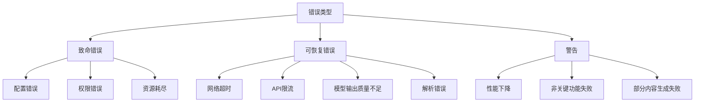

### 错误处理策略

| 错误类型 | 严重程度 | 处理策略 | 恢复机制 | 通知级别 |
|---------|---------|---------|---------|---------|
| **致命错误** | 高 | 停止流程，保存状态 | 需要人工干预 | 立即通知用户 |
| **可恢复错误** | 中 | 重试、降级处理 | 自动恢复或回退到备选方案 | 警告通知 |
| **警告** | 低 | 记录并继续 | 不需要恢复 | 日志记录 |

### 全局错误处理器设计

```python
# 全局错误处理器示例 (utils/error_handler.py)
class GlobalErrorHandler:
    """全局错误处理器，统一管理所有节点的错误处理逻辑"""

    def __init__(self, config=None):
        self.config = config or {}
        self.error_history = []
        self.recovery_strategies = {
            "network_timeout": self._handle_network_timeout,
            "api_rate_limit": self._handle_rate_limit,
            "model_quality_low": self._handle_low_quality,
            "parsing_error": self._handle_parsing_error,
            # 其他错误类型的处理策略...
        }

    def handle_error(self, error_type, error_info, node_name, shared_state):
        """处理错误并尝试恢复"""
        # 记录错误
        error_record = {
            "type": error_type,
            "info": error_info,
            "node": node_name,
            "timestamp": datetime.now(),
            "recovered": False
        }
        self.error_history.append(error_record)

        # 确定错误严重程度
        severity = self._determine_severity(error_type)

        # 根据严重程度采取不同策略
        if severity == "fatal":
            return self._handle_fatal_error(error_record, shared_state)
        elif severity == "recoverable":
            return self._handle_recoverable_error(error_record, shared_state)
        else:  # warning
            return self._handle_warning(error_record, shared_state)

    def _determine_severity(self, error_type):
        """确定错误的严重程度"""
        fatal_errors = ["config_error", "permission_denied", "resource_exhausted"]
        recoverable_errors = ["network_timeout", "api_rate_limit", "model_quality_low", "parsing_error"]

        if error_type in fatal_errors:
            return "fatal"
        elif error_type in recoverable_errors:
            return "recoverable"
        else:
            return "warning"

    def _handle_fatal_error(self, error_record, shared_state):
        """处理致命错误"""
        # 保存当前状态
        self._save_checkpoint(shared_state)

        # 通知用户
        log_and_notify(
            f"致命错误: {error_record['type']} 在节点 {error_record['node']}",
            level="error",
            notify=True
        )

        # 更新共享状态
        shared_state["process_status"]["errors"].append({
            "stage": error_record["node"],
            "error": error_record["info"],
            "severity": "fatal",
            "timestamp": error_record["timestamp"]
        })

        return {
            "success": False,
            "error": error_record["info"],
            "recoverable": False
        }

    def _handle_recoverable_error(self, error_record, shared_state):
        """处理可恢复错误"""
        # 查找恢复策略
        recovery_strategy = self.recovery_strategies.get(
            error_record["type"],
            self._default_recovery_strategy
        )

        # 尝试恢复
        recovery_result = recovery_strategy(error_record, shared_state)

        # 更新错误记录
        error_record["recovered"] = recovery_result["success"]

        # 更新共享状态
        shared_state["process_status"]["errors"].append({
            "stage": error_record["node"],
            "error": error_record["info"],
            "severity": "recoverable",
            "recovery_attempted": True,
            "recovery_success": recovery_result["success"],
            "timestamp": error_record["timestamp"]
        })

        # 通知用户
        if recovery_result["success"]:
            log_and_notify(
                f"已恢复错误: {error_record['type']} 在节点 {error_record['node']}",
                level="warning"
            )
        else:
            log_and_notify(
                f"恢复失败: {error_record['type']} 在节点 {error_record['node']}",
                level="error",
                notify=True
            )

        return recovery_result

    def _handle_warning(self, error_record, shared_state):
        """处理警告"""
        # 记录警告
        shared_state["process_status"]["warnings"].append({
            "stage": error_record["node"],
            "warning": error_record["info"],
            "timestamp": error_record["timestamp"]
        })

        # 通知用户
        log_and_notify(
            f"警告: {error_record['info']} 在节点 {error_record['node']}",
            level="warning"
        )

        return {
            "success": True,
            "warning": error_record["info"]
        }

    # 具体恢复策略
    def _handle_network_timeout(self, error_record, shared_state):
        """处理网络超时"""
        # 实现指数退避重试
        max_retries = self.config.get("network_timeout_max_retries", 3)
        current_retries = error_record.get("retries", 0)

        if current_retries >= max_retries:
            return {"success": False, "error": "超过最大重试次数"}

        # 更新重试计数
        error_record["retries"] = current_retries + 1

        # 计算退避时间
        backoff_time = 2 ** current_retries
        time.sleep(backoff_time)

        return {"success": True, "action": "retried"}

    def _handle_rate_limit(self, error_record, shared_state):
        """处理API限流"""
        # 实现限流处理逻辑
        wait_time = self.config.get("rate_limit_wait_time", 60)
        log_and_notify(f"API限流，等待{wait_time}秒后重试", "warning")
        time.sleep(wait_time)

        return {"success": True, "action": "waited"}

    def _handle_low_quality(self, error_record, shared_state):
        """处理模型输出质量不足"""
        # 尝试使用不同模型或提示
        fallback_model = self.config.get("fallback_model")
        if fallback_model:
            log_and_notify(f"切换到备用模型: {fallback_model}", "info")
            shared_state["current_model"] = fallback_model
            return {"success": True, "action": "model_switched"}

        # 如果没有备用模型，尝试调整提示
        return {"success": True, "action": "prompt_adjusted"}

    def _handle_parsing_error(self, error_record, shared_state):
        """处理解析错误"""
        # 实现解析错误处理逻辑
        return {"success": True, "action": "simplified_parsing"}

    def _default_recovery_strategy(self, error_record, shared_state):
        """默认恢复策略"""
        return {"success": False, "error": "没有适用的恢复策略"}

    def _save_checkpoint(self, shared_state):
        """保存当前处理状态的检查点"""
        checkpoint_path = f"checkpoints/checkpoint_{datetime.now().strftime('%Y%m%d_%H%M%S')}.json"
        os.makedirs(os.path.dirname(checkpoint_path), exist_ok=True)

        # 创建可序列化的状态副本
        serializable_state = self._create_serializable_copy(shared_state)

        with open(checkpoint_path, "w") as f:
            json.dump(serializable_state, f, indent=2)

        log_and_notify(f"状态检查点已保存: {checkpoint_path}", "info")

    def _create_serializable_copy(self, obj):
        """创建对象的可序列化副本"""
        if isinstance(obj, dict):
            return {k: self._create_serializable_copy(v) for k, v in obj.items()
                   if not k.startswith('_') and k not in ['vector_index', 'embeddings']}
        elif isinstance(obj, list):
            return [self._create_serializable_copy(item) for item in obj]
        elif isinstance(obj, (str, int, float, bool, type(None))):
            return obj
        else:
            return str(obj)
```

### 错误报告与分析

系统将生成详细的错误报告，包含以下信息：

1. **错误摘要**：错误类型、发生位置、时间戳
2. **上下文信息**：错误发生时的系统状态和输入数据
3. **恢复尝试**：已尝试的恢复策略及其结果
4. **建议操作**：针对无法自动恢复的错误提供建议操作

错误报告将以结构化格式存储，便于后续分析和系统改进。

## 💻 Agentic 编码最佳实践 (Agentic Coding Best Practices)

本项目采用 Agentic 编码方法，由人类设计系统，AI Agent 实现代码。为确保高质量的协作成果，项目实现应遵循以下最佳实践：

### 人机协作模式

1. **明确职责分工**
   - 人类负责：高层设计决策、需求澄清、代码审查、质量把控
   - AI Agent 负责：代码实现、单元测试编写、文档生成、重构建议
   - 双方共同负责：问题排查、性能优化、安全审计

2. **迭代式开发流程**
   - 从小而简单的解决方案开始，逐步迭代完善
   - 每次迭代前明确目标和验收标准
   - 每次迭代后进行人类审查和反馈
   - 保持频繁沟通，及时解决疑问和阻碍

3. **设计先行原则**
   - 在实现前先完成高层设计文档 (`docs/design.md`)
   - 设计文档应包含系统架构、数据流、接口定义和关键算法
   - 设计应考虑可测试性、可扩展性和错误处理
   - 人类应审查并批准设计，再进入实现阶段

### 代码风格与组织

1. **一致的代码风格**
   - 遵循 [PEP 8](https://peps.python.org/pep-0008/) 编码规范
   - 使用 [Black](https://github.com/psf/black) 自动格式化代码
   - 使用 [isort](https://pycqa.github.io/isort/) 对导入进行排序
   - 使用 [flake8](https://flake8.pycqa.org/) 进行代码质量检查
   - 在项目根目录提供配置文件，确保 AI 和人类遵循相同标准

2. **代码长度约束**
   - 单文件代码行数：不超过 300 行（不含注释和空行）
   - 单个函数/方法行数：不超过 30 行
   - 单行长度：不超过 88 个字符（与 Black 默认设置一致）
   - 单个类行数：不超过 200 行
   - 单个节点类：不超过 100 行
   - 嵌套层级：不超过 2 层
   - 参数数量：函数参数不超过 5 个

   ```python
   # 在项目根目录创建 .flake8 配置文件
   # .flake8
   [flake8]
   max-line-length = 88
   max-complexity = 6  # 降低复杂度以限制嵌套
   max-function-length = 30
   ignore = E203, W503
   per-file-ignores =
       __init__.py: F401
   ```

   ```python
   # 在项目根目录创建 pyproject.toml 配置文件
   # pyproject.toml
   [tool.black]
   line-length = 88
   target-version = ['py38']
   include = '\.pyi?$'

   [tool.isort]
   profile = "black"
   line_length = 88
   ```

3. **模块化设计**
   - 遵循 [PocketFlow](https://github.com/The-Pocket/PocketFlow) 的节点和流程设计模式
   - 每个节点应放在单独的文件中，相关节点组织在同一个包中
   - 遵循单一职责原则，每个节点只负责一项任务
   - 使用共享内存 (`shared`) 在节点间传递数据，避免全局变量

4. **命名约定**
   - 节点类名使用 `CamelCase` 并以 `Node` 或 `Flow` 结尾
   - 函数和变量名使用 `snake_case`
   - 常量使用 `UPPER_CASE_WITH_UNDERSCORES`
   - 私有方法和属性以单下划线开头 `_private_method`
   - 使用有意义的、描述性的名称，避免缩写

5. **文档与注释**
   - 所有节点类和公共方法必须有 docstring，遵循 [Google 风格](https://google.github.io/styleguide/pyguide.html#38-comments-and-docstrings)
   - 复杂逻辑需要添加注释说明
   - 每个节点应说明其输入、输出和副作用
   - 在 docstring 中包含参数类型、返回值和异常信息

### AI 与 LLM 调用最佳实践

1. **提示工程 (Prompt Engineering)**
   - 设计清晰、具体的提示模板，包含任务描述和期望输出格式
   - 提供足够的上下文信息，但避免不必要的冗余
   - 使用少量示例 (few-shot learning) 引导 LLM 生成符合预期的输出
   - 实现提示模板管理系统，便于集中维护和优化

2. **LLM 调用策略**
   - 实现重试机制，处理临时性 API 错误
   - 使用指数退避策略，避免频繁重试导致的限流
   - 实现结果缓存，避免重复调用相同或相似的提示
   - 设置超时和最大 token 限制，防止资源耗尽

   ```python
   from pydantic import BaseModel, Field
   from typing import Dict, List, Optional, Any, Union, Tuple
   import os
   import time
   import json
   import hashlib
   from litellm import completion

   class LLMResponse(BaseModel):
       """LLM 响应模型"""
       content: str = Field(..., description="LLM 生成的内容")
       model: str = Field(..., description="使用的模型名称")
       provider: str = Field(..., description="使用的提供商")
       usage: Dict[str, int] = Field(default_factory=dict, description="令牌使用情况")
       finish_reason: Optional[str] = Field(None, description="生成结束原因")

   class LLMMetadata(BaseModel):
       """LLM 调用元数据"""
       provider: str = Field(..., description="使用的提供商")
       model: str = Field(..., description="使用的模型名称")
       timestamp: float = Field(..., description="调用时间戳")
       attempt: int = Field(1, description="尝试次数")
       fallback_used: bool = Field(False, description="是否使用了回退模型")
       from_cache: bool = Field(False, description="是否来自缓存")
       latency: float = Field(0.0, description="调用延迟（秒）")
       error: Optional[str] = Field(None, description="错误信息")

   def _try_llm_call(
       messages: List[Dict[str, str]],
       model_info: Dict[str, str],
       fallbacks: List[Dict[str, str]],
       task_type: Optional[str],
       llm_config: Dict[str, Any],
       attempt: int
   ) -> Tuple[Optional[str], bool, Dict[str, Any]]:
       """尝试调用 LLM 并处理结果

       Args:
           messages: 消息列表
           model_info: 模型信息
           fallbacks: 回退模型列表
           task_type: 任务类型
           llm_config: LLM 配置
           attempt: 当前尝试次数

       Returns:
           元组 (响应内容, 成功标志, 元数据)
       """
       start_time = time.time()
       try:
           # 使用 LiteLLM 统一调用接口
           response = completion(
               model=f"{model_info['provider']}/{model_info['model']}",
               messages=messages,
               fallbacks=fallbacks,
               api_key=_get_api_key(model_info["provider"], llm_config),
               max_tokens=llm_config.get("max_tokens", 4000),
               temperature=_get_temperature(task_type)
           )

           # 计算延迟
           latency = time.time() - start_time

           # 提取响应内容
           content = response.choices[0].message.content

           # 提取使用的模型信息
           used_model = response.model
           provider, model = _parse_model_string(used_model)

           # 验证响应
           if _validate_response(content, task_type):
               # 构建元数据
               metadata = LLMMetadata(
                   provider=provider,
                   model=model,
                   timestamp=time.time(),
                   attempt=attempt + 1,
                   fallback_used=provider != model_info["provider"] or model != model_info["model"],
                   latency=latency
               )

               return content, True, metadata.dict()

           return None, False, {"error": "响应验证失败"}

       except Exception as e:
           # 记录错误
           error_msg = f"LLM 调用失败: {str(e)}"
           log_and_notify(error_msg, level="warning")
           return None, False, {"error": error_msg}

   def call_llm(
       prompt: str,
       context: Optional[str] = None,
       task_type: Optional[str] = None,
       target_language: str = 'en',
       retry_count: int = 3,
       config: Optional[Dict[str, Any]] = None
   ) -> Tuple[Optional[str], bool, Dict[str, Any]]:
       """增强的 LLM 调用函数，支持智能模型选择和回退机制

       Args:
           prompt: 主要提示内容
           context: 上下文信息（可选）
           task_type: 任务类型，用于智能模型选择
           target_language: 目标语言
           retry_count: 重试次数
           config: 自定义配置

       Returns:
           元组 (响应内容, 成功标志, 元数据)
       """
       # 加载配置
       llm_config = config or get_llm_config()

       # 构建完整提示
       full_prompt = _build_prompt(prompt, context, task_type, target_language)

       # 检查缓存
       cache_key = _generate_cache_key(full_prompt)
       cached_result = get_from_cache(cache_key)
       if cached_result:
           metadata = LLMMetadata(
               provider=cached_result["metadata"]["provider"],
               model=cached_result["metadata"]["model"],
               timestamp=cached_result["metadata"]["timestamp"],
               from_cache=True,
               latency=0.0
           )
           return cached_result["response"], True, metadata.dict()

       # 智能模型选择
       model_info = _select_model_for_task(task_type, llm_config)

       # 准备 LiteLLM 调用参数
       messages = [{"role": "user", "content": full_prompt}]

       # 准备回退链
       fallbacks = _prepare_fallback_models(model_info["provider"], model_info["model"], llm_config)

       # 尝试调用 LLM，支持重试
       for attempt in range(retry_count):
           content, success, metadata = _try_llm_call(
               messages, model_info, fallbacks, task_type, llm_config, attempt
           )

           if success:
               # 缓存结果
               save_to_cache(cache_key, {
                   "response": content,
                   "metadata": metadata
               })

               return content, True, metadata

           # 如果不是最后一次尝试，等待后重试
           if attempt < retry_count - 1:
               # 指数退避
               wait_time = 2 ** attempt
               time.sleep(wait_time)

       # 所有尝试都失败
       error_msg = "所有 LLM 调用尝试均失败"
       log_and_notify(error_msg, level="error")

       metadata = LLMMetadata(
           provider="none",
           model="none",
           timestamp=time.time(),
           attempt=retry_count,
           error=error_msg
       )

       return None, False, metadata.dict()
   ```

3. **输出解析与验证**
   - 定义清晰的输出格式（如 JSON 结构）
   - 实现健壮的解析逻辑，处理格式不符合预期的情况
   - 对 LLM 输出进行验证，确保符合业务规则和数据格式
   - 实现降级策略，在解析失败时提供备选处理方案

   ```python
   def _build_prompt(
       prompt: str,
       context: Optional[str] = None,
       task_type: Optional[str] = None,
       target_language: str = 'en'
   ) -> str:
       """构建完整的提示

       Args:
           prompt: 主要提示内容
           context: 上下文信息
           task_type: 任务类型
           target_language: 目标语言

       Returns:
           完整的提示字符串
       """
       # 添加任务特定的指令
       task_instructions = {
           "summarize": "请总结以下内容，保持简洁和信息量：",
           "explain_code": "请解释以下代码的功能和工作原理：",
           "analyze_question": "请分析以下问题，提供结构化的理解：",
           "generate_learning_path": "请基于以下信息生成个性化学习路径：",
           "answer_question": "请回答以下问题，基于提供的上下文："
       }

       instruction = task_instructions.get(task_type, "")

       # 添加语言指令
       language_instruction = ""
       if target_language and target_language.lower() != 'en':
           language_instruction = f"\n请用{target_language}语言回答。"

       # 组合提示
       if context:
           full_prompt = f"{instruction}\n\n上下文：\n{context}\n\n问题：\n{prompt}{language_instruction}"
       else:
           full_prompt = f"{instruction}\n\n{prompt}{language_instruction}"

       return full_prompt

   def _select_model_for_task(task_type: Optional[str], config: Dict[str, Any]) -> Dict[str, str]:
       """根据任务类型选择最合适的模型

       Args:
           task_type: 任务类型
           config: LLM 配置

       Returns:
           包含 provider 和 model 的字典
       """
       # 默认模型
       default_model = {
           "provider": config.get("provider", "openai"),
           "model": config.get("model", "gpt-4")
       }

       # 任务特定模型映射
       task_model_mapping = {
           "summarize": {"provider": "openai", "model": "gpt-3.5-turbo"},
           "explain_code": {"provider": "anthropic", "model": "claude-3-opus"},
           "analyze_question": {"provider": "openai", "model": "gpt-4"},
           "generate_learning_path": {"provider": "anthropic", "model": "claude-3-opus"},
           "answer_question": {"provider": "openai", "model": "gpt-4"}
       }

       # 如果有任务特定模型，使用它，否则使用默认模型
       return task_model_mapping.get(task_type, default_model)

   def _prepare_fallback_models(
       primary_provider: str,
       primary_model: str,
       config: Dict[str, Any]
   ) -> List[Dict[str, str]]:
       """准备模型回退链

       Args:
           primary_provider: 主要提供商
           primary_model: 主要模型
           config: LLM 配置

       Returns:
           回退模型列表
       """
       # 添加备选模型
       fallbacks = []

       # 添加 OpenAI 回退
       if primary_provider != "openai" or primary_model != "gpt-4":
           fallbacks.append({
               "model": "openai/gpt-4",
               "api_key": os.getenv("OPENAI_API_KEY")
           })

       # 添加 Anthropic 回退
       if primary_provider != "anthropic" or primary_model != "claude-3-opus":
           fallbacks.append({
               "model": "anthropic/claude-3-opus",
               "api_key": os.getenv("ANTHROPIC_API_KEY")
           })

       # 添加 OpenRouter 回退
       if primary_provider != "openrouter":
           fallbacks.append({
               "model": "openrouter/auto",
               "api_key": os.getenv("OPENROUTER_API_KEY")
           })

       # 添加阿里百炼回退
       if primary_provider != "alibaba":
           fallbacks.append({
               "model": "alibaba/qwen-max",
               "api_key": os.getenv("ALIBABA_API_KEY")
           })

       # 添加火山引擎回退
       if primary_provider != "volcengine":
           fallbacks.append({
               "model": "volcengine/volcengine-gpt-4",
               "api_key": os.getenv("VOLCENGINE_API_KEY")
           })

       # 添加硅基流动回退
       if primary_provider != "moonshot":
           fallbacks.append({
               "model": "moonshot/moonshot-v1-8k",
               "api_key": os.getenv("MOONSHOT_API_KEY")
           })

       return fallbacks

   def _get_api_key(provider: str, config: Dict[str, Any]) -> str:
       """获取 API 密钥

       Args:
           provider: 提供商
           config: LLM 配置

       Returns:
           API 密钥
       """
       # 首先尝试从配置中获取
       if "api_key" in config:
           return config["api_key"]

       # 然后尝试从环境变量获取
       env_var_map = {
           "openai": "OPENAI_API_KEY",
           "anthropic": "ANTHROPIC_API_KEY",
           "openrouter": "OPENROUTER_API_KEY",
           "alibaba": "ALIBABA_API_KEY",
           "volcengine": "VOLCENGINE_API_KEY",
           "moonshot": "MOONSHOT_API_KEY"
       }

       env_var = env_var_map.get(provider)
       if env_var:
           return os.getenv(env_var, "")

       return ""

   def _get_temperature(task_type: Optional[str]) -> float:
       """根据任务类型获取温度参数

       Args:
           task_type: 任务类型

       Returns:
           温度参数
       """
       # 低温度任务（需要确定性和准确性）
       low_temp_tasks = ["explain_code", "summarize", "analyze_question"]

       # 高温度任务（需要创造性）
       high_temp_tasks = ["generate_learning_path"]

       if task_type in low_temp_tasks:
           return 0.2
       elif task_type in high_temp_tasks:
           return 0.8
       else:
           return 0.7

   def _parse_model_string(model_string: str) -> Tuple[str, str]:
       """解析模型字符串

       Args:
           model_string: 模型字符串，格式为 "provider/model"

       Returns:
           (provider, model) 元组
       """
       if "/" in model_string:
           parts = model_string.split("/", 1)
           return parts[0], parts[1]
       else:
           # 如果没有提供商前缀，假设是 OpenAI
           return "openai", model_string

   def _generate_cache_key(prompt: str) -> str:
       """生成缓存键

       Args:
           prompt: 提示字符串

       Returns:
           缓存键
       """
       # 使用 MD5 哈希作为缓存键
       return hashlib.md5(prompt.encode()).hexdigest()

   def _validate_response(response: str, task_type: Optional[str]) -> bool:
       """验证 LLM 响应

       Args:
           response: LLM 响应内容
           task_type: 任务类型

       Returns:
           响应是否有效
       """
       if not response:
           return False

       # 基本验证
       if len(response.strip()) < 10:
           return False

       # 任务特定验证
       if task_type == "generate_learning_path":
           # 检查是否包含 JSON 结构
           return "{" in response and "}" in response

       return True
   ```

4. **成本与性能优化**
   - 优先使用较小模型处理简单任务，仅在必要时使用高级模型
   - 实现批处理机制，合并多个相似请求
   - 使用嵌入和向量检索减少 LLM 上下文长度
   - 监控和记录 API 调用成本，设置预算警报

   ```python
   # 缓存管理函数
   def get_from_cache(cache_key: str) -> Optional[Dict[str, Any]]:
       """从缓存中获取结果

       Args:
           cache_key: 缓存键

       Returns:
           缓存的结果，如果不存在则返回 None
       """
       cache_dir = os.path.join(os.path.dirname(__file__), ".cache", "llm")
       cache_file = os.path.join(cache_dir, f"{cache_key}.json")

       if not os.path.exists(cache_file):
           return None

       try:
           # 检查缓存是否过期
           cache_ttl = int(os.getenv("LLM_CACHE_TTL", "86400"))  # 默认 24 小时
           if time.time() - os.path.getmtime(cache_file) > cache_ttl:
               return None

           with open(cache_file, "r", encoding="utf-8") as f:
               return json.load(f)
       except Exception as e:
           log_and_notify(f"读取缓存失败: {str(e)}", level="warning")
           return None

   def save_to_cache(cache_key: str, data: Dict[str, Any]) -> bool:
       """保存结果到缓存

       Args:
           cache_key: 缓存键
           data: 要缓存的数据

       Returns:
           是否成功保存
       """
       # 检查是否启用缓存
       if os.getenv("LLM_CACHE_ENABLED", "true").lower() != "true":
           return False

       cache_dir = os.path.join(os.path.dirname(__file__), ".cache", "llm")
       os.makedirs(cache_dir, exist_ok=True)
       cache_file = os.path.join(cache_dir, f"{cache_key}.json")

       try:
           with open(cache_file, "w", encoding="utf-8") as f:
               json.dump(data, f, ensure_ascii=False, indent=2)
           return True
       except Exception as e:
           log_and_notify(f"保存缓存失败: {str(e)}", level="warning")
           return False

   def log_and_notify(message: str, level: str = "info", notify: bool = False) -> None:
       """记录日志并可选择通知用户

       Args:
           message: 消息内容
           level: 日志级别 (info, warning, error)
           notify: 是否通知用户
       """
       import logging

       # 配置日志
       logging.basicConfig(
           level=logging.INFO,
           format='%(asctime)s - %(name)s - %(levelname)s - %(message)s'
       )

       logger = logging.getLogger("codebase-knowledge-builder")

       # 根据级别记录日志
       if level == "warning":
           logger.warning(message)
       elif level == "error":
           logger.error(message)
       else:
           logger.info(message)

       # 如果需要通知用户，可以在这里实现
       if notify:
           # 这里可以实现用户通知逻辑，如发送邮件、显示通知等
           print(f"[通知] {message}")
   ```

### 错误处理与日志

1. **异常处理**
   - 创建自定义异常层次结构，区分不同类型的错误
   - 在节点的 `exec` 方法中捕获并处理异常，返回结构化的错误信息
   - 在 `post` 方法中更新 `shared["process_status"]["errors"]`
   - 实现降级策略，在关键功能失败时提供备选方案

2. **日志记录**
   - 使用 `log_and_notify` 工具函数统一日志记录
   - 记录每个节点的开始、完成和失败事件
   - 记录关键决策点和重要参数值
   - 对敏感信息进行脱敏处理后再记录

3. **状态跟踪**
   - 在 `shared["process_status"]` 中维护当前处理阶段和进度
   - 记录警告和错误，包含时间戳和上下文信息
   - 实现状态查询接口，便于监控和调试
   - 提供处理历史记录，用于审计和问题排查

### 测试与质量保证

1. **测试驱动开发**
   - 先编写测试，再实现功能
   - 为每个节点编写单元测试，验证其行为
   - 使用 mock 对象模拟外部依赖和 LLM 调用
   - 编写集成测试验证节点间的交互

2. **AI 生成内容质量评估**
   - 实现自动评估机制，检查生成内容的质量
   - 定义明确的质量标准和评分规则
   - 收集用户反馈，持续改进生成质量
   - 建立质量基准，监控质量变化趋势

3. **持续集成**
   - 配置 GitHub Actions 自动运行测试
   - 包含代码风格检查、类型检查和安全扫描
   - 生成测试覆盖率报告
   - 自动化部署测试环境

### 安全与伦理考虑

1. **数据安全**
   - 敏感信息（如 LLM API 密钥、配置）通过环境变量提供，不在代码或配置文件中硬编码
   - 实现环境变量加载机制，支持 `.env` 文件和系统环境变量
   - 实现输入验证，防止注入攻击
   - 限制 LLM 访问敏感信息的能力
   - 实现数据脱敏机制，保护用户隐私

   ```python
   # 环境变量处理示例 (utils/env_manager.py)
   import os
   from dotenv import load_dotenv
   from typing import Dict, Any, Optional

   # 加载环境变量
   def load_env_vars(env_file: Optional[str] = None) -> None:
       """加载环境变量，优先从指定的 .env 文件加载，然后从系统环境变量加载"""
       if env_file and os.path.exists(env_file):
           load_dotenv(env_file)
       else:
           # 尝试从默认位置加载
           load_dotenv()

   # 获取 LLM 配置
   def get_llm_config() -> Dict[str, Any]:
       """从环境变量获取 LLM 配置"""
       config = {
           "api_key": os.getenv("LLM_API_KEY"),
           "base_url": os.getenv("LLM_BASE_URL"),
           "model": os.getenv("LLM_MODEL", "gpt-4"),
           "timeout": int(os.getenv("LLM_TIMEOUT", "60")),
           "max_tokens": int(os.getenv("LLM_MAX_TOKENS", "4000")),
           "provider": os.getenv("LLM_PROVIDER", "openai"),
       }

       # 验证必要的配置
       if not config["api_key"]:
           raise ValueError("LLM API 密钥未设置，请在环境变量中设置 LLM_API_KEY")

       return config
   ```

2. **AI 伦理准则**
   - 确保生成内容不包含有害、歧视或不适当的内容
   - 实现内容过滤机制，检测并移除不当内容
   - 明确标识 AI 生成的内容，避免误导
   - 提供反馈机制，允许用户报告问题

3. **版权与许可**
   - 尊重原始代码的版权和许可
   - 在生成的文档中引用原始代码来源
   - 确保生成内容的许可与原始代码兼容
   - 提供明确的使用条款和限制

### 版本控制与协作

1. **Git 工作流**
   - 采用 [GitHub Flow](https://guides.github.com/introduction/flow/)
   - 功能开发在特性分支进行
   - 通过 Pull Request 提交代码，进行人类审查
   - 提交信息遵循 [约定式提交](https://www.conventionalcommits.org/)

2. **人机协作审查**
   - 人类审查 AI 生成的代码，确保质量和安全
   - AI 辅助人类审查，检查常见问题和最佳实践
   - 建立审查清单，确保一致性
   - 记录审查意见和修改历史

3. **知识共享与文档**
   - 维护设计决策记录 (ADR)，记录重要决策及其理由
   - 生成并维护 API 文档和用户指南
   - 提供示例和教程，帮助用户理解和使用
   - 建立常见问题解答 (FAQ)，解决用户疑问

## 🔧 技术栈约束 (Technology Stack Constraints)

为确保项目的一致性、可维护性和高效开发，本项目采用以下技术栈约束：

### Pydantic 数据模型示例

使用 Pydantic 进行数据验证和类型检查，确保配置、API 请求/响应和节点输入/输出的正确性：

```python
from pydantic import BaseModel, Field, validator, ConfigDict
from typing import List, Dict, Optional, Union, Literal
from enum import Enum
import os
from datetime import datetime

# 枚举类型定义
class LLMProvider(str, Enum):
    OPENAI = "openai"
    OPENROUTER = "openrouter"
    ALIBABA = "alibaba"
    VOLCENGINE = "volcengine"
    MOONSHOT = "moonshot"
    ANTHROPIC = "anthropic"

class CacheStrategy(str, Enum):
    LRU = "lru"
    LFU = "lfu"
    SIZE = "size"
    CUSTOM = "custom"

# 配置模型
class LLMConfig(BaseModel):
    """LLM 配置模型"""
    model_config = ConfigDict(extra="forbid")  # 禁止额外字段

    provider: LLMProvider
    model: str
    api_key: str = Field(..., description="API 密钥")
    base_url: Optional[str] = None
    max_tokens: int = Field(4000, ge=1, le=32000)
    temperature: float = Field(0.7, ge=0, le=2.0)

    @validator("api_key")
    def validate_api_key(cls, v):
        if not v or len(v) < 8:
            raise ValueError("API 密钥不能为空且长度必须大于 8")
        return v

    @classmethod
    def from_env(cls):
        """从环境变量加载配置"""
        return cls(
            provider=os.getenv("LLM_PROVIDER", "openai"),
            model=os.getenv("LLM_MODEL", "gpt-4"),
            api_key=os.getenv("LLM_API_KEY", ""),
            base_url=os.getenv("LLM_BASE_URL"),
            max_tokens=int(os.getenv("LLM_MAX_TOKENS", "4000")),
            temperature=float(os.getenv("LLM_TEMPERATURE", "0.7"))
        )

class CacheConfig(BaseModel):
    """缓存配置模型"""
    enabled: bool = True
    ttl: int = Field(86400, description="缓存有效期（秒）")
    max_size_gb: float = Field(5.0, ge=0.1, le=100.0)
    optimization_interval: int = 3600
    priority_strategy: CacheStrategy = CacheStrategy.LRU

class PerformanceConfig(BaseModel):
    """性能配置模型"""
    parallel: Dict[str, Union[bool, int]] = {
        "enabled": True,
        "max_workers": 8,
        "chunk_size": 5,
        "show_progress": True
    }
    cache: CacheConfig = CacheConfig()

class NodeConfig(BaseModel):
    """节点配置基类"""
    model_config = ConfigDict(extra="allow")  # 允许额外字段，便于扩展

class PrepareRepoNodeConfig(NodeConfig):
    """PrepareRepoNode 配置"""
    max_repo_size: int = 100_000_000  # 100MB
    split_threshold: int = 50_000_000  # 50MB

class AIUnderstandNodeConfig(NodeConfig):
    """AIUnderstandCoreModulesNode 配置"""
    retry_count: int = Field(3, ge=1, le=10)
    quality_threshold: float = Field(0.7, ge=0, le=1.0)
    model: str = "${LLM_MODEL:-gpt-4}"
    language_detection: bool = True
    terminology_extraction: bool = True

# 完整配置模型
class AppConfig(BaseModel):
    """应用配置模型"""
    general: Dict[str, Union[str, bool, Dict]] = {
        "target_language": "zh",
        "output_format": "markdown",
        "cache_enabled": True
    }
    performance: PerformanceConfig = PerformanceConfig()
    nodes: Dict[str, NodeConfig] = {}

    @validator("nodes")
    def validate_nodes(cls, v):
        """验证节点配置"""
        # 确保必要的节点存在
        required_nodes = ["PrepareRepoNode", "AIUnderstandCoreModulesNode"]
        for node in required_nodes:
            if node not in v:
                v[node] = NodeConfig()
        return v

    def get_node_config(self, node_name: str) -> NodeConfig:
        """获取节点配置"""
        if node_name not in self.nodes:
            # 返回默认配置
            if node_name == "PrepareRepoNode":
                return PrepareRepoNodeConfig()
            elif node_name == "AIUnderstandCoreModulesNode":
                return AIUnderstandNodeConfig()
            return NodeConfig()
        return self.nodes[node_name]

# 节点输入/输出模型
class NodeInput(BaseModel):
    """节点输入基类"""
    pass

class NodeOutput(BaseModel):
    """节点输出基类"""
    success: bool
    error: Optional[str] = None

class PrepareRepoInput(NodeInput):
    """PrepareRepoNode 输入"""
    repo_url: str
    local_path: Optional[str] = None
    branch: Optional[str] = None
    use_cache: bool = True

class PrepareRepoOutput(NodeOutput):
    """PrepareRepoNode 输出"""
    repo_path: Optional[str] = None
    file_count: Optional[int] = None
    total_size: Optional[int] = None
    from_cache: bool = False

# API 请求/响应模型
class GenerateDocRequest(BaseModel):
    """生成文档请求"""
    repo_url: str
    target_language: str = "zh"
    output_format: Literal["markdown", "pdf"] = "markdown"
    include_sections: List[str] = ["overview", "architecture", "modules", "examples"]

    @validator("repo_url")
    def validate_repo_url(cls, v):
        """验证仓库 URL"""
        if not v.startswith(("http://", "https://", "git@")):
            raise ValueError("仓库 URL 必须以 http://, https:// 或 git@ 开头")
        return v

class GenerateDocResponse(BaseModel):
    """生成文档响应"""
    success: bool
    doc_files: List[str] = []
    error: Optional[str] = None
    processing_time: float
    timestamp: datetime = Field(default_factory=datetime.now)
```

这个示例展示了如何使用 Pydantic 定义各种数据模型，包括：

1. **配置模型**：用于验证和处理应用配置
2. **节点输入/输出模型**：确保节点间数据传递的正确性
3. **API 请求/响应模型**：验证 API 接口的输入和输出

Pydantic 提供了强大的数据验证功能，包括：
- 类型检查和转换
- 字段验证（范围、格式等）
- 自定义验证器
- 从环境变量加载配置
- 模型继承和组合

使用 Pydantic 可以大大减少运行时错误，提高代码的健壮性和可维护性。

### 开发环境

1. **Python 版本**
   - 使用 Python 3.10 或更高版本
   - 确保所有依赖兼容此版本

2. **虚拟环境管理**
   - 使用 [uv](https://github.com/astral-sh/uv) 管理虚拟环境和依赖
   - 使用以下命令创建和管理环境：

   ```bash
   # 安装 uv
   curl -LsSf https://astral.sh/uv/install.sh | sh

   # 创建虚拟环境
   uv venv

   # 激活虚拟环境
   source .venv/bin/activate  # Linux/macOS
   .venv\Scripts\activate     # Windows

   # 安装依赖
   uv pip install -e .        # 开发模式安装项目
   uv pip install -r requirements.txt  # 从锁定文件安装

   # 生成锁定版本的 requirements.txt
   uv pip compile pyproject.toml -o requirements.txt
   ```

3. **依赖管理**
   - 使用 `pyproject.toml` 作为主要依赖声明文件
   - 使用 `uv pip compile` 生成锁定版本的 `requirements.txt`
   - 明确指定依赖的版本范围，避免自动升级到不兼容版本

### 核心依赖

1. **LLM 集成**
   - 使用 [LiteLLM](https://github.com/BerriAI/litellm) (^0.12.0) 统一调用不同的 LLM API
   - 支持 OpenAI, Anthropic, Gemini 等主流 LLM 提供商

2. **代码分析**
   - 使用 [tree-sitter](https://github.com/tree-sitter/py-tree-sitter) (^0.20.1) 进行代码解析
   - 使用 [GitPython](https://github.com/gitpython-developers/GitPython) (^3.1.40) 处理 Git 仓库和历史

3. **向量检索**
   - 使用 [FAISS](https://github.com/facebookresearch/faiss) (^1.7.4) 进行向量索引和检索
   - 使用 [sentence-transformers](https://github.com/UKPLab/sentence-transformers) (^2.2.2) 生成文本嵌入

4. **数据验证与类型检查**
   - 使用 [Pydantic](https://docs.pydantic.dev/) (^2.5.0) 进行数据验证和类型检查
   - 支持配置模型、API 请求/响应模型和节点输入/输出验证

5. **文档生成**
   - 使用 [Markdown](https://python-markdown.github.io/) (^3.5) 处理 Markdown 文本
   - 使用 [WeasyPrint](https://weasyprint.org/) (^60.1) 将 Markdown 转换为 PDF

6. **Web 框架** (可选)
   - 使用 [FastAPI](https://fastapi.tiangolo.com/) (^0.104.1) 构建 API 接口
   - 使用 [Streamlit](https://streamlit.io/) (^1.28.0) 构建简单的 Web UI

### 开发工具

1. **代码质量**
   - 使用 [Black](https://github.com/psf/black) (^23.10.0) 自动格式化代码
   - 使用 [isort](https://pycqa.github.io/isort/) (^5.12.0) 对导入进行排序
   - 使用 [flake8](https://flake8.pycqa.org/) (^6.1.0) 进行代码质量检查
   - 使用 [Pydantic](https://docs.pydantic.dev/) (^2.5.0) 进行数据验证和类型检查

2. **测试工具**
   - 使用 [pytest](https://docs.pytest.org/) (^7.4.3) 编写和运行测试
   - 使用 [pytest-cov](https://github.com/pytest-dev/pytest-cov) (^4.1.0) 生成测试覆盖率报告
   - 使用 [VCR.py](https://github.com/kevin1024/vcrpy) (^4.3.1) 记录和回放 HTTP 交互

3. **CI/CD**
   - 使用 GitHub Actions 进行持续集成
   - 配置自动测试、代码质量检查和发布流程

### 项目结构

```
codebase-knowledge-builder/
├── pyproject.toml           # 项目元数据和依赖声明
├── requirements.txt         # 锁定版本的依赖列表
├── README.md                # 项目说明
├── docs/                    # 文档目录
│   ├── design.md            # 设计文档
│   └── ...
├── src/                     # 源代码目录
│   ├── __init__.py
│   ├── nodes/               # 节点定义
│   │   ├── __init__.py
│   │   ├── input_node.py
│   │   └── ...
│   ├── utils/               # 工具函数
│   │   ├── __init__.py
│   │   ├── llm_wrapper.py
│   │   └── ...
│   └── main.py              # 入口文件
├── tests/                   # 测试目录
│   ├── __init__.py
│   ├── test_nodes/
│   ├── test_utils/
│   └── ...
└── .github/                 # GitHub 配置
    └── workflows/           # GitHub Actions 工作流
        ├── tests.yml
        └── ...
```

## 📋 总结与后续步骤 (Summary and Next Steps)

### 设计总结

本设计文档详细描述了代码库教程生成 Agent 的核心理念、需求、流程设计、工具函数、节点设计和编码最佳实践。该 Agent 利用 AI 技术深入理解代码库，并生成富有洞察力的教程内容，支持多种用户角色、多语言输出和多种发布方式。

系统设计的主要特点包括：

1. **以 AI 为核心引擎**：利用大型语言模型理解代码库并生成内容，而非仅提取和格式化现有信息。

2. **全面的错误处理**：在各个阶段实现错误检测、日志记录和恢复机制，确保系统的稳定性和可靠性。

3. **模块化与可扩展性**：采用插件式架构和配置驱动设计，便于扩展和定制。

4. **多语言支持**：能够根据用户指定语言生成教程内容，同时保持代码和技术术语的准确性。

5. **质量保证机制**：实现内容质量评估和用户反馈收集，持续改进生成结果。

6. **多种输出格式**：支持 Markdown 和 PDF 输出，并能一键发布到 GitHub Pages。

### 后续步骤

基于本设计文档，建议按以下步骤进行实施：

1. **基础框架搭建**（1-2周）
   - 实现核心工具函数和基本节点结构
   - 搭建项目骨架和配置系统
   - 建立开发环境和测试框架

2. **核心功能实现**（2-3周）
   - 实现代码解析和 AI 理解功能
   - 实现基本内容生成功能
   - 实现内容组合和格式化功能

3. **增强功能开发**（2-3周）
   - 实现 RAG 数据准备和检索功能
   - 实现时间线生成功能
   - 实现交互式问答功能

4. **丰富功能完善**（2-3周）
   - 实现依赖图、术语表等生成功能
   - 实现多语言支持和翻译检查
   - 实现 GitHub Pages 发布功能

5. **测试与优化**（1-2周）
   - 进行单元测试和集成测试
   - 性能优化和内存管理
   - 用户体验改进

6. **文档与发布**（1周）
   - 编写用户文档和 API 文档
   - 准备示例和教程
   - 发布第一个版本

### 增量更新与变更处理

为提高系统效率并避免每次都重新生成所有内容，我们设计了智能增量更新机制：

#### 变更检测机制

```python
def detect_repository_changes(repo_path, previous_state_file=None):
    """检测代码库变更，支持精确到文件级别的变更识别

    Args:
        repo_path: 代码库路径
        previous_state_file: 上一次处理状态文件路径

    Returns:
        变更信息字典，包含新增、修改、删除的文件列表和元数据
    """
    # 获取当前代码库状态
    current_state = {}

    # 遍历所有文件
    for root, _, files in os.walk(repo_path):
        for file in files:
            # 跳过隐藏文件和特定目录
            if file.startswith('.') or any(p in root for p in ['.git', '__pycache__', 'node_modules']):
                continue

            file_path = os.path.join(root, file)
            rel_path = os.path.relpath(file_path, repo_path)

            # 计算文件哈希
            file_hash = compute_file_hash(file_path)

            # 记录文件信息
            current_state[rel_path] = {
                'hash': file_hash,
                'mtime': os.path.getmtime(file_path),
                'size': os.path.getsize(file_path)
            }

    # 如果没有之前的状态，则所有文件都视为新增
    if not previous_state_file or not os.path.exists(previous_state_file):
        return {
            'added': list(current_state.keys()),
            'modified': [],
            'deleted': [],
            'unchanged': [],
            'current_state': current_state
        }

    # 加载之前的状态
    with open(previous_state_file, 'r') as f:
        previous_state = json.load(f)

    # 比较状态，识别变更
    added = []
    modified = []
    unchanged = []

    for file_path, current_info in current_state.items():
        if file_path not in previous_state:
            added.append(file_path)
        elif current_info['hash'] != previous_state[file_path]['hash']:
            modified.append(file_path)
        else:
            unchanged.append(file_path)

    # 识别删除的文件
    deleted = [f for f in previous_state if f not in current_state]

    return {
        'added': added,
        'modified': modified,
        'deleted': deleted,
        'unchanged': unchanged,
        'current_state': current_state
    }

def compute_file_hash(file_path):
    """计算文件哈希值"""
    hasher = hashlib.md5()
    with open(file_path, 'rb') as f:
        buf = f.read(65536)
        while len(buf) > 0:
            hasher.update(buf)
            buf = f.read(65536)
    return hasher.hexdigest()
```

#### 增量处理策略

系统采用多级增量处理策略，根据变更范围和影响确定处理方式：

1. **文件级增量处理**：仅处理变更的文件，保留其他文件的处理结果
2. **模块级增量处理**：当文件变更影响整个模块时，重新处理整个模块
3. **依赖感知处理**：分析变更文件的依赖关系，处理所有受影响的组件
4. **全量回退机制**：当变更过大或关键结构发生变化时，自动回退到全量处理

```python
def determine_processing_strategy(changes, dependency_graph):
    """确定处理策略，基于变更范围和依赖关系

    Args:
        changes: 变更信息字典
        dependency_graph: 代码库依赖关系图

    Returns:
        处理策略字典，包含处理模式和需要处理的文件/模块列表
    """
    # 变更文件数量
    total_changed = len(changes['added']) + len(changes['modified']) + len(changes['deleted'])
    total_files = total_changed + len(changes['unchanged'])
    change_ratio = total_changed / total_files if total_files > 0 else 1.0

    # 检查是否有关键文件变更
    critical_patterns = ['setup.py', 'requirements.txt', 'package.json', 'config.', 'settings.']
    has_critical_changes = any(
        any(pattern in f for pattern in critical_patterns)
        for f in changes['added'] + changes['modified'] + changes['deleted']
    )

    # 确定基本策略
    if change_ratio > 0.3 or has_critical_changes:
        # 变更超过30%或有关键文件变更，执行全量处理
        return {
            'mode': 'full',
            'reason': 'Large changes or critical files modified',
            'process_all': True
        }

    # 构建需要处理的文件集合
    files_to_process = set(changes['added'] + changes['modified'])

    # 添加受影响的依赖文件
    affected_files = set()
    for changed_file in files_to_process:
        # 获取依赖于此文件的其他文件
        if changed_file in dependency_graph:
            affected_files.update(dependency_graph[changed_file]['dependents'])

    # 合并直接变更和受影响的文件
    all_affected = files_to_process.union(affected_files)

    # 按模块分组
    modules_to_process = {}
    for file in all_affected:
        module = determine_module(file)
        if module not in modules_to_process:
            modules_to_process[module] = []
        modules_to_process[module].append(file)

    # 确定最终策略
    if len(modules_to_process) > len(all_affected) * 0.7:
        # 如果影响了大部分模块，执行全量处理
        return {
            'mode': 'full',
            'reason': 'Changes affect most modules',
            'process_all': True
        }
    else:
        # 执行增量处理
        return {
            'mode': 'incremental',
            'files': list(all_affected),
            'modules': modules_to_process,
            'process_all': False
        }
```

#### 文档更新机制

增量更新过程中，系统会智能合并新旧文档内容，保留用户自定义内容：

1. **结构保留**：保持文档的整体结构和导航关系
2. **内容合并**：智能合并自动生成内容和用户添加内容
3. **冲突解决**：当自动内容和用户内容冲突时，提供解决选项
4. **版本跟踪**：记录文档的所有版本，支持回滚到之前版本

```python
def update_documentation(new_content, existing_file, user_sections_marker='<!-- USER CONTENT -->'):
    """更新文档，保留用户自定义内容

    Args:
        new_content: 新生成的文档内容
        existing_file: 现有文档文件路径
        user_sections_marker: 用户内容标记

    Returns:
        合并后的文档内容
    """
    # 如果文件不存在，直接使用新内容
    if not os.path.exists(existing_file):
        return new_content

    # 读取现有文档
    with open(existing_file, 'r', encoding='utf-8') as f:
        existing_content = f.read()

    # 提取用户自定义部分
    user_sections = []
    pattern = f"{user_sections_marker}\\s*?START\\s*?-->([\\s\\S]*?)<!--\\s*?{user_sections_marker}\\s*?END"
    for match in re.finditer(pattern, existing_content):
        user_sections.append({
            'content': match.group(1),
            'start_marker': f"{user_sections_marker} START -->",
            'end_marker': f"<!-- {user_sections_marker} END",
            'full_match': match.group(0)
        })

    # 如果没有用户自定义部分，直接使用新内容
    if not user_sections:
        return new_content

    # 合并内容
    merged_content = new_content
    for section in user_sections:
        # 检查新内容中是否有相同位置的标记
        if section['start_marker'] in merged_content and section['end_marker'] in merged_content:
            # 替换新内容中的标记部分
            pattern = f"{section['start_marker']}[\\s\\S]*?{section['end_marker']}"
            merged_content = re.sub(pattern, section['full_match'], merged_content)
        else:
            # 如果新内容中没有标记，尝试找到合适的位置插入
            # 这里可以实现更复杂的逻辑，如基于章节标题匹配等
            merged_content += f"\n\n{section['full_match']}\n"

    return merged_content
```

#### 用户自定义内容保护

系统提供明确的机制，允许用户标记不应被自动更新的内容区域：

```markdown
<!-- USER CONTENT START -->
这里是用户添加的自定义内容，在文档更新时会被保留。
可以包含任何 Markdown 格式的内容，如代码示例、注释等。
<!-- USER CONTENT END -->
```

这些标记区域在增量更新过程中会被智能识别和保留，确保用户的自定义内容不会丢失。

### 风险与缓解策略

1. **LLM API 限制**
   - 风险：API 调用限制、成本高昂
   - 缓解：实现缓存机制、批处理和降级策略

2. **大型代码库处理**
   - 风险：内存溢出、处理时间过长
   - 缓解：实现分块处理、增量分析和并行处理

3. **生成内容质量**
   - 风险：内容不准确、不完整或不连贯
   - 缓解：实现质量评估、多轮细化和用户反馈机制

4. **多语言支持挑战**
   - 风险：翻译不准确、技术术语混乱
   - 缓解：实现术语表、翻译检查和专业领域适配

通过遵循本设计文档中的原则和最佳实践，团队可以构建一个高质量、可靠且易于扩展的代码库教程生成 Agent，为不同用户角色提供有价值的学习资源。
