# Design Doc: 代码库教程生成 Agent 📄🤖

> 请勿移除 AI 提示

## 📝 摘要

本设计文档描述了一个利用 AI 技术自动分析代码库并生成教程的智能 Agent 系统。该系统以大型语言模型(LLM)为核心，结合代码分析工具和检索增强生成(RAG)技术，能够生成结构化、多语言、富有洞察力的代码库教程，并支持交互式问答和多种发布方式。系统设计遵循模块化原则，强调错误处理、可扩展性和用户反馈机制。

**核心理念**: 本设计强调利用 AI (大型语言模型, LLM) 作为核心引擎来 **理解** 代码库并 **生成** 富有洞察力的文档内容，而非仅仅提取和格式化现有信息。代码分析工具主要为 AI 提供上下文，RAG 用于确保生成内容的准确性并支持交互问答。 **实现代码应追求简洁、高效。** ✨

## 🌟 需求 (Requirements)

> AI 提示: 保持简洁明了。
> 如果需求抽象，请编写具体的用户故事，并确保需求与后续设计（如 AI 核心、层级结构、多语言）保持一致。

该 Agent 旨在利用 AI 深入理解代码库，并为多种用户角色自动生成和定制富有洞察力的教程。需求按优先级分为核心需求、增强需求和可选需求：

### 核心需求（P0）

1.  **开源项目维护者**: **AI 自动分析并理解项目架构**，生成**结构清晰、从整体到模块细节逐层展开**的教程，帮助新贡献者快速上手。
    - _验收标准_: 能够识别并解释项目的核心模块、架构和关键组件，生成层次分明的文档结构。

2.  **新手开发者**: 通过交互式问答（**由 AI Agent 基于 RAG 理解并回答**）定制个性化学习路径，快速定位关键模块与核心功能的实现。
    - _验收标准_: 能够准确回答关于代码库结构、功能和实现细节的问题，提供相关代码引用。

3.  **统一输入源**: 为方便使用，Agent 应能接受**统一的代码库来源**（本地文件路径或远程 Git URL）。
    - _验收标准_: 系统能够处理本地路径和远程 Git URL，自动进行必要的克隆和验证。

4.  **便捷分发与富文本呈现**: 支持多文件 Markdown (**适配 GitHub/GitLab 文档规范，包含清晰的内部链接以便于 GitHub Pages 等网页浏览**) 和 PDF 导出，文件间具有便捷导航，代码引用可直接链接到源码。
    - _验收标准_:
      - 生成的文档被拆分为多个 Markdown 文件，包括主文档和各模块/功能的子文档
      - 文件间具有清晰的导航链接（上一页/下一页/目录）
      - 代码引用部分包含到源代码文件的直接链接
      - 所有文档符合 Markdown 规范，可以导出为 PDF

### 增强需求（P1）

5.  **技术教育者**: **AI 根据代码逻辑生成**包含代码片段、流程图示（及其解释）和用法示例的教程，辅助学生实践掌握开发思维。
    - _验收标准_: 生成的教程包含有意义的代码示例和可视化图表，能够清晰解释代码逻辑。

6.  **技术团队负责人**: **AI 结合代码分析与版本历史理解**，生成能自动关联最新代码设计思路的教程，确保新成员高效同步。
    - _验收标准_: 教程能够反映代码库的最新状态，并解释关键设计决策。

7.  **国际化社区**: 支持**根据用户指定语言（如中、英文）直接生成**教程内容，同时保持代码和技术术语的准确性。
    - _验收标准_: 能够生成指定语言的教程，技术术语保持一致性和准确性。

8.  **开发者体验**: **AI 基于代码理解生成** API 功能说明，并结合代码上下文生成或提取可运行的测试用例作为功能演示。
    - _验收标准_: 生成的 API 文档准确反映代码功能，提供的测试用例可以运行并演示功能。

9.  **架构演变理解**: **AI 解读 Commit 历史**，生成动态的代码演变时间轴或关键节点叙述，展示架构迭代决策过程。
    - _验收标准_: 能够从 Git 历史中提取并解释关键的架构变更，形成有意义的演变叙述。

### 可选需求（P2）

10. **非技术背景贡献者**: **AI 生成**可视化的依赖关系图（及其解释）和通俗易懂的术语表，降低理解代码逻辑的门槛。
    - _验收标准_: 生成的依赖图和术语表易于理解，适合非技术背景人员阅读。

11. **快速概览**: **AI 提炼核心设计思想**，生成包含高亮注释和架构图解释的"五分钟速览"模式。
    - _验收标准_: 能够生成简洁的项目概览，突出核心设计理念和关键组件。

12. **GitHub Pages 发布**: 支持将生成的 Markdown 教程直接构建或配置以便发布为 GitHub Pages 站点。
    - _验收标准_: 能够自动配置并发布文档到 GitHub Pages，生成可访问的网站。

### 非功能性需求

1. **性能要求**: 系统应能处理中大型代码库（10万行代码以上），生成过程的响应时间应在可接受范围内（初始分析可能需要较长时间，但交互式问答应在秒级响应）。

2. **安全性**: 系统应提供安全机制处理私有代码库，包括但不限于认证、授权和敏感信息保护。

3. **可靠性**: 系统应具备错误处理和恢复机制，在处理过程中出现问题时能够提供有意义的错误信息并尽可能恢复。

## 🌊 流程设计 (Flow Design)

> AI 提示:
>
> 1. 考虑 Agent、MapReduce、RAG、Workflow 等设计模式，并在适用的地方应用。
> 2. 呈现简洁、高层次的工作流描述，强调 AI 在分析和生成中的核心作用。

### 适用的设计模式:

1.  **Workflow**: 整个教程生成过程是一个多阶段的流水线，由 AI 理解和生成驱动。
2.  **MapReduce**:
    - _Map_: 并行分析代码库中的每个文件（提取基础结构供 AI 理解）或每个 Commit（分析变更）。
    - _Reduce_: 汇总分析结果，可能利用 AI 生成统一的概览或总结。
3.  **Agent/RAG**: Agent 利用 LLM 理解用户问题，并通过 RAG 从代码库及 AI 初步分析结果中检索信息，动态生成答案或定制教程。
4.  **错误处理与恢复**: 在各个阶段实现错误检测、日志记录和恢复机制，确保系统的稳定性和可靠性。
5.  **用户反馈循环**: 收集用户对生成内容的反馈，用于改进后续生成过程和结果质量。

### 流程高层设计:

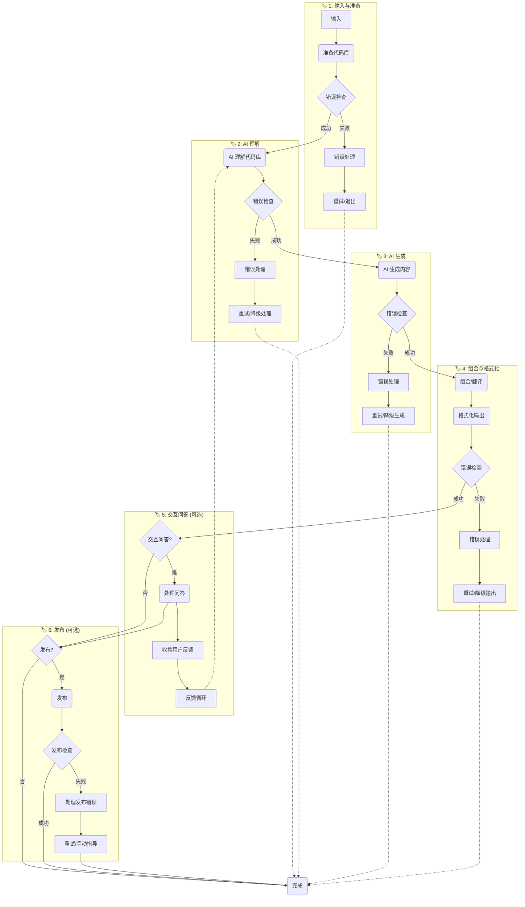

**分阶段详解**

#### `🏷️ 1`: 输入与代码库准备

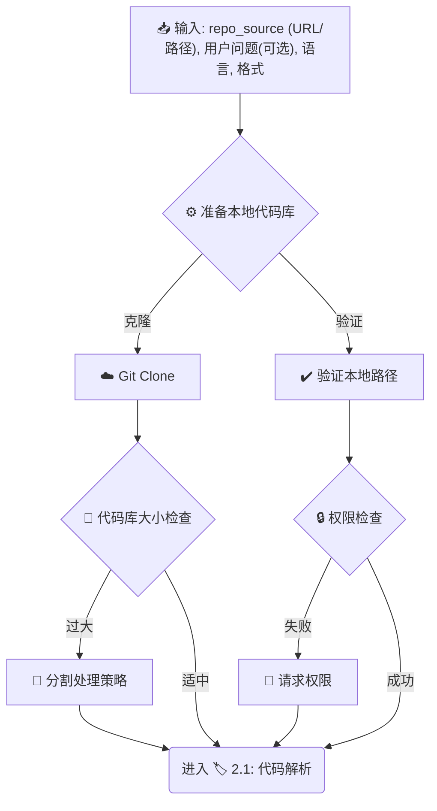

> _此阶段确保我们有一个有效的本地代码库路径 (`local_repo_path`) 供后续使用，并处理大型代码库和权限问题。_

#### `🏷️ 2`: 代码库 AI 理解

##### `🏷️ 2.1`: 代码解析 (并行)

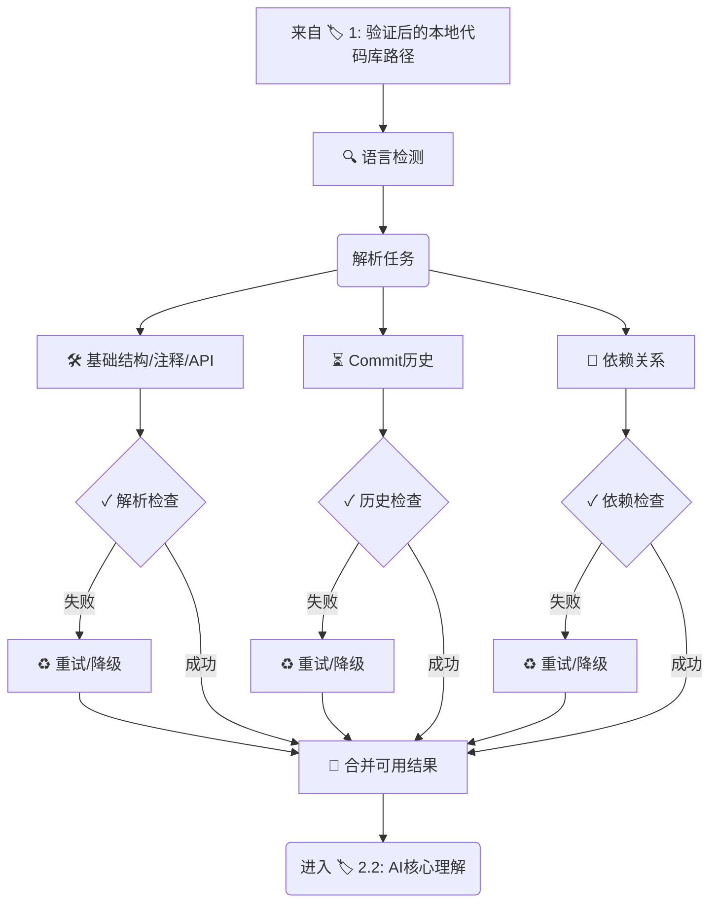

> _并行解析代码库，提取基础信息，包含错误处理和语言检测。_

##### `🏷️ 2.2`: AI 核心理解

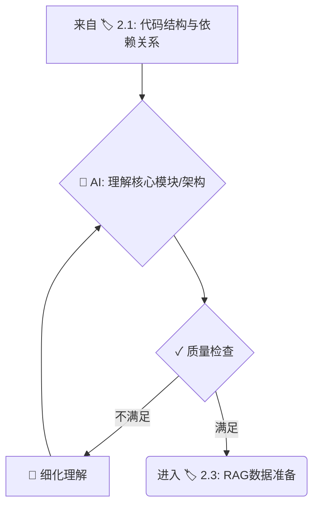

> _AI 基于解析结果进行核心理解，包含质量检查和迭代细化。_

##### `🏷️ 2.3`: RAG 数据准备

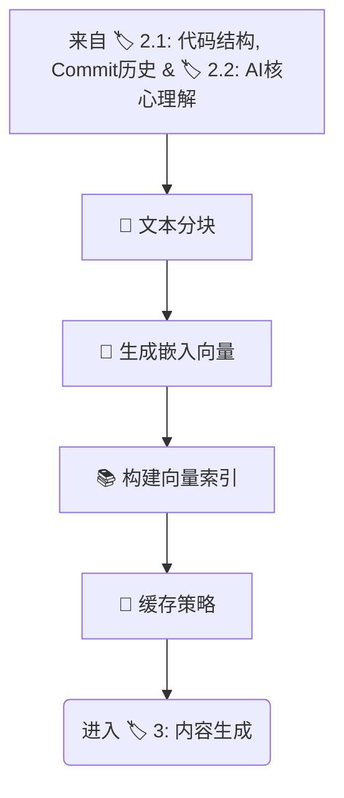

> _结合代码解析、历史信息和 AI 理解结果准备 RAG 数据，包含分块策略和缓存机制。_

#### `🏷️ 3`: AI 内容生成

##### `🏷️ 3.1`: 生成整体内容 (并行)

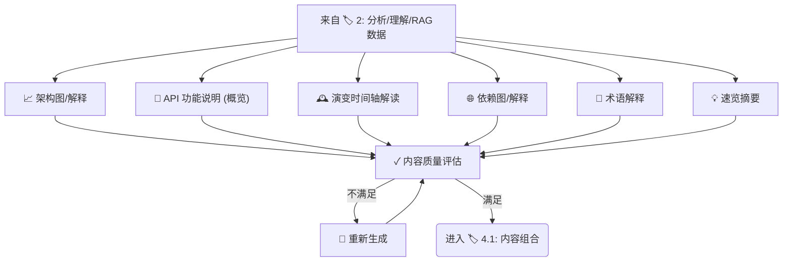

> _并行生成教程的整体性内容，包含质量评估和重新生成机制。_

##### `🏷️ 3.2`: 生成模块细节 (Batch/Loop)

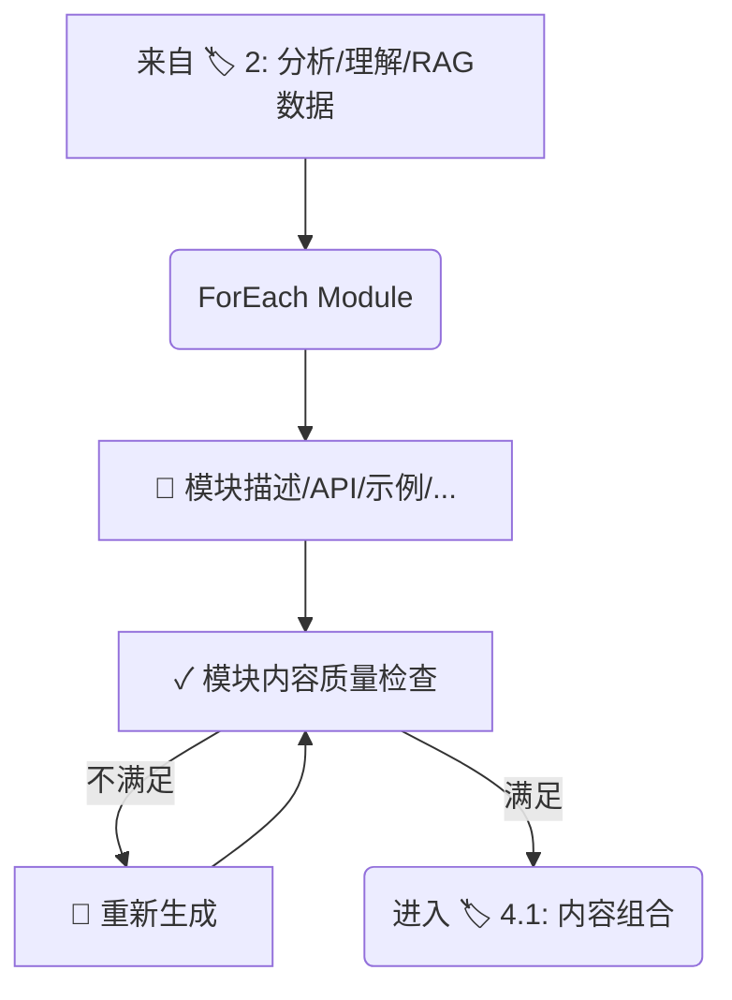

> _遍历核心模块，为每个模块生成详细信息，包含质量检查和重新生成机制。_

#### `🏷️ 4`: 组合、格式化与输出

##### `🏷️ 4.1`: 内容组合

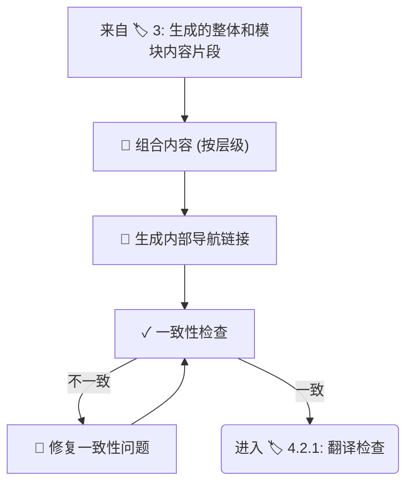

> _按层级顺序组合所有生成的内容，生成内部导航链接，并进行一致性检查。_

##### `🏷️ 4.2.1`: 翻译检查 (可选)

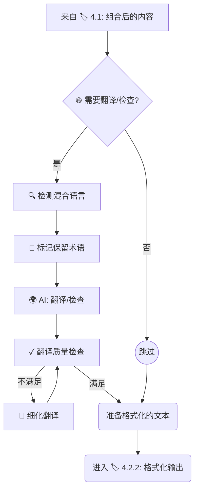

> _此子阶段处理可选的最终翻译检查，包含混合语言检测、术语保留和翻译质量评估。_

##### `🏷️ 4.2.2`: 格式化输出

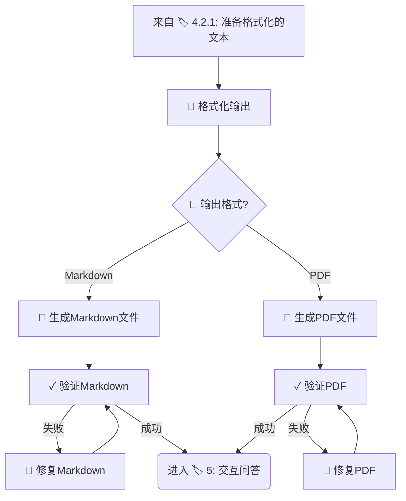

> _此子阶段根据用户选择的格式生成最终的输出文件，并验证输出质量。_

#### `🏷️ 5`: 处理交互式问答 (可选)

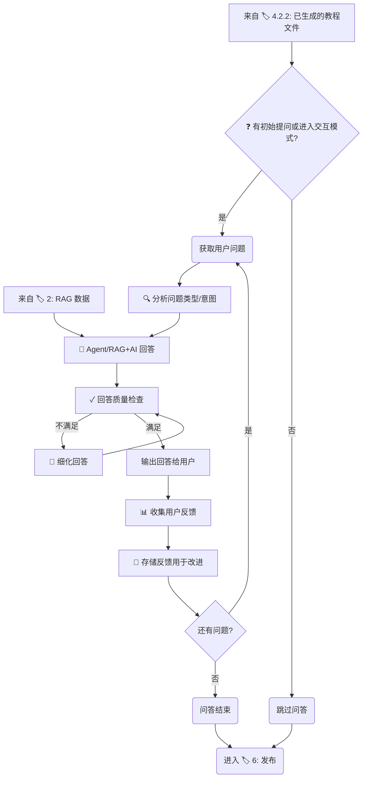

> _在生成主教程后，此可选阶段处理用户的交互式提问，包含问题分析、质量检查和用户反馈收集。_

#### `🏷️ 6`: 发布 (可选)

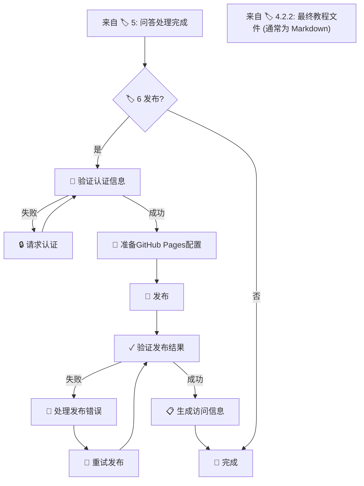

> _如果用户指定，将结果发布到平台，特别支持 GitHub Pages 配置，包含认证验证、发布验证和错误处理。_

## 🛠️ 工具函数 (Utility Functions)

> AI 提示:
>
> 1. 仔细回顾文档，理解工具函数的定义。
> 2. 仅包含流程中节点所必需的工具函数，强调 `call_llm` 的核心地位。

### 核心 AI 函数

1.  **`call_llm(prompt, context=None, task_type=None, target_language='en', retry_count=3, config=None)`** (`utils/llm_wrapper.py`) - **核心 🧠**
    - _输入_: 主要提示 (str), 上下文信息 (代码片段, 结构, 历史等) (str), 可选的任务类型标识 (str, 如 'summarize', 'explain_code', 'translate'), **目标语言 (str, 默认 'en')**, 重试次数 (int, 默认 3), 配置 (dict, 默认从环境变量加载)
    - _输出_: LLM 生成的文本 (str), 成功/失败状态 (bool), 元数据 (dict, 包含模型信息、延迟、token 使用等)
    - _必要性_: **驱动几乎所有的内容理解和生成任务**。需要在 prompt 中结合 target_language 指示 AI 输出语言，并强调不翻译代码/技术术语。
    - _错误处理_: 实现指数退避重试机制，处理 API 超时、限流等问题。记录详细错误日志。
    - _缓存机制_: 对相同或相似的提示实现本地缓存，避免重复调用，提高效率和降低成本。
    - _推荐实现_: **使用 `litellm` 库** 统一调用不同的 LLM API。
    - _默认支持的 LLM 提供商_:
      - **OpenRouter**: 提供多种模型访问，包括 Claude、Llama 等
      - **阿里百炼 (Alibaba Tongyi)**: 支持通义千问等模型
      - **火山引擎 (Volcengine)**: 支持火山方舟等模型
      - **硅基流动 (Moonshot AI)**: 支持 Moonshot 系列模型
      - 以及 OpenAI、Anthropic Claude 等常见模型
    - _配置加载_: 默认从环境变量加载配置，支持运行时覆盖。
    - _智能模型选择_: 根据任务类型和复杂度自动选择最合适的模型。
    - _模型回退链_: 定义模型回退顺序，当首选模型失败时自动尝试备选模型。

    ```python
    # 核心实现概要
    def call_llm(prompt, context=None, task_type=None, target_language='en', retry_count=3, config=None):
        """增强的 LLM 调用函数，支持智能模型选择和回退机制"""
        # 1. 加载配置
        # 2. 构建完整提示
        # 3. 检查缓存，如有则返回缓存结果
        # 4. 智能选择最适合任务的模型
        # 5. 准备模型回退链
        # 6. 尝试调用主模型，失败时尝试回退模型
        # 7. 实现重试机制和指数退避
        # 8. 记录性能指标和使用统计
        # 9. 缓存成功结果
        # 10. 返回生成内容、状态和元数据
    ```

2.  **`evaluate_llm_output(output, task_type, criteria=None, trace_id=None)`** (`utils/llm_evaluator.py`) - **质量保证**
    - _输入_: LLM 输出 (str), 任务类型 (str), 可选的评估标准 (dict), Langfuse 跟踪 ID (str, 可选)
    - _输出_: 质量评分 (float), 问题标记 (list), 改进建议 (str)
    - _必要性_: 评估 LLM 生成内容的质量，确保满足预期标准。
    - _实现建议_: 可使用规则基础检查或另一个 LLM 调用进行评估，并通过 Langfuse 记录评估结果。

    ```python
    # 核心实现概要
    def evaluate_llm_output(output, task_type, criteria=None, trace_id=None):
        """评估 LLM 输出质量，并记录到 Langfuse"""
        # 1. 加载配置
        # 2. 根据任务类型选择评估标准
        # 3. 执行评估（使用规则或另一个 LLM 调用）
        # 4. 如果启用了 Langfuse，记录评估结果
        # 5. 返回评分、问题列表和改进建议
    ```

3.  **`collect_user_feedback(content_id, feedback_type, rating, comment=None, trace_id=None)`** (`utils/feedback_collector.py`) - **用户反馈**
    - _输入_: 内容 ID (str), 反馈类型 (str), 评分 (float), 评论 (str, 可选), Langfuse 跟踪 ID (str, 可选)
    - _输出_: 反馈 ID (str), 成功/失败状态 (bool)
    - _必要性_: 收集用户对生成内容的反馈，用于改进系统。
    - _实现建议_: 使用 Langfuse 记录用户反馈，并存储到本地数据库。

    ```python
    # 核心实现概要
    def collect_user_feedback(content_id, feedback_type, rating, comment=None, trace_id=None):
        """收集用户反馈并记录到 Langfuse"""
        # 1. 生成唯一的反馈 ID
        # 2. 准备反馈数据（ID、内容ID、类型、评分、评论等）
        # 3. 保存反馈到本地数据库
        # 4. 如果启用了 Langfuse，记录反馈到 Langfuse
        # 5. 返回反馈 ID 和操作成功状态
    ```

### 代码分析函数

4.  **`parse_code(code_path, language=None, max_file_size=10*1024*1024)`** (`utils/code_parser.py`) - **AI 输入提供者**
    - _输入_: 代码文件或目录路径 (str), 编程语言 (str, 可选自动检测), 最大文件大小限制 (int)
    - _输出_: 代码基础结构 (AST, 函数/类签名, 原始注释) (dict/object), 依赖关系 (dict)
    - _必要性_: 为 `call_llm` 提供准确、结构化的代码上下文。
    - _错误处理_: 处理不支持的语言、过大文件、解析错误等情况，提供降级解析选项。
    - _语言支持_: 实现对多种常见编程语言的支持，包括混合语言项目的处理策略。

5.  **`detect_programming_language(file_path)`** (`utils/code_parser.py`)
    - _输入_: 文件路径 (str)
    - _输出_: 检测到的编程语言 (str), 置信度 (float)
    - _必要性_: 自动识别代码文件的编程语言，支持混合语言项目。
    - _实现建议_: 结合文件扩展名、shebang 行和内容特征进行检测。

6.  **`analyze_code_size(repo_path)`** (`utils/code_parser.py`)
    - _输入_: 代码库路径 (str)
    - _输出_: 代码库大小统计 (dict)，包含总大小、文件数、各语言代码行数等
    - _必要性_: 评估代码库规模，决定是否需要分割处理。
    - _实现建议_: 使用文件系统操作和简单的代码行计数。

### Git 相关函数

7.  **`get_commit_history(repo_path, max_commits=1000, filter_criteria=None)`** (`utils/git_utils.py`) - **AI 输入提供者**
    - _输入_: 本地仓库路径 (str), 最大提交数 (int), 过滤条件 (dict)
    - _输出_: Commit 历史列表 (list of dicts)
    - _必要性_: 为 `call_llm` 提供代码演变历史上下文。
    - _错误处理_: 处理 Git 操作失败、空仓库等情况。
    - _优化_: 实现智能过滤，只提取关键的架构变更提交。

8.  **`git_clone(repo_url, local_path, depth=None, branch=None, auth=None, use_cache=True, cache_ttl=86400)`** (`utils/git_utils.py`)
    - _输入_: 仓库 URL (str), 本地目标路径 (str), 克隆深度 (int), 分支 (str), 认证信息 (dict), 是否使用缓存 (bool), 缓存有效期 (int, 秒)
    - _输出_: 克隆是否成功 (bool), 详细信息 (dict), 是否使用了缓存 (bool)
    - _必要性_: 从远程 URL 获取代码库。
    - _错误处理_: 处理网络问题、认证失败、权限问题等。
    - _安全性_: 安全处理认证信息，支持多种认证方式。
    - _缓存机制_: 默认启用24小时缓存，避免重复下载相同仓库。

    ```python
    # 核心实现概要
    def git_clone(repo_url, local_path, depth=None, branch=None, auth=None,
                 use_cache=True, cache_ttl=None):
        """克隆或使用缓存的Git仓库"""
        # 1. 从环境变量获取缓存配置（有效期、缓存目录等）
        # 2. 生成仓库唯一标识（用于缓存）
        # 3. 检查缓存是否存在且有效
        #    - 如果有效，直接从缓存复制到目标路径并返回
        # 4. 准备克隆参数（深度、分支等）
        # 5. 处理认证信息（令牌或用户名密码）
        # 6. 执行 Git 克隆操作
        # 7. 如果启用缓存，更新缓存
        # 8. 返回操作结果（成功状态、路径、是否使用缓存等）
    ```

### 可视化函数

9.  **`generate_mermaid(data, type, theme=None, config=None)`** (`utils/viz_generator.py`)
    - _输入_: 结构化数据 (dict/list), 图表类型 ('flowchart', 'graph' 等) (str), 主题 (str), 配置 (dict)
    - _输出_: Mermaid 语法的字符串 (str)
    - _必要性_: 生成架构图、依赖关系图等可视化内容。
    - _错误处理_: 处理复杂或无效的输入数据。
    - _增强_: 支持多种图表类型和自定义样式。

### RAG 相关函数

10.  **`chunk_text(text, chunk_size=1000, overlap=200, smart_chunking=True)`** (`utils/rag_utils.py`)
    - _输入_: 文本 (str), 块大小 (int), 重叠大小 (int), 智能分块标志 (bool)
    - _输出_: 文本块列表 (list of str)
    - _必要性_: 将代码和文档分割成适合嵌入和检索的块。
    - _智能分块_: 如果启用，尊重代码和文档的自然边界（如函数、类、段落）。

11. **`get_embedding(text, model='default', batch=False)`** (`utils/embedding.py`)
    - _输入_: 文本 (str 或 list of str), 模型名称 (str), 批处理标志 (bool)
    - _输出_: 文本的向量表示 (list of float 或 list of list of float)
    - _必要性_: 用于 RAG 中的文本嵌入，以便进行相似度搜索。
    - _错误处理_: 处理 API 错误、超长文本等情况。
    - _批处理_: 支持批量处理多个文本，提高效率。

12. **`vector_search(query_embedding, index, top_k=5, similarity_threshold=0.7)`** (`utils/vector_db.py`)
    - _输入_: 查询向量 (list of float), 向量索引 (object), 返回数量 (int), 相似度阈值 (float)
    - _输出_: 最相似的文档片段 ID 和相似度 (list of tuples)
    - _必要性_: 用于 RAG 中根据用户问题检索相关代码或文档片段。
    - _过滤_: 根据相似度阈值过滤结果，确保只返回相关内容。

13. **`create_vector_index(embeddings, metadata=None, index_type='flat')`** (`utils/vector_db.py`)
    - _输入_: 嵌入向量列表 (list of list of float), 元数据 (list of dict), 索引类型 (str)
    - _输出_: 向量索引对象 (object)
    - _必要性_: 构建 RAG 所需的向量数据库索引。
    - _索引类型_: 支持多种索引类型，如平面索引、HNSW 等，根据数据规模选择合适的类型。
    - _持久化_: 支持索引的保存和加载，避免重复构建。

### 格式化与发布函数

14. **`split_content_into_files(content_dict, output_dir, file_structure=None, repo_structure=None, justdoc_compatible=True)`** (`utils/formatter.py`)
    - _输入_: 包含教程各部分内容的字典 (dict), 输出目录 (str), 文件结构配置 (dict), 代码仓库结构 (dict), 是否生成 JustDoc 兼容文档 (bool)
    - _输出_: 生成的文件路径列表 (list of str)
    - _必要性_: 将生成的内容拆分为多个 Markdown 文件，便于导航和阅读。
    - _文件结构_: 采用概览-模块方式组织文件，文件放置在与代码仓库结构对应的目录中。
    - _JustDoc 命名约定_:
      - 使用 `index.md` 作为目录索引文件
      - 目录和文件名使用小写字母
      - 多单词名称使用连字符（-）分隔，而非下划线
      - 每个文件包含 JustDoc 兼容的元数据（title, category, order 等）
    - _文档放置_: 生成的文档统一放置到代码仓库对应的目录结构中，与源代码保持一致，便于查找和通过 JustDoc 输出线上文档。
    - _路径映射实现_:
      ```python
      def map_module_to_docs_path(module_name, repo_structure):
          """将模块名映射到文档路径，符合 JustDoc 命名约定"""
          # 1. 查找模块在代码仓库中的位置
          # 2. 将源代码路径转换为文档路径
          # 3. 处理特殊情况（如找不到对应路径）
          # 4. 将下划线转换为连字符，符合 JustDoc 命名约定
          # 5. 返回完整的文档路径
      ```
    - _文件结构示例_:
      ```python
      # 文件结构示例 - 符合 JustDoc 的命名约定
      default_structure = {
          # 概览文件固定位置
          "README.md": {"title": "项目概览", "sections": ["introduction", "quick_look"]},
          "docs/index.md": {"title": "文档首页", "sections": ["introduction", "navigation"]},
          "docs/overview.md": {"title": "系统架构", "sections": ["overall_architecture", "core_modules_summary"]},
          "docs/glossary.md": {"title": "术语表", "sections": ["glossary"]},
          "docs/evolution.md": {"title": "演变历史", "sections": ["evolution_narrative"]},

          # 模块文档放置在与代码仓库结构对应的目录中，使用 JustDoc 兼容的命名
          "docs/{module_dir}/{module_file}.md": {"title": "{module_title}", "sections": ["description", "api", "examples"]}
      }

      # 模块文件生成示例 - 符合 JustDoc 命名约定
      # 源代码: src/auth/service.py -> 文档: docs/auth/service.md
      # 源代码: src/data_processor/main.py -> 文档: docs/data-processor/main.md
      # 源代码: utils/helpers/string_utils.py -> 文档: docs/utils/helpers/string-utils.md
      # ├── overview.md            # 系统架构概览
      # ├── auth/                  # 与源码目录结构对应
      # │   ├── index.md           # 模块索引页
      # │   ├── service.md         # 具体服务文档
      # │   └── models.md          # 模型文档
      # ├── data-processor/        # 注意使用连字符而非下划线
      # │   ├── index.md           # 模块索引页
      # │   └── main.md            # 主要功能文档
      # └── utils/
      #     ├── index.md           # 工具模块索引
      #     └── helpers/
      #         ├── index.md       # 辅助工具索引
      #         └── string-utils.md # 字符串工具文档

      # 代码仓库结构示例
      repo_structure = {
          "auth_service": {
              "path": "src/auth/service.py",
              "type": "class"
          },
          "data_processor": {
              "path": "src/data/processor.py",
              "type": "class"
          },
          "helpers": {
              "path": "utils/helpers.py",
              "type": "module"
          }
      }
      ```

15. **`generate_navigation_links(files_info, current_file, related_content=None)`** (`utils/formatter.py`)
    - _输入_: 文件信息列表 (list of dict), 当前文件路径 (str), 相关内容信息 (list of dict, 可选)
    - _输出_: 导航链接 HTML/Markdown 代码 (str)
    - _必要性_: 在多文件文档中生成导航链接，便于用户浏览。
    - _导航类型_: 包括上一页/下一页链接、目录链接、面包屑导航等。
    - _上下文相关_: 根据当前页面内容和相关模块，生成更加上下文相关的导航链接。
    - _功能概要_:
      - 找到当前文件在文件列表中的位置
      - 生成上一页/下一页导航链接
      - 生成目录链接
      - 根据相关内容生成上下文相关的导航
      - 返回格式化的导航链接HTML/Markdown
    - _Markdown 输出示例_:
      ```markdown
      <!-- 上下文相关导航链接 - 符合 JustDoc 命名约定 -->
      [← 系统架构](../overview.md) | [🏠 首页](../index.md) | [数据处理器 →](../data-processor/main.md)

      > 当前位置: [首页](../index.md) > [Auth 模块](index.md) > Service

      ### 相关内容

      **核心服务:** [认证服务](../auth/service.md), [用户管理](../auth/users.md)
      **依赖模块:** [数据存储](../storage/manager.md), [日志系统](../utils/logger.md)

      ---
      title: 认证服务
      category: Auth
      order: 2
      ---
      ```

16. **`create_code_links(code_references, repo_url=None, branch='main', context_text=None)`** (`utils/formatter.py`)
    - _输入_: 代码引用信息 (dict), 仓库 URL (str), 分支名 (str), 上下文文本 (str, 可选)
    - _输出_: 带有源码链接的代码引用 Markdown (str) 或嵌入了链接的上下文文本
    - _必要性_: 为代码引用创建直接链接到源代码的链接，便于用户查看完整代码。
    - _链接类型_: 支持 GitHub/GitLab 风格的源码链接，包括行号范围。
    - _嵌入模式_: 当提供上下文文本时，将模块和函数引用自然地嵌入到文本中，而非单独列出。
    - _功能概要_:
      - 构建基本的文件链接
      - 如果提供了行号，添加行号范围
      - 返回完整的GitHub源码链接
    - _标准模式 Markdown 输出_:
      ```markdown
      **格式化 Markdown 的核心函数** [查看源码](https://github.com/user/repo/blob/main/src/utils/formatter.py#L10-L20) | [查看详细文档](../utils/formatter.md#format-markdown)

      ```python
      def format_markdown(...):\n    ...
      ```

      > 此函数位于 `src/utils/formatter.py` 模块中，负责将生成的内容转换为格式化的 Markdown。

      <!-- JustDoc 兼容的代码引用元数据 -->
      ```yaml
      source:
        file: src/utils/formatter.py
        line_start: 10
        line_end: 20
      ```
      ```

    - _嵌入模式实现_:
      - 在内容中自然嵌入代码引用
      - 创建函数名和模块名到引用信息的映射
      - 分割内容为段落，逐段处理
      - 处理文本中的代码引用，将纯文本引用替换为链接
      - 合并处理后的段落并返回结果

17. **`generate_module_detail_page(module_name, module_info, related_modules, code_references, repo_url)`** (`utils/formatter.py`)
    - _输入_: 模块名称 (str), 模块信息 (dict), 相关模块列表 (list), 代码引用信息 (list), 仓库 URL (str)
    - _输出_: 模块详情页面的 Markdown 内容 (str)
    - _必要性_: 生成模块详情页面，将相关模块链接自然嵌入到文本中，使文档更加流畅。
    - _链接嵌入_: 在描述、API 文档和示例中自然嵌入相关模块和函数链接，而非单独列出。
    - _功能概要_:
      - 生成模块标题和基本信息
      - 生成模块描述，嵌入相关模块链接
      - 生成API文档，包含函数签名和说明
      - 生成代码示例和解释
      - 生成依赖关系说明
      - 返回完整的模块详情页面Markdown内容
    - _Markdown 输出示例_:
      ```markdown
      # 📦 String Utils

      ## 📋 概述

      [`string_utils`](../utils/string-utils.md) 模块提供了一系列字符串处理函数，用于在 [`formatter`](../utils/formatter.md) 模块中进行文本格式化。

      ## 🔌 API

      ### [`clean_text`](https://github.com/user/repo/blob/main/src/utils/string_utils.py#L10-L25)

      清理文本中的特殊字符和多余空白。

      ### [`format_code_block`](https://github.com/user/repo/blob/main/src/utils/string_utils.py#L28-L45)

      格式化代码块，确保正确的缩进和语法高亮。

      ## 💻 示例

      ### 🔍 示例 1

      ```python
      from utils.string_utils import clean_text

      text = "  多余的空格   和特殊\t字符\n\n"
      cleaned = clean_text(text)
      print(cleaned)  # 输出: "多余的空格 和特殊 字符"
      ```

      这个示例展示了如何使用 [`clean_text`](https://github.com/user/repo/blob/main/src/utils/string_utils.py#L10-L25) 函数清理文本中的多余空格和特殊字符。

      ## 🔗 依赖关系

      本模块被 [`formatter`](../utils/formatter.md) 模块依赖，用于处理文本格式化前的预处理工作。

      ---
      
      **相关模块:** [Formatter](../utils/formatter.md) | [Text Processor](../utils/text-processor.md)

17. **`format_markdown(content_dict, template=None, toc=True, nav_links=True, add_emojis=True)`** (`utils/formatter.py`)
    - _输入_: 包含教程各部分内容的字典 (dict), 模板 (str), 是否生成目录 (bool), 是否生成导航链接 (bool), 是否添加 emoji (bool)
    - _输出_: 格式化后的完整 Markdown 文本 (str), **包含内部导航链接和适用于 Web 文档（如 GitHub Pages）的结构**
    - _必要性_: 组合所有生成的内容并应用适合 GitHub Pages 等平台的 Markdown 格式。
    - _模板支持_: 允许使用自定义模板定制输出格式。
    - _验证_: 验证生成的 Markdown 是否符合规范，检查链接有效性。
    - _与多文件集成_: 与 `split_content_into_files` 和 `generate_navigation_links` 配合使用，生成完整的多文件文档。
    - _Emoji 支持_: 自动为标题添加适当的 emoji，使文档重点更加突出。
    - _功能概要_:
      - 根据内容字典和可选模板生成完整的Markdown文档
      - 可选生成目录和导航链接
      - 可选添加emoji图标增强可读性
      - 验证生成的Markdown是否符合规范
      - 返回格式化后的Markdown文本

18. **`convert_to_pdf(markdown_files, output_path, style=None, toc=True, cover_page=True)`** (`utils/formatter.py`)
    - _输入_: Markdown 文件路径列表 (list of str), 输出 PDF 路径 (str), 样式配置 (dict), 是否包含目录 (bool), 是否包含封面 (bool)
    - _输出_: PDF 文件路径 (str) 或二进制内容
    - _必要性_: 提供 PDF 格式的教程输出，支持多文件合并。
    - _样式定制_: 支持自定义 PDF 样式，如字体、颜色、页眉页脚等。
    - _错误处理_: 处理转换过程中的错误，如特殊字符、复杂表格等。
    - _多文件合并_: 将多个 Markdown 文件合并为单个 PDF，保持目录结构和内部链接。

19. **`publish_to_platform(content_dir, platform, target_repo, auth, config=None)`** (`utils/publisher.py`)
    - _输入_: 内容目录 (str), 平台 (str), 目标仓库信息 (str), 认证信息 (dict), 平台特定配置 (dict)
    - _输出_: 发布 URL 或成功状态 (str/bool), 详细信息 (dict)
    - _必要性_: 实现将教程自动发布到多种文档平台的功能。
    - _支持的平台_:
      - **GitHub Pages**: 配置和触发 GitHub Pages 构建
      - **GitLab Pages**: 支持 GitLab CI/CD 自动部署
      - **ReadTheDocs**: 集成 ReadTheDocs 文档托管
      - **Netlify**: 支持 Netlify 静态网站托管
      - **Vercel**: 支持 Vercel 部署
      - **Gitbook**: 支持发布到 Gitbook 平台
      - **Docsify**: 生成 Docsify 配置文件
      - **VuePress**: 生成 VuePress 配置文件
      - **MkDocs**: 生成 MkDocs 配置文件
      - **JustDoc**: 支持 JustDoc 文档系统
    - _错误处理_: 处理认证失败、权限问题、网络错误等情况。
    - _验证_: 发布后验证内容是否正确显示，链接是否有效。
    - _多文件支持_: 保持目录结构和文件间链接关系，确保发布后的导航正常工作。
    - _功能概要_:
      - 根据平台类型选择合适的发布策略
      - 验证认证信息和权限
      - 准备发布配置（如GitHub Pages配置）
      - 执行发布操作
      - 验证发布结果
      - 返回发布URL或状态信息

### 辅助函数

20. **`detect_natural_language(text)`** (`utils/language_utils.py`)
    - _输入_: 文本 (str)
    - _输出_: 检测到的自然语言 (str), 置信度 (float)
    - _必要性_: 检测注释、文档等中使用的自然语言，支持多语言处理。
    - _实现建议_: 使用语言检测库如 langdetect 或 fastText。

21. **`generate_visualization(data, vis_type, options=None)`** (`utils/visualizer.py`)
    - _输入_: 数据 (dict/list), 可视化类型 (str), 选项 (dict)
    - _输出_: 可视化代码 (str), 格式 (str)
    - _必要性_: 生成丰富的可视化图表，提高文档的可读性和理解性。
    - _支持的可视化类型_:
      - **架构图**: 使用 Mermaid 生成架构图
      - **依赖关系图**: 使用 Mermaid 或 D3.js 生成依赖关系图
      - **时序图**: 展示代码执行流程或系统交互
      - **状态图**: 展示状态转换和生命周期
      - **类图**: 展示类之间的关系
      - **流程图**: 展示算法或业务流程
      - **甘特图**: 展示项目时间线和里程碑
      - **交互式图表**: 使用 Plotly 或 Vega-Lite 生成交互式图表
    - _功能概要_:
      - 根据可视化类型选择合适的图表生成器
      - 处理输入数据，确保格式正确
      - 应用可选的样式和配置选项
      - 生成可视化代码（如Mermaid、PlantUML等）
      - 返回可视化代码和格式类型

22. **`extract_technical_terms(text, domain=None, language=None)`** (`utils/language_utils.py`)
    - _输入_: 文本 (str), 领域 (str), 语言 (str)
    - _输出_: 提取的技术术语列表 (list of str)
    - _必要性_: 识别需要在翻译过程中保留的技术术语。
    - _实现建议_: 结合规则和 NLP 技术识别专业术语。
    - _多语言支持_: 支持多种语言的术语识别，包括英文、中文等。
    - _功能概要_:
      - 自动检测文本语言（如果未指定）
      - 根据语言选择合适的术语提取规则
      - 应用领域特定的术语识别规则
      - 提取并返回技术术语列表

23. **`log_and_notify(message, level='info', notify=False)`** (`utils/logger.py`)
    - _输入_: 消息 (str), 日志级别 (str), 是否通知用户 (bool)
    - _输出_: 无
    - _必要性_: 统一的日志记录和用户通知机制。
    - _实现建议_: 使用标准日志库，结合用户界面通知功能。

24. **`parallel_process(items, process_func, max_workers=None, chunk_size=1, show_progress=True)`** (`utils/performance.py`)
    - _输入_: 待处理项列表 (list), 处理函数 (callable), 最大工作线程数 (int), 分块大小 (int), 是否显示进度 (bool)
    - _输出_: 处理结果列表 (list)
    - _必要性_: 提供高效的并行处理能力，加速大型代码库的分析和内容生成。
    - _实现建议_: 使用 `concurrent.futures` 库实现线程池或进程池。
    - _错误处理_: 捕获并记录单个项处理失败，不影响整体流程。
    - _进度跟踪_: 支持实时进度显示，提供 ETA 估计。
    - _功能概要_:
      - 设置合适的工作线程/进程数
      - 将项目列表分块处理
      - 使用线程池或进程池并行执行处理函数
      - 显示处理进度（如果启用）
      - 处理并记录错误，不中断整体流程
      - 返回处理结果列表

25. **`optimize_cache_strategy(cache_dir, ttl=86400, max_size_gb=5, priority_func=None)`** (`utils/cache_manager.py`)
    - _输入_: 缓存目录 (str), 缓存有效期 (int, 秒), 最大缓存大小 (float, GB), 优先级函数 (callable)
    - _输出_: 优化后的缓存统计信息 (dict)
    - _必要性_: 智能管理缓存，提高系统性能，避免重复计算和 API 调用。
    - _实现建议_: 使用 LRU (最近最少使用) 策略结合自定义优先级。
    - _缓存类型_: 支持多种缓存类型 (LLM 调用、嵌入向量、解析结果等)。
    - _功能概要_:
      - 扫描缓存目录，收集缓存项信息
      - 清理过期的缓存项
      - 如果缓存总大小超过限制，根据优先级删除低优先级项
      - 应用自定义优先级函数（如果提供）
      - 返回优化后的缓存统计信息

## 🧠 节点设计 (Node Design)

> AI 提示: 节点实现应力求**简洁高效**！

### 💾 共享内存 (Shared Memory)

> AI 提示: 尽量减少数据冗余，可增加 AI 中间结果字段。

共享内存结构组织如下:

```python
shared = {
    # 输入参数
    "repo_source": None,        # 统一的代码库来源 (URL 或本地路径) (str)
    "user_query": None,         # 用户交互式问题 (str, 可选)
    "target_language": "en",    # 目标教程语言 ('en', 'zh') (str)
    "output_format": "markdown", # 输出格式 ('markdown', 'pdf') (str)
    "publish_target": None,     # 发布目标平台 ('github', 'gitlab', None) (str)
    "publish_repo": None,       # 发布目标仓库信息 (str, 可选)
    "auth_info": None,          # 发布所需的认证信息 (dict/object, 可选)

    # 处理后的代码库路径和基本信息
    "local_repo_path": None,    # 经过处理和验证的本地代码库路径 (str)
    "repo_size_info": None,     # 代码库大小统计信息 (dict)
    "detected_languages": None, # 检测到的编程语言 {file_path: {"language": lang, "confidence": conf}}

    # 处理状态和错误跟踪
    "process_status": {
        "current_stage": None,  # 当前处理阶段 (str)
        "progress": 0.0,        # 总体进度 (float, 0.0-1.0)
        "stage_progress": {},   # 各阶段进度 {stage_name: progress_float}
        "errors": [],           # 错误记录 [{"stage": stage, "error": err, "timestamp": time}]
        "warnings": []          # 警告记录 [{"stage": stage, "warning": warn, "timestamp": time}]
    },

    # 分析阶段产出
    "code_structure": None,     # 解析: 基础代码结构 (AST, 签名, 原始注释)
    "dependencies": None,       # 解析: 文件/模块间依赖
    "raw_comments": None,       # 解析: 提取的原始注释
    "commit_history": None,     # 解析: Commit 历史记录
    "text_chunks": None,        # RAG: 文本块 (代码, 注释, 可能含 AI 摘要)
    "embeddings": None,         # RAG: 嵌入向量
    "vector_index": None,       # RAG: 向量索引
    "cache": {                  # 缓存数据
        "llm_calls": {},        # LLM 调用缓存 {hash(prompt+context): response}
        "embeddings": {},       # 嵌入缓存 {hash(text): embedding}
        "parsed_files": {}      # 解析缓存 {file_path: parsed_result}
    },

    # AI 分析/理解产出 (新增或整合)
    "ai_analysis": {
        "core_modules_explanation": None, # AI: 对核心模块的识别和解释
        "function_summaries": {},       # AI: (可选) 对关键函数的摘要 {func_id: summary}
        "overall_architecture_summary": None, # AI: 对整体架构的理解摘要
        "quality_metrics": {            # AI 生成内容的质量评估
            "architecture_understanding": None, # 架构理解质量评分 (float)
            "code_coverage": None,      # 代码覆盖率评分 (float)
            "explanation_clarity": None # 解释清晰度评分 (float)
        },
        "technical_terms": [],          # 识别的技术术语列表
        # ... 其他 AI 理解的中间结果
    },

    # AI 内容生成阶段产出 (更依赖 AI, 需体现层级结构)
    "generated_content": {
        # 整体部分
        "overall_architecture_diagram": None, # 可视化: Mermaid 架构图
        "overall_architecture_explanation": None,# AI: 对整体架构的解释
        "core_modules_summary": None,      # AI: 核心模块列表及职责概览
        "evolution_narrative": None, # AI: 对代码演变历史的解读和叙述
        "dependency_overview_graph": None, # 可视化: 顶层依赖图
        "dependency_overview_explanation": None,# AI: 对顶层依赖的解释
        "glossary": None,           # AI: 生成的术语解释
        "quick_look": None,         # AI: 生成的五分钟速览内容

        # 分模块细节 (例如，使用字典存储，键为模块名)
        "module_details": {
            # "module_name_A": {
            #    "description": "AI生成的模块详细描述",
            #    "api_description": "AI生成的该模块API说明",
            #    "code_examples": [{"snippet": "...", "explanation": "..."}],
            #    "internal_dependencies": "AI解释的模块内部依赖或与其他模块关系",
            #    "quality_score": 0.0  # 内容质量评分 (float, 0.0-1.0)
            # },
            # "module_name_B": { ... }
        },

        # 交互式问答结果
        "custom_answers": [],       # Agent/RAG + AI: 回答用户问题的结果
        "user_feedback": [],        # 用户对回答的反馈 [{"question_id": id, "rating": rating, "comment": comment}]
    },

    # 输出阶段产出
    "final_tutorial_markdown": None, # 最终组合和翻译后的 Markdown 文本 (str)
    "output_file_path": None,      # 生成的本地文件路径 (str)
    "publish_url": None,           # 发布后的 URL (str, 可选)
    "gh_pages_config": None,       # GitHub Pages 配置信息 (dict)
    "validation_results": {        # 输出验证结果
        "markdown_validation": None, # Markdown 验证结果 (dict)
        "link_validation": None,   # 链接验证结果 (dict)
        "publish_validation": None # 发布验证结果 (dict)
    }
}
```

### 📝 节点设计与实现阶段

#### 节点依赖关系图

下图展示了主要节点之间的依赖关系和数据流动：

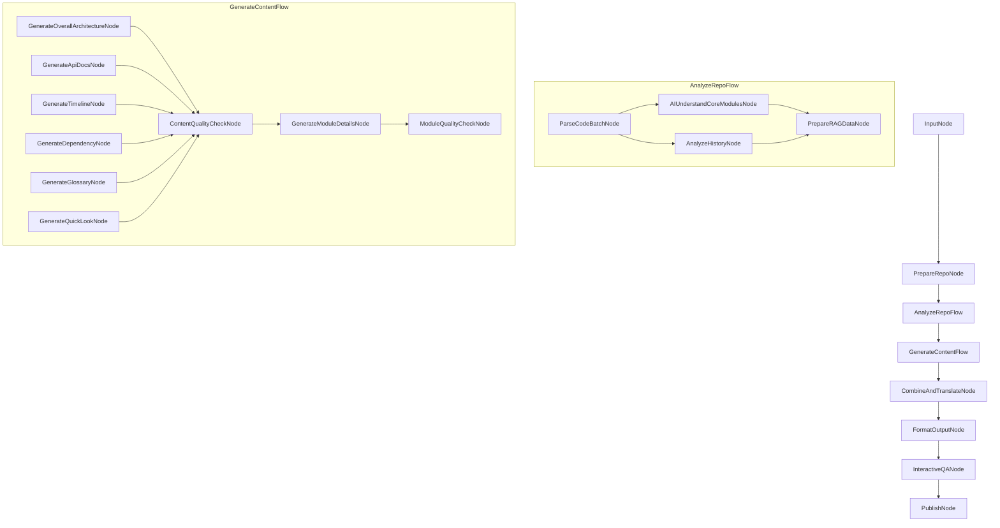

#### 节点阶段划分概览 (Node Allocation Overview)

下表概述了主要节点/流程在各流程阶段中的对应关系、错误处理策略和可扩展性设计：

| 节点/流程 (Node/Flow)           | 对应流程阶段 | 错误处理策略 | 可扩展性设计 |
| :------------------------------ | :------------ | :----------- | :----------- |
| `InputNode`                     | 🏷️ 1: 输入与准备 | 输入验证，提供默认值 | 支持自定义参数扩展 |
| `PrepareRepoNode`               | 🏷️ 1: 输入与准备 | 处理网络错误，权限问题 | 支持多种代码库来源 |
| `AnalyzeRepoFlow`               | 🏷️ 2: AI 理解 | 合并可用分析结果 | 模块化设计，支持新分析器 |
| ↳ `ParseCodeBatchNode`          | 🏷️ 2.1: 代码解析 | 降级解析，跳过问题文件 | 支持多种编程语言 |
| ↳ `AIUnderstandCoreModulesNode` | 🏷️ 2.2: AI 核心理解 | LLM 调用重试，结果验证 | 可配置理解深度，支持多语言 |
| ↳ `AnalyzeHistoryNode`          | 🏷️ 2.1: 代码解析 | 处理空仓库，历史截断 | 支持过滤和聚焦 |
| ↳ `PrepareRAGDataNode`          | 🏷️ 2.3: RAG 数据准备 | 处理大文件，优化分块 | 可配置索引类型和参数 |
| `GenerateContentFlow`           | 🏷️ 3: AI 生成 | 内容质量检查，重新生成 | 插件式内容生成器 |
| ↳ `GenerateOverallArchitectureNode` | 🏷️ 3.1: 生成整体内容 | 结构验证，降级生成 | 支持多种架构表示，增强可视化 |
| ↳ `GenerateApiDocsNode`         | 🏷️ 3.1: 生成整体内容 | API 提取失败处理 | 支持多种 API 风格 |
| ↳ `ContentQualityCheckNode`     | 🏷️ 3.1: 生成整体内容 | 质量评估反馈 | 可配置质量标准 |
| ↳ `GenerateModuleDetailsNode`   | 🏷️ 3.2: 生成模块细节 | 模块缺失处理 | 支持自定义模块模板 |
| ↳ `ModuleQualityCheckNode`      | 🏷️ 3.2: 生成模块细节 | 质量评估反馈 | 可配置质量标准 |
| ↳ `GenerateTimelineNode`        | 🏷️ 3.1: 生成整体内容 | 历史数据不足处理 | 支持多种时间线格式 |
| ↳ `GenerateDependencyNode`      | 🏷️ 3.1: 生成整体内容 | 依赖分析失败处理 | 支持多种依赖图表示 |
| ↳ `GenerateGlossaryNode`        | 🏷️ 3.1: 生成整体内容 | 术语提取失败处理 | 支持领域特定术语 |
| ↳ `GenerateQuickLookNode`       | 🏷️ 3.1: 生成整体内容 | 内容不足处理 | 可配置概览深度 |
| `CombineAndTranslateNode`       | 🏷️ 4.1: 内容组合 & 4.2.1: 翻译检查 | 内容缺失处理，翻译错误 | 支持多语言和自定义模板，增强术语处理 |
| `FormatOutputNode`              | 🏷️ 4.2.2: 格式化输出 | 格式转换错误处理 | 支持多种输出格式 |
| `InteractiveQANode`             | 🏷️ 5: 交互问答 | 问题理解失败，RAG 检索失败 | 支持多轮对话和反馈 |
| `PublishNode`                   | 🏷️ 6: 发布 | 认证失败，网络错误 | 支持多平台发布，包括 GitHub Pages、GitLab Pages、ReadTheDocs、Netlify、Vercel、Gitbook、Docsify、VuePress、MkDocs 和 JustDoc |

#### 核心节点详细设计

##### 1. `PrepareRepoNode`

- **目的**: 准备本地代码库，处理 URL 或本地路径，验证权限，分析代码库大小。
- **输入**: `shared["repo_source"]`
- **输出**: `shared["local_repo_path"]`, `shared["repo_size_info"]`
- **错误处理**:
  - 处理无效 URL/路径: 提供详细错误信息，建议修复步骤
  - 处理权限问题: 请求必要权限，提供替代方案
  - 处理超大代码库: 实现分割策略，或提供部分分析选项
- **实现要点**:
  - 使用 Pydantic 进行数据验证和类型检查
  - 支持多种输入源（URL、本地路径）
  - 实现缓存机制避免重复下载
  - 提供详细的错误信息和恢复建议

##### 2. `AIUnderstandCoreModulesNode`

- **目的**: 利用 AI 理解代码库的核心模块和整体架构。
- **输入**: `shared["code_structure"]`, `shared["dependencies"]`
- **输出**: `shared["ai_analysis"]["core_modules_explanation"]`, `shared["ai_analysis"]["overall_architecture_summary"]`
- **错误处理**:
  - 处理 LLM 调用失败: 实现重试机制，降级处理
  - 处理理解质量不佳: 实现质量评估和迭代细化
- **实现要点**:
  - 构建结构化的分析提示，包含代码结构和依赖关系
  - 使用 LLM 分析代码库架构和模块关系
  - 实现质量评估机制，确保分析结果的准确性
  - 提供降级处理策略，在 LLM 调用失败时生成基本理解

##### 3. `InteractiveQANode`

- **目的**: 处理用户的交互式问题，利用 RAG 和 AI 生成回答，支持多轮对话和个性化学习路径。
- **输入**: `shared["user_query"]`, `shared["vector_index"]`, `shared["text_chunks"]`, `shared["conversation_history"]`
- **输出**: `shared["generated_content"]["custom_answers"]`, `shared["conversation_history"]`
- **错误处理**:
  - 处理问题理解失败: 请求澄清，提供替代解释
  - 处理 RAG 检索失败: 使用备用上下文，基于已有理解生成回答
- **增强功能**:
  - 多轮对话历史: 保存完整对话上下文，支持后续相关问题
  - 主动澄清机制: 当用户问题不明确时主动请求澄清
  - 个性化学习路径: 基于用户问题和反馈生成定制化学习路径
  - 交互式文档导航: 允许通过对话方式导航和探索文档
- **实现要点**:
  - 从共享状态中获取用户查询、向量索引和文本块
  - 分析用户问题类型和意图
  - 使用RAG检索相关内容
  - 构建包含上下文的提示
  - 生成回答并提取后续问题建议

#### 可扩展性设计

系统设计遵循以下可扩展性原则：

1. **插件式架构**: 每个节点都可以被替换或扩展，只要遵循相同的接口。

2. **配置驱动**: 关键参数通过配置文件控制，无需修改代码即可调整行为。

3. **中间件支持**: 支持在节点间添加中间件，用于日志记录、性能监控、错误处理等。

4. **自定义钩子**: 在关键点提供钩子，允许用户注入自定义逻辑。

5. **模块化设计**: 功能被分解为独立模块，可以单独升级或替换。

## 🛡️ 全局错误处理与恢复框架 (Global Error Handling and Recovery Framework)

为确保系统在各种异常情况下的稳定性和可靠性，我们设计了一个全面的错误处理与恢复框架。该框架将错误分类并提供统一的处理机制，减少人工干预需求。

### 错误分类系统

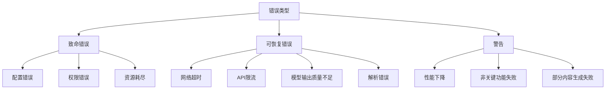

### 错误处理策略

| 错误类型 | 严重程度 | 处理策略 | 恢复机制 | 通知级别 |
|---------|---------|---------|---------|---------|
| **致命错误** | 高 | 停止流程，保存状态 | 需要人工干预 | 立即通知用户 |
| **可恢复错误** | 中 | 重试、降级处理 | 自动恢复或回退到备选方案 | 警告通知 |
| **警告** | 低 | 记录并继续 | 不需要恢复 | 日志记录 |

### 全局错误处理器设计

```python
# 全局错误处理器示例 (utils/error_handler.py)
class GlobalErrorHandler:
    """全局错误处理器，统一管理所有节点的错误处理逻辑"""

    def __init__(self, config=None):
        # 初始化错误处理器，设置配置和错误恢复策略
        pass

    def handle_error(self, error_type, error_info, node_name, shared_state):
        """处理错误并尝试恢复

        1. 记录错误信息
        2. 确定错误严重程度
        3. 根据严重程度采取不同处理策略
        4. 返回处理结果
        """
        pass

    def _determine_severity(self, error_type):
        """确定错误的严重程度

        将错误分为致命错误、可恢复错误和警告三类
        """
        pass

    def _handle_fatal_error(self, error_record, shared_state):
        """处理致命错误

        1. 保存当前状态检查点
        2. 通知用户
        3. 更新共享状态
        4. 返回错误信息
        """
        pass

    def _handle_recoverable_error(self, error_record, shared_state):
        """处理可恢复错误

        1. 查找适用的恢复策略
        2. 尝试恢复
        3. 更新错误记录和共享状态
        4. 通知用户恢复结果
        5. 返回恢复结果
        """
        pass

    def _handle_warning(self, error_record, shared_state):
        """处理警告

        1. 记录警告信息
        2. 通知用户
        3. 返回警告信息
        """
        pass

    # 具体恢复策略
    def _handle_network_timeout(self, error_record, shared_state):
        """处理网络超时，实现指数退避重试"""
        pass

    def _handle_rate_limit(self, error_record, shared_state):
        """处理API限流，等待一段时间后重试"""
        pass

    def _handle_low_quality(self, error_record, shared_state):
        """处理模型输出质量不足，尝试使用备用模型或调整提示"""
        pass

    def _handle_parsing_error(self, error_record, shared_state):
        """处理解析错误，尝试简化解析逻辑"""
        pass

    def _save_checkpoint(self, shared_state):
        """保存当前处理状态的检查点"""
        pass
```

### 错误报告与分析

系统将生成详细的错误报告，包含以下信息：

1. **错误摘要**：错误类型、发生位置、时间戳
2. **上下文信息**：错误发生时的系统状态和输入数据
3. **恢复尝试**：已尝试的恢复策略及其结果
4. **建议操作**：针对无法自动恢复的错误提供建议操作

错误报告将以结构化格式存储，便于后续分析和系统改进。

## 💻 Agentic 编码最佳实践 (Agentic Coding Best Practices)

本项目采用 Agentic 编码方法，由人类设计系统，AI Agent 实现代码。为确保高质量的协作成果，项目实现应遵循以下最佳实践：

### 人机协作模式

1. **明确职责分工**
   - 人类负责：高层设计决策、需求澄清、代码审查、质量把控
   - AI Agent 负责：代码实现、单元测试编写、文档生成、重构建议
   - 双方共同负责：问题排查、性能优化、安全审计

2. **迭代式开发流程**
   - 从小而简单的解决方案开始，逐步迭代完善
   - 每次迭代前明确目标和验收标准
   - 每次迭代后进行人类审查和反馈
   - 保持频繁沟通，及时解决疑问和阻碍

3. **设计先行原则**
   - 在实现前先完成高层设计文档 (`docs/design.md`)
   - 设计文档应包含系统架构、数据流、接口定义和关键算法
   - 设计应考虑可测试性、可扩展性和错误处理
   - 人类应审查并批准设计，再进入实现阶段

### 代码风格与组织

1. **一致的代码风格**
   - 遵循 [PEP 8](https://peps.python.org/pep-0008/) 编码规范
   - 使用 [Black](https://github.com/psf/black) 自动格式化代码
   - 使用 [isort](https://pycqa.github.io/isort/) 对导入进行排序
   - 使用 [flake8](https://flake8.pycqa.org/) 进行代码质量检查
   - 在项目根目录提供配置文件，确保 AI 和人类遵循相同标准

2. **代码长度约束**
   - 单文件代码行数：不超过 300 行（不含注释和空行）
   - 单个函数/方法行数：不超过 30 行
   - 单行长度：不超过 120 个字符（与 Black 默认设置一致）
   - 单个类行数：不超过 200 行
   - 单个节点类：不超过 100 行
   - 嵌套层级：不超过 2 层
   - 参数数量：函数参数不超过 5 个


3. **模块化设计**
   - 遵循 [PocketFlow](https://github.com/The-Pocket/PocketFlow) 的节点和流程设计模式
   - 每个节点应放在单独的文件中，相关节点组织在同一个包中
   - 遵循单一职责原则，每个节点只负责一项任务
   - 使用共享内存 (`shared`) 在节点间传递数据，避免全局变量

4. **命名约定**
   - 节点类名使用 `CamelCase` 并以 `Node` 或 `Flow` 结尾
   - 函数和变量名使用 `snake_case`
   - 常量使用 `UPPER_CASE_WITH_UNDERSCORES`
   - 私有方法和属性以单下划线开头 `_private_method`
   - 使用有意义的、描述性的名称，避免缩写

5. **文档与注释**
   - 所有节点类和公共方法必须有 docstring，遵循 [Google 风格](https://google.github.io/styleguide/pyguide.html#38-comments-and-docstrings)
   - 复杂逻辑需要添加注释说明
   - 每个节点应说明其输入、输出和副作用
   - 在 docstring 中包含参数类型、返回值和异常信息

### AI 与 LLM 调用最佳实践

1. **提示工程 (Prompt Engineering)**
   - 设计清晰、具体的提示模板，包含任务描述和期望输出格式
   - 提供足够的上下文信息，但避免不必要的冗余
   - 使用少量示例 (few-shot learning) 引导 LLM 生成符合预期的输出
   - 实现提示模板管理系统，便于集中维护和优化

2. **LLM 调用策略**
   - 实现重试机制，处理临时性 API 错误
   - 使用指数退避策略，避免频繁重试导致的限流
   - 实现结果缓存，避免重复调用相同或相似的提示
   - 设置超时和最大 token 限制，防止资源耗尽

   ```python
   from pydantic import BaseModel, Field
   from typing import Dict, List, Optional, Any, Union, Tuple
   from litellm import completion

   class LLMResponse(BaseModel):
       """LLM 响应模型"""
       content: str = Field(..., description="LLM 生成的内容")
       model: str = Field(..., description="使用的模型名称")
       provider: str = Field(..., description="使用的提供商")
       usage: Dict[str, int] = Field(default_factory=dict, description="令牌使用情况")
       finish_reason: Optional[str] = Field(None, description="生成结束原因")

   class LLMMetadata(BaseModel):
       """LLM 调用元数据"""
       provider: str = Field(..., description="使用的提供商")
       model: str = Field(..., description="使用的模型名称")
       timestamp: float = Field(..., description="调用时间戳")
       attempt: int = Field(1, description="尝试次数")
       fallback_used: bool = Field(False, description="是否使用了回退模型")
       from_cache: bool = Field(False, description="是否来自缓存")
       latency: float = Field(0.0, description="调用延迟（秒）")
       error: Optional[str] = Field(None, description="错误信息")

   def call_llm(
       prompt: str,
       context: Optional[str] = None,
       task_type: Optional[str] = None,
       target_language: str = 'en',
       retry_count: int = 3,
       config: Optional[Dict[str, Any]] = None
   ) -> Tuple[Optional[str], bool, Dict[str, Any]]:
       """增强的 LLM 调用函数，支持智能模型选择和回退机制

       1. 加载配置
       2. 构建完整提示
       3. 检查缓存，如有则返回缓存结果
       4. 智能选择最适合任务的模型
       5. 准备模型回退链
       6. 尝试调用主模型，失败时尝试回退模型
       7. 实现重试机制和指数退避
       8. 缓存成功结果
       9. 返回生成内容、状态和元数据
       """
       pass
   ```

3. **输出解析与验证**
   - 定义清晰的输出格式（如 JSON 结构）
   - 实现健壮的解析逻辑，处理格式不符合预期的情况
   - 对 LLM 输出进行验证，确保符合业务规则和数据格式
   - 实现降级策略，在解析失败时提供备选处理方案

   ```python
   def _build_prompt(
       prompt: str,
       context: Optional[str] = None,
       task_type: Optional[str] = None,
       target_language: str = 'en'
   ) -> str:
       """构建完整的提示

       1. 根据任务类型添加特定指令
       2. 添加目标语言指令
       3. 组合提示、上下文和问题
       4. 返回完整的提示字符串
       """
       pass

   def _select_model_for_task(task_type: Optional[str], config: Dict[str, Any]) -> Dict[str, str]:
       """根据任务类型选择最合适的模型

       1. 定义默认模型
       2. 建立任务类型到模型的映射
       3. 根据任务类型选择合适的模型
       4. 返回包含提供商和模型的字典
       """
       pass

   def _prepare_fallback_models(
       primary_provider: str,
       primary_model: str,
       config: Dict[str, Any]
   ) -> List[Dict[str, str]]:
       """准备模型回退链

       1. 创建回退模型列表
       2. 添加各种提供商的备选模型
       3. 确保不添加与主模型相同的模型
       4. 返回回退模型列表
       """
       pass

   def _get_temperature(task_type: Optional[str]) -> float:
       """根据任务类型获取温度参数

       1. 定义低温度任务（需要确定性和准确性）
       2. 定义高温度任务（需要创造性）
       3. 根据任务类型返回合适的温度值
       """
       pass

   def _parse_model_string(model_string: str) -> Tuple[str, str]:
       """解析模型字符串

       1. 解析格式为 "provider/model" 的模型字符串
       2. 如果没有提供商前缀，使用默认提供商
       3. 返回 (provider, model) 元组
       """
       pass

   def _generate_cache_key(prompt: str) -> str:
       """生成缓存键

       1. 使用哈希算法生成提示字符串的唯一标识
       2. 返回缓存键
       """
       pass

   def _validate_response(response: str, task_type: Optional[str]) -> bool:
       """验证 LLM 响应

       1. 检查响应是否为空
       2. 进行基本验证（如长度检查）
       3. 根据任务类型进行特定验证
       4. 返回响应是否有效
       """
       pass
   ```

4. **成本与性能优化**
   - 优先使用较小模型处理简单任务，仅在必要时使用高级模型
   - 实现批处理机制，合并多个相似请求
   - 使用嵌入和向量检索减少 LLM 上下文长度
   - 监控和记录 API 调用成本，设置预算警报

   ```python
   # 缓存管理函数
   def get_from_cache(cache_key: str) -> Optional[Dict[str, Any]]:
       """从缓存中获取结果

       1. 根据缓存键构建缓存文件路径
       2. 检查缓存文件是否存在
       3. 检查缓存是否过期
       4. 读取并返回缓存内容
       """
       pass

   def save_to_cache(cache_key: str, data: Dict[str, Any]) -> bool:
       """保存结果到缓存

       1. 检查是否启用缓存
       2. 创建缓存目录（如果不存在）
       3. 将数据序列化并写入缓存文件
       4. 返回操作是否成功
       """
       pass

   def log_and_notify(message: str, level: str = "info", notify: bool = False) -> None:
       """记录日志并可选择通知用户

       1. 配置日志记录器
       2. 根据级别记录日志
       3. 如果需要，通知用户（如显示通知、发送邮件等）
       """
       pass
   ```

### 错误处理与日志

1. **异常处理**
   - 创建自定义异常层次结构，区分不同类型的错误
   - 在节点的 `exec` 方法中捕获并处理异常，返回结构化的错误信息
   - 在 `post` 方法中更新 `shared["process_status"]["errors"]`
   - 实现降级策略，在关键功能失败时提供备选方案

2. **日志记录**
   - 使用 `log_and_notify` 工具函数统一日志记录
   - 记录每个节点的开始、完成和失败事件
   - 记录关键决策点和重要参数值
   - 对敏感信息进行脱敏处理后再记录

3. **状态跟踪**
   - 在 `shared["process_status"]` 中维护当前处理阶段和进度
   - 记录警告和错误，包含时间戳和上下文信息
   - 实现状态查询接口，便于监控和调试
   - 提供处理历史记录，用于审计和问题排查

### 测试与质量保证

1. **测试驱动开发**
   - 先编写测试，再实现功能
   - 为每个节点编写单元测试，验证其行为
   - 使用 mock 对象模拟外部依赖和 LLM 调用
   - 编写集成测试验证节点间的交互

2. **AI 生成内容质量评估**
   - 实现自动评估机制，检查生成内容的质量
   - 定义明确的质量标准和评分规则
   - 收集用户反馈，持续改进生成质量
   - 建立质量基准，监控质量变化趋势

3. **持续集成**
   - 配置 GitHub Actions 自动运行测试
   - 包含代码风格检查、类型检查和安全扫描
   - 生成测试覆盖率报告
   - 自动化部署测试环境

### 安全与伦理考虑

1. **数据安全**
   - 敏感信息（如 LLM API 密钥、配置）通过环境变量提供，不在代码或配置文件中硬编码
   - 实现环境变量加载机制，支持 `.env` 文件和系统环境变量
   - 实现输入验证，防止注入攻击
   - 限制 LLM 访问敏感信息的能力
   - 实现数据脱敏机制，保护用户隐私

   ```python
   # 环境变量处理示例 (utils/env_manager.py)
   import os
   from dotenv import load_dotenv
   from typing import Dict, Any, Optional

   # 加载环境变量
   def load_env_vars(env_file: Optional[str] = None) -> None:
       """加载环境变量，优先从指定的 .env 文件加载，然后从系统环境变量加载"""
       # 实现从 .env 文件或系统环境变量加载配置的逻辑

   # 获取 LLM 配置
   def get_llm_config() -> Dict[str, Any]:
       """从环境变量获取 LLM 配置"""
       # 从环境变量中读取 LLM 相关配置
       # 设置默认值并进行必要的类型转换
       # 验证必要的配置（如 API 密钥）
       # 返回配置字典
   ```

2. **AI 伦理准则**
   - 确保生成内容不包含有害、歧视或不适当的内容
   - 实现内容过滤机制，检测并移除不当内容
   - 明确标识 AI 生成的内容，避免误导
   - 提供反馈机制，允许用户报告问题

3. **版权与许可**
   - 尊重原始代码的版权和许可
   - 在生成的文档中引用原始代码来源
   - 确保生成内容的许可与原始代码兼容
   - 提供明确的使用条款和限制

### 版本控制与协作

1. **Git 工作流**
   - 采用 [GitHub Flow](https://guides.github.com/introduction/flow/)
   - 功能开发在特性分支进行
   - 通过 Pull Request 提交代码，进行人类审查
   - 提交信息遵循 [约定式提交](https://www.conventionalcommits.org/)

2. **人机协作审查**
   - 人类审查 AI 生成的代码，确保质量和安全
   - AI 辅助人类审查，检查常见问题和最佳实践
   - 建立审查清单，确保一致性
   - 记录审查意见和修改历史

3. **知识共享与文档**
   - 维护设计决策记录 (ADR)，记录重要决策及其理由
   - 生成并维护 API 文档和用户指南
   - 提供示例和教程，帮助用户理解和使用
   - 建立常见问题解答 (FAQ)，解决用户疑问

## 🔧 技术栈约束 (Technology Stack Constraints)

为确保项目的一致性、可维护性和高效开发，本项目采用以下技术栈约束：

### Pydantic 数据模型

使用 Pydantic 进行数据验证和类型检查，确保配置、API 请求/响应和节点输入/输出的正确性：

```python
# 核心数据模型示例
from pydantic import BaseModel, Field, validator
from typing import List, Dict, Optional, Union, Literal
from enum import Enum
from datetime import datetime

# 枚举类型示例
class LLMProvider(str, Enum):
    OPENAI = "openai"
    OPENROUTER = "openrouter"
    ALIBABA = "alibaba"
    # 其他提供商...

# 配置模型示例
class LLMConfig(BaseModel):
    """LLM 配置模型"""
    provider: LLMProvider
    model: str
    api_key: str = Field(..., description="API 密钥")
    max_tokens: int = Field(4000, ge=1, le=32000)
    # 其他配置字段...

# 节点输入/输出模型示例
class NodeInput(BaseModel):
    """节点输入基类"""
    pass

class NodeOutput(BaseModel):
    """节点输出基类"""
    success: bool
    error: Optional[str] = None

# API 请求/响应模型示例
class GenerateDocRequest(BaseModel):
    """生成文档请求"""
    repo_url: str
    target_language: str = "zh"
    output_format: Literal["markdown", "pdf"] = "markdown"
    include_sections: List[str] = ["overview", "architecture", "modules", "examples"]
```

这个示例展示了如何使用 Pydantic 定义各种数据模型，包括：

1. **配置模型**：用于验证和处理应用配置
2. **节点输入/输出模型**：确保节点间数据传递的正确性
3. **API 请求/响应模型**：验证 API 接口的输入和输出

Pydantic 提供了强大的数据验证功能，包括：
- 类型检查和转换
- 字段验证（范围、格式等）
- 自定义验证器
- 从环境变量加载配置
- 模型继承和组合

使用 Pydantic 可以大大减少运行时错误，提高代码的健壮性和可维护性。

### 开发环境

1. **Python 版本**
   - 使用 Python 3.10 或更高版本
   - 确保所有依赖兼容此版本

2. **虚拟环境管理**
   - 使用 [uv](https://github.com/astral-sh/uv) 管理虚拟环境和依赖
   - 使用以下命令创建和管理环境：

   ```bash
   # 安装 uv
   curl -LsSf https://astral.sh/uv/install.sh | sh

   # 创建虚拟环境
   uv venv

   # 激活虚拟环境
   source .venv/bin/activate  # Linux/macOS
   .venv\Scripts\activate     # Windows

   # 安装依赖
   uv pip install -e .        # 开发模式安装项目
   uv pip install -r requirements.txt  # 从锁定文件安装

   # 生成锁定版本的 requirements.txt
   uv pip compile pyproject.toml -o requirements.txt
   ```

3. **依赖管理**
   - 使用 `pyproject.toml` 作为主要依赖声明文件
   - 使用 `uv pip compile` 生成锁定版本的 `requirements.txt`
   - 明确指定依赖的版本范围，避免自动升级到不兼容版本

### 技术实现约束

1. **技术栈简化原则**
   - 优先使用现有技术栈实现功能，避免引入冗余技术
   - 不引入额外库实现当前技术栈已能实现的功能
   - 减少依赖数量，降低维护成本和潜在兼容性问题
   - 遵循"最小依赖原则"，只引入必要的外部库

2. **统一接口使用**
   - 使用 LiteLLM 统一管理与大模型的交互，不直接引入 OpenAI、Anthropic 等特定提供商的 SDK
   - 使用 Langfuse 统一处理可观测性和追踪，不引入其他监控工具
   - 使用 Pydantic 统一处理数据验证，不引入其他验证库

3. **技术选择标准**
   - 功能完备性：能够满足核心需求
   - 维护活跃度：有持续更新和社区支持
   - 兼容性：与现有技术栈良好集成
   - 性能：在资源消耗和执行效率间取得平衡
   - 文档质量：有完善的文档和示例

### 核心依赖

1. **LLM 集成**
   - 使用 [LiteLLM](https://github.com/BerriAI/litellm) (^0.12.0) 统一调用不同的 LLM API
   - 支持 OpenAI, Anthropic, Gemini 等主流 LLM 提供商
   - 简化多模型供应商集成，提供统一的接口和错误处理
   - **约束**: 不直接引入 OpenAI、Anthropic 等特定提供商的 SDK，所有 LLM 调用必须通过 LiteLLM 进行

2. **LLM 可观测性与追踪**
   - 使用 [Langfuse](https://github.com/langfuse/langfuse) (^2.0.0) 进行 LLM 应用的可观测性和追踪
   - 支持记录 LLM 调用、评估生成质量和性能监控
   - 提供详细的调用历史、token 使用统计和成本分析
   - 支持用户反馈收集和模型性能评估
   - **约束**: 不引入其他监控或日志工具进行 LLM 调用追踪

3. **代码分析**
   - 使用 [tree-sitter](https://github.com/tree-sitter/py-tree-sitter) (^0.20.1) 进行代码解析
   - 使用 [GitPython](https://github.com/gitpython-developers/GitPython) (^3.1.40) 处理 Git 仓库和历史
   - **约束**: 不使用其他代码解析库或Git操作库，避免功能重复

4. **向量检索**
   - 使用 [FAISS](https://github.com/facebookresearch/faiss) (^1.7.4) 进行向量索引和检索
   - 使用 [sentence-transformers](https://github.com/UKPLab/sentence-transformers) (^2.2.2) 生成文本嵌入
   - **约束**: 不引入其他向量数据库或嵌入模型库，充分利用FAISS的高性能特性

5. **数据验证与类型检查**
   - 使用 [Pydantic](https://docs.pydantic.dev/) (^2.5.0) 进行数据验证和类型检查
   - 支持配置模型、API 请求/响应模型和节点输入/输出验证
   - **约束**: 不使用其他数据验证库，统一使用Pydantic进行所有数据验证和类型检查

6. **文档生成**
   - 使用 [Markdown](https://python-markdown.github.io/) (^3.5) 处理 Markdown 文本
   - 使用 [WeasyPrint](https://weasyprint.org/) (^60.1) 将 Markdown 转换为 PDF
   - **约束**: 不引入其他Markdown处理或PDF生成库，保持文档生成流程的一致性

7. **Web 框架** (可选)
   - 使用 [FastAPI](https://fastapi.tiangolo.com/) (^0.104.1) 构建 API 接口
   - 使用 [Streamlit](https://streamlit.io/) (^1.28.0) 构建简单的 Web UI
   - **约束**: 如需Web功能，仅使用这两个框架，不引入其他Web框架

### 开发工具

1. **代码质量**
   - 使用 [Black](https://github.com/psf/black) (^23.10.0) 自动格式化代码
   - 使用 [isort](https://pycqa.github.io/isort/) (^5.12.0) 对导入进行排序
   - 使用 [flake8](https://flake8.pycqa.org/) (^6.1.0) 进行代码质量检查
   - 使用 [Pydantic](https://docs.pydantic.dev/) (^2.5.0) 进行数据验证和类型检查

2. **测试工具**
   - 使用 [pytest](https://docs.pytest.org/) (^7.4.3) 编写和运行测试
   - 使用 [pytest-cov](https://github.com/pytest-dev/pytest-cov) (^4.1.0) 生成测试覆盖率报告
   - 使用 [VCR.py](https://github.com/kevin1024/vcrpy) (^4.3.1) 记录和回放 HTTP 交互

3. **CI/CD**
   - 使用 GitHub Actions 进行持续集成
   - 配置自动测试、代码质量检查和发布流程

### 项目结构

```
codebase-knowledge-builder/
├── pyproject.toml           # 项目元数据和依赖声明
├── requirements.txt         # 锁定版本的依赖列表
├── README.md                # 项目说明
├── docs/                    # 文档目录
│   ├── design.md            # 设计文档
│   └── ...
├── src/                     # 源代码目录
│   ├── __init__.py
│   ├── nodes/               # 节点定义
│   │   ├── __init__.py
│   │   ├── input_node.py
│   │   └── ...
│   ├── utils/               # 工具函数
│   │   ├── __init__.py
│   │   ├── llm_wrapper.py
│   │   └── ...
│   └── main.py              # 入口文件
├── tests/                   # 测试目录
│   ├── __init__.py
│   ├── test_nodes/
│   ├── test_utils/
│   └── ...
└── .github/                 # GitHub 配置
    └── workflows/           # GitHub Actions 工作流
        ├── tests.yml
        └── ...
```

## 📋 总结与后续步骤 (Summary and Next Steps)

### 设计总结

本设计文档详细描述了代码库教程生成 Agent 的核心理念、需求、流程设计、工具函数、节点设计和编码最佳实践。该 Agent 利用 AI 技术深入理解代码库，并生成富有洞察力的教程内容，支持多种用户角色、多语言输出和多种发布方式。

系统设计的主要特点包括：

1. **以 AI 为核心引擎**：利用大型语言模型理解代码库并生成内容，而非仅提取和格式化现有信息。

2. **全面的错误处理**：在各个阶段实现错误检测、日志记录和恢复机制，确保系统的稳定性和可靠性。

3. **模块化与可扩展性**：采用插件式架构和配置驱动设计，便于扩展和定制。

4. **多语言支持**：能够根据用户指定语言生成教程内容，同时保持代码和技术术语的准确性。

5. **质量保证机制**：实现内容质量评估和用户反馈收集，持续改进生成结果。

6. **多种输出格式**：支持 Markdown 和 PDF 输出，并能一键发布到 GitHub Pages。

7. **技术栈简化与约束**：优先使用现有技术栈实现功能，避免引入冗余技术，如使用LiteLLM统一管理与大模型交互而非直接引入OpenAI等SDK，减少依赖数量，降低维护成本和潜在兼容性问题。

### 后续步骤

基于本设计文档，建议按以下步骤进行实施：

1. **基础框架搭建**（1-2周）
   - 实现核心工具函数和基本节点结构
   - 搭建项目骨架和配置系统
   - 建立开发环境和测试框架
   - 严格遵循技术实现约束，确保不引入冗余依赖

2. **核心功能实现**（2-3周）
   - 实现代码解析和 AI 理解功能
   - 实现基本内容生成功能
   - 实现内容组合和格式化功能

3. **增强功能开发**（2-3周）
   - 实现 RAG 数据准备和检索功能
   - 实现时间线生成功能
   - 实现交互式问答功能

4. **丰富功能完善**（2-3周）
   - 实现依赖图、术语表等生成功能
   - 实现多语言支持和翻译检查
   - 实现 GitHub Pages 发布功能

5. **测试与优化**（1-2周）
   - 进行单元测试和集成测试
   - 性能优化和内存管理
   - 用户体验改进

6. **文档与发布**（1周）
   - 编写用户文档和 API 文档
   - 准备示例和教程
   - 发布第一个版本

### 增量更新与变更处理

为提高系统效率并避免每次都重新生成所有内容，我们设计了智能增量更新机制：

#### 变更检测机制

```python
def detect_repository_changes(repo_path, previous_state_file=None):
    """检测代码库变更，支持精确到文件级别的变更识别

    Args:
        repo_path: 代码库路径
        previous_state_file: 上一次处理状态文件路径

    Returns:
        变更信息字典，包含新增、修改、删除的文件列表和元数据
    """
    # 1. 遍历代码库中的所有文件，计算每个文件的哈希值
    # 2. 跳过隐藏文件和特定目录（如 .git, __pycache__, node_modules）
    # 3. 如果没有之前的状态记录，则所有文件都视为新增
    # 4. 否则，与之前的状态比较，识别新增、修改、删除和未变更的文件
    # 5. 返回变更信息字典，包含各类文件列表和当前状态
    pass
```

#### 增量处理策略

系统采用多级增量处理策略，根据变更范围和影响确定处理方式：

1. **文件级增量处理**：仅处理变更的文件，保留其他文件的处理结果
2. **模块级增量处理**：当文件变更影响整个模块时，重新处理整个模块
3. **依赖感知处理**：分析变更文件的依赖关系，处理所有受影响的组件
4. **全量回退机制**：当变更过大或关键结构发生变化时，自动回退到全量处理

```python
def determine_processing_strategy(changes, dependency_graph):
    """确定处理策略，基于变更范围和依赖关系

    Args:
        changes: 变更信息字典
        dependency_graph: 代码库依赖关系图

    Returns:
        处理策略字典，包含处理模式和需要处理的文件/模块列表
    """
    # 1. 计算变更比例（变更文件数/总文件数）
    # 2. 检查是否有关键文件变更（如配置文件、依赖声明等）
    # 3. 如果变更比例大于阈值或有关键文件变更，执行全量处理
    # 4. 否则，分析变更文件的依赖关系，找出所有受影响的文件
    # 5. 按模块分组受影响的文件，确定需要重新处理的模块
    # 6. 如果影响了大部分模块，仍执行全量处理
    # 7. 否则，返回增量处理策略，包含需要处理的文件和模块列表
    pass
```

#### 文档更新机制

增量更新过程中，系统会智能合并新旧文档内容，保留用户自定义内容：

1. **结构保留**：保持文档的整体结构和导航关系
2. **内容合并**：智能合并自动生成内容和用户添加内容
3. **冲突解决**：当自动内容和用户内容冲突时，提供解决选项
4. **版本跟踪**：记录文档的所有版本，支持回滚到之前版本

```python
def update_documentation(new_content, existing_file, user_sections_marker='<!-- USER CONTENT -->'):
    """更新文档，保留用户自定义内容

    Args:
        new_content: 新生成的文档内容
        existing_file: 现有文档文件路径
        user_sections_marker: 用户内容标记

    Returns:
        合并后的文档内容
    """
    # 1. 检查现有文档是否存在，不存在则直接使用新内容
    # 2. 读取现有文档内容
    # 3. 使用正则表达式提取用户自定义部分（标记为 <!-- USER CONTENT START --> 和 <!-- USER CONTENT END -->）
    # 4. 如果没有找到用户自定义部分，直接使用新内容
    # 5. 否则，将用户自定义部分合并到新内容中
    # 6. 如果新内容中有相同位置的标记，替换这些部分
    # 7. 如果新内容中没有对应标记，尝试找到合适位置插入用户内容
    # 8. 返回合并后的文档内容
    pass
```

#### 用户自定义内容保护

系统提供明确的机制，允许用户标记不应被自动更新的内容区域：

```markdown
<!-- USER CONTENT START -->
这里是用户添加的自定义内容，在文档更新时会被保留。
可以包含任何 Markdown 格式的内容，如代码示例、注释等。
<!-- USER CONTENT END -->
```

这些标记区域在增量更新过程中会被智能识别和保留，确保用户的自定义内容不会丢失。

### 风险与缓解策略

1. **LLM API 限制**
   - 风险：API 调用限制、成本高昂
   - 缓解：实现缓存机制、批处理和降级策略

2. **大型代码库处理**
   - 风险：内存溢出、处理时间过长
   - 缓解：实现分块处理、增量分析和并行处理

3. **生成内容质量**
   - 风险：内容不准确、不完整或不连贯
   - 缓解：实现质量评估、多轮细化和用户反馈机制

4. **多语言支持挑战**
   - 风险：翻译不准确、技术术语混乱
   - 缓解：实现术语表、翻译检查和专业领域适配

通过遵循本设计文档中的原则和最佳实践，团队可以构建一个高质量、可靠且易于扩展的代码库教程生成 Agent，为不同用户角色提供有价值的学习资源。

### 文档生成增强功能

#### JustDoc 支持与文件命名约定

为了更好地支持 JustDoc 等文档发布平台，系统采用以下文件命名和组织约定：

1. **文件命名规则**
   - 主文档：`README.md` 或 `index.md`（包含项目概述和导航）
   - 模块文档：直接使用模块名作为文件名，如 `core.md`、`utils.md`
   - 功能文档：使用功能名称作为文件名，如 `installation.md`、`api.md`
   - 避免使用空格和特殊字符，使用连字符（`-`）代替空格

2. **目录结构**
   - 所有生成的文档统一放置在代码仓库的 `docs/` 目录下
   - 按照概览-模块方式组织文件，便于导航和查找
   - 示例结构：
     ```
     docs/
     ├── README.md                # 项目概述和导航
     ├── architecture.md          # 架构概述
     ├── installation.md          # 安装指南
     ├── modules/                 # 模块文档目录
     │   ├── core.md              # 核心模块文档
     │   ├── utils.md             # 工具模块文档
     │   └── ...
     ├── api/                     # API 文档目录
     │   ├── endpoints.md         # API 端点文档
     │   └── ...
     └── examples/                # 示例目录
         ├── basic.md             # 基本示例
         └── ...
     ```

3. **JustDoc 配置**
   - 自动生成 `justdoc.json` 配置文件，指定文档结构和导航
   - 支持 JustDoc 的元数据格式，如 frontmatter
   - 示例配置：
     ```json
     {
       "name": "项目名称",
       "version": "1.0.0",
       "description": "项目描述",
       "basePath": "/docs",
       "theme": "default",
       "navigation": [
         {
           "title": "概述",
           "path": "/README.md"
         },
         {
           "title": "架构",
           "path": "/architecture.md"
         },
         {
           "title": "模块",
           "items": [
             {
               "title": "核心模块",
               "path": "/modules/core.md"
             },
             {
               "title": "工具模块",
               "path": "/modules/utils.md"
             }
           ]
         }
       ]
     }
     ```

#### Emoji 支持

为了使文档更加生动和易于理解，系统支持在生成的文档中添加 Emoji：

1. **Emoji 使用策略**
   - 标题 Emoji：每个主要标题前添加相关的 Emoji，增强视觉层次
   - 列表 Emoji：在列表项前使用 Emoji 代替传统的无序列表标记
   - 重点标记：使用 Emoji 标记重要信息、警告或提示
   - 内容相关：根据内容主题自动选择相关的 Emoji

2. **Emoji 映射**
   - 维护主题-Emoji 映射表，确保一致性
   - 示例映射：
     ```json
     {
       "architecture": "🏗️",
       "installation": "📥",
       "configuration": "⚙️",
       "api": "🔌",
       "examples": "💡",
       "warning": "⚠️",
       "tip": "💡",
       "note": "📝",
       "important": "❗",
       "module": "📦",
       "function": "🔧",
       "class": "🧩",
       "interface": "🔄"
     }
     ```

3. **智能 Emoji 选择**
   - 分析内容主题和上下文，选择最相关的 Emoji
   - 避免过度使用，保持文档的专业性
   - 根据用户配置调整 Emoji 使用密度

#### 模块链接嵌入

为了提高文档的流畅性和可读性，系统将模块链接直接嵌入到相关引用部分，而非单独列出：

1. **内联链接策略**
   - 在提到模块或功能时，直接将其转换为链接
   - 示例：「核心功能由 [数据处理模块](modules/data_processing.md) 实现」
   - 避免在段落末尾堆积链接引用

2. **上下文感知链接**
   - 根据上下文确定链接目标，避免冗余
   - 同一模块在同一段落中只链接一次
   - 为链接添加悬停提示，显示简短描述

3. **代码引用链接**
   - 代码片段中的类、函数等符号直接链接到源代码
   - 示例：
     ```python
     # 这个函数链接到源代码文件
     def process_data(input_data):
         # 实现细节...
     ```

通过这些增强功能，生成的文档不仅结构清晰、内容准确，还具有良好的可读性和导航体验，同时符合现代文档平台的最佳实践。
