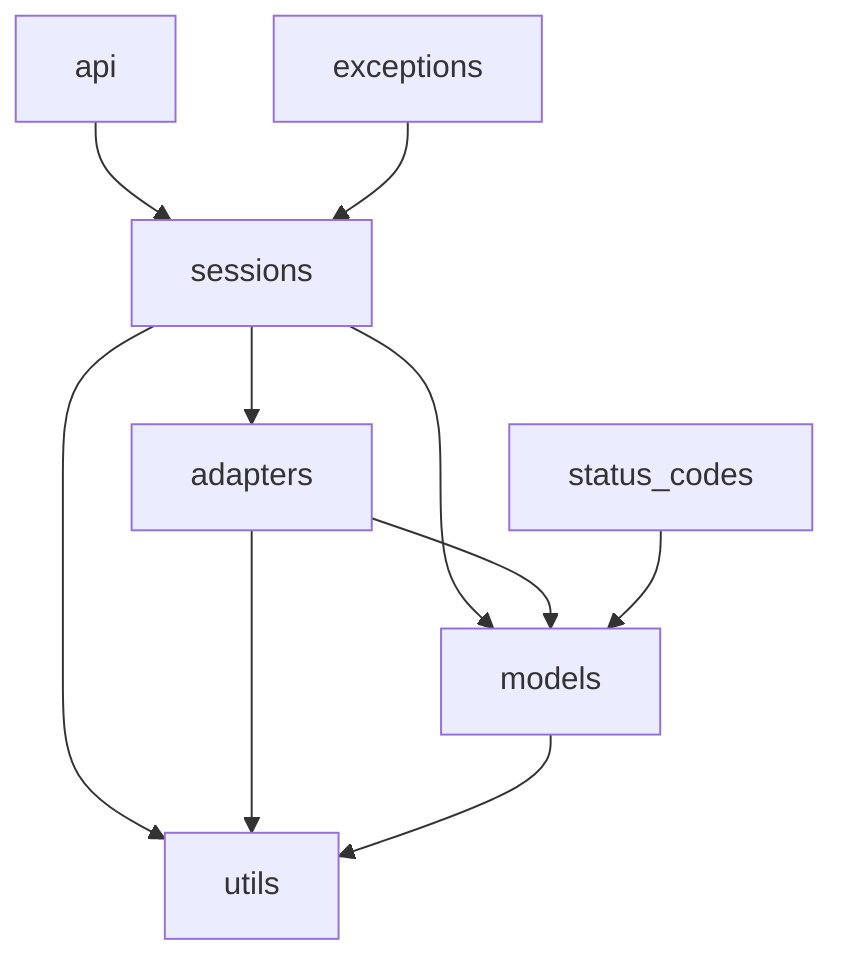
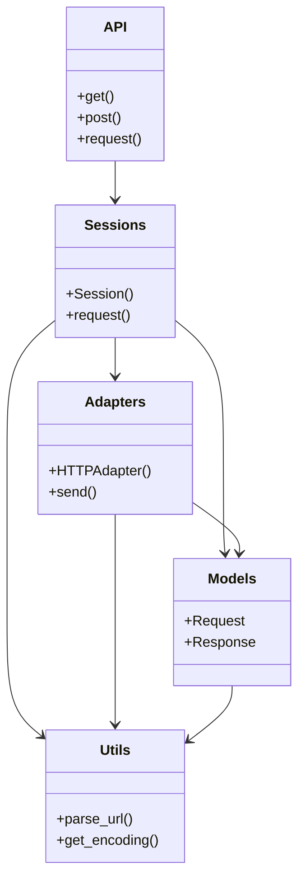
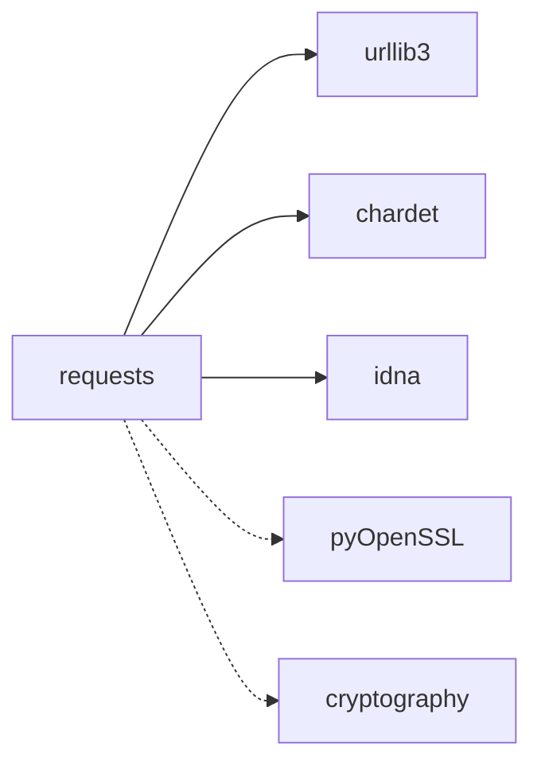

# 📦 Requests 代码库依赖关系分析文档

## 1. 🔍 依赖概述

### 主要依赖类型和分类
- **内部依赖**：模块间的分层依赖关系
  - 用户接口层：`api`
  - 业务逻辑层：`sessions`
  - 基础设施层：`adapters`, `models`, `utils`
  - 支持层：`exceptions`, `status_codes`
  
- **外部依赖**：Python标准库依赖
  - 核心依赖：`urllib3`, `chardet`, `idna`
  - 可选依赖：`pyOpenSSL`, `cryptography`(用于SSL支持)

### 依赖管理策略
- 采用**显式依赖声明**（requirements.txt/pyproject.toml）
- 使用**最小版本约束**策略
- 通过`try/except`实现**可选依赖**处理
- 内部模块通过**相对导入**管理依赖

## 2. 🏗️ 内部依赖关系

### 模块间依赖关系图



### 关键组件依赖层次



## 3. 🌐 外部依赖分析

### 主要第三方依赖



### 版本要求和兼容性

| 依赖包 | 最低版本 | 推荐版本 | 用途 |
|--------|----------|----------|------|
| urllib3 | 1.21.1 | 1.26.0+ | HTTP连接池和传输 |
| chardet | 3.0.2 | 4.0.0+ | 字符编码检测 |
| idna | 2.0 | 3.0+ | 国际化域名处理 |
| pyOpenSSL | 0.14 | (可选) | SSL/TLS支持 |
| cryptography | 1.3.4 | (可选) | 加密支持 |

## 4. 🛠️ 依赖优化建议

### 潜在循环依赖检查
当前依赖结构为**分层单向依赖**，未发现循环依赖问题。依赖流向清晰：
api → sessions → (adapters/models/utils)

### 优化方向
1. **utils模块拆分**：当前utils模块功能较杂，可考虑按功能拆分为：
   - `url_utils`
   - `header_utils`
   - `auth_utils`
2. **可选依赖懒加载**：对SSL相关依赖实现按需加载
3. **接口抽象**：在adapters和models之间引入抽象层

## 5. 🏆 依赖管理最佳实践

### 推荐方法
1. **精确版本锁定**：生产环境使用`==`指定确切版本
2. **依赖隔离**：使用虚拟环境或容器
3. **定期更新**：每季度检查依赖更新
4. **安全扫描**：集成dependabot或snyk

### 版本控制策略
```python
# 推荐版本约束示例
install_requires = [
    'urllib3>=1.21.1,<2.0.0',
    'chardet>=3.0.2,<5.0.0',
    'idna>=2.0,<4.0',
]
extras_require = {
    'security': ['pyOpenSSL>=0.14', 'cryptography>=1.3.4'],
}
```

### 更新策略
- **补丁版本**：自动更新（~=）
- **次要版本**：手动测试后更新（>=）
- **主要版本**：需要兼容性评估

> 💡 提示：requests作为底层库，应保持较宽松的上限约束以便下游兼容
