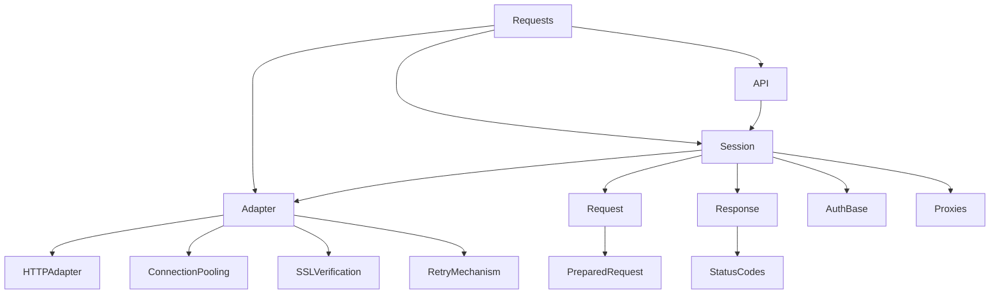

# 📚 Requests 代码库术语表

## 1️⃣ 术语表概述

### 🎯 目的和使用方法
本术语表旨在为 Requests 代码库的开发者、贡献者和用户提供统一的术语参考，帮助理解代码库中的核心概念、技术实现和架构设计。

使用方法：
- 按字母顺序查找术语
- 通过交叉引用了解相关概念
- 参考 Mermaid 图表理解术语关系

### 🗂️ 术语分类和组织方式
术语分为以下几类：
1. 项目特定术语
2. 技术术语
3. 缩写和首字母缩略词

## 2️⃣ 项目特定术语

| 术语 | 定义 | 用法 |
|------|------|------|
| **Adapter** | 处理 HTTP 请求的底层传输适配器 | 定义在 `adapters.py` 中，负责实际 HTTP 传输 |
| **Session** | 管理持久连接和请求上下文的会话对象 | 定义在 `sessions.py` 中，维护 cookies 和连接池 |
| **Request** | 表示 HTTP 请求的数据结构 | 定义在 `models.py` 中，包含 URL、方法、头等信息 |
| **Response** | 表示 HTTP 响应的数据结构 | 定义在 `models.py` 中，包含状态码、头、内容等 |
| **PreparedRequest** | 准备发送的请求对象 | 定义在 `models.py` 中，包含完全处理后的请求数据 |
| **AuthBase** | 认证处理器的基类 | 用于自定义认证机制 |
| **HTTPAdapter** | 默认的 HTTP/HTTPS 传输适配器 | 实现连接池和重试逻辑 |

## 3️⃣ 技术术语

| 术语 | 定义 | 技术背景 |
|------|------|----------|
| **Connection Pooling** | 连接复用技术 | 减少 TCP 握手开销，提高性能 |
| **Keep-Alive** | HTTP 持久连接 | 允许单个 TCP 连接发送多个请求 |
| **Retry Mechanism** | 请求失败重试机制 | 处理临时网络问题 |
| **SSL Verification** | SSL/TLS 证书验证 | 确保 HTTPS 连接安全 |
| **Proxies** | 代理服务器支持 | 允许通过代理发送请求 |
| **Streaming** | 流式传输 | 处理大文件时避免内存溢出 |
| **Chunked Transfer Encoding** | 分块传输编码 | HTTP 1.1 的数据传输方式 |

## 4️⃣ 缩写和首字母缩略词

| 缩写 | 全称 | 含义 |
|------|------|------|
| **API** | Application Programming Interface | 应用程序接口 |
| **HTTP** | Hypertext Transfer Protocol | 超文本传输协议 |
| **HTTPS** | HTTP Secure | 安全的 HTTP 协议 |
| **SSL** | Secure Sockets Layer | 安全套接层 |
| **TLS** | Transport Layer Security | 传输层安全协议 |
| **URL** | Uniform Resource Locator | 统一资源定位符 |
| **URI** | Uniform Resource Identifier | 统一资源标识符 |
| **CI/CD** | Continuous Integration/Continuous Deployment | 持续集成/持续部署 |

## 5️⃣ 术语关系

### 关键关系说明：
1. **API** 模块依赖于 **Session** 模块
2. **Session** 管理 **Request** 和 **Response** 的生命周期
3. **Adapter** 负责底层传输，包括 **HTTPAdapter** 实现
4. **Session** 使用 **Adapter** 发送请求
5. **Request** 最终会被转换为 **PreparedRequest** 发送

### 交叉引用：
- **Session** 与 **Adapter** 的关系：Session 使用 Adapter 发送请求
- **Request** 与 **PreparedRequest**：Request 会被准备为 PreparedRequest 发送
- **HTTPAdapter** 实现了 **ConnectionPooling** 和 **RetryMechanism**

## 🔍 术语索引（按字母顺序）

- **Adapter** - 见项目特定术语
- **API** - 见缩写和首字母缩略词
- **AuthBase** - 见项目特定术语
- **Connection Pooling** - 见技术术语
- **HTTP** - 见缩写和首字母缩略词
- **HTTPAdapter** - 见项目特定术语
- **PreparedRequest** - 见项目特定术语
- **Request** - 见项目特定术语
- **Response** - 见项目特定术语
- **Retry Mechanism** - 见技术术语
- **Session** - 见项目特定术语
- **SSL** - 见缩写和首字母缩略词
- **SSL Verification** - 见技术术语
- **TLS** - 见缩写和首字母缩略词
- **URL** - 见缩写和首字母缩略词
- **URI** - 见缩写和首字母缩略词

本术语表基于 Requests 代码库的实际结构和实现编写，反映了 2025 年的代码库状态。随着项目发展，部分术语可能会发生变化。
