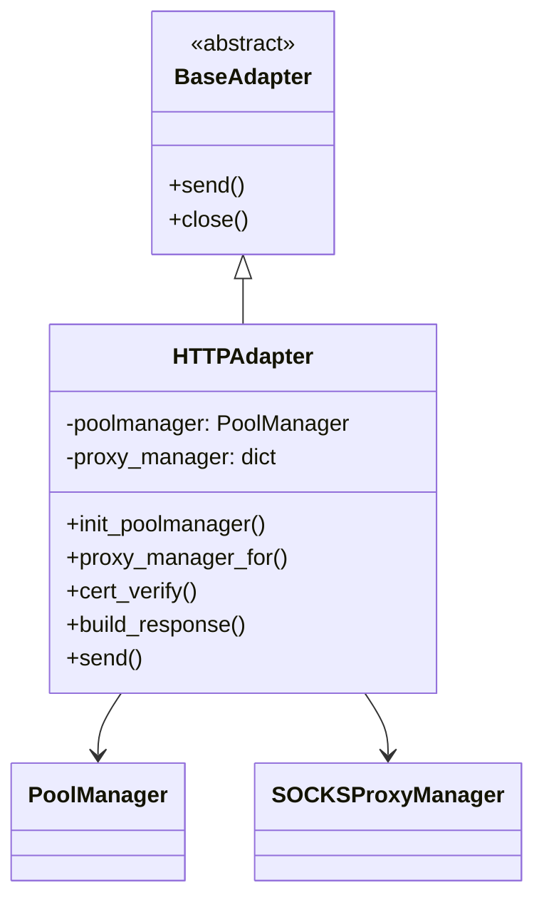
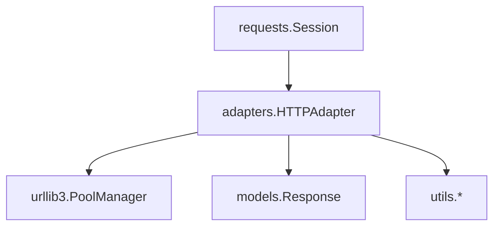

# 📦 📦 requests.adapters 模块文档


## 📋 模块概述

### 模块信息
- **模块名称**: `adapters`
- **完整路径**: `src/requests/adapters.py`
- **核心功能**: 提供HTTP请求的底层传输适配器实现，处理连接池管理、代理配置、SSL验证等底层网络通信细节
- **重要性评分**: 8/10 (关键基础设施组件)

### 核心价值
该模块是Requests库的网络传输层核心，负责:
1. 管理与服务器的连接池
2. 处理HTTP/HTTPS协议的底层通信
3. 提供SSL证书验证和代理支持
4. 实现请求重试机制

### 适用场景
- 需要精细控制HTTP连接行为时
- 需要配置自定义代理或SSL验证时
- 需要调整连接池大小或重试策略时

## 🏗️ 架构设计

### 设计思路
模块采用适配器模式设计，主要特点:
- 抽象基础适配器接口(`BaseAdapter`)
- 具体实现(`HTTPAdapter`)基于urllib3的`PoolManager`
- 分离连接管理与请求处理逻辑
- 支持可配置的连接池和代理管理

### 核心组件


## 🔧 详细API文档

### 类: `BaseAdapter`
基类适配器，定义适配器接口规范

#### 方法: `send()`
发送预处理请求并返回响应

**参数**:
| 参数名 | 类型 | 默认值 | 描述 |
|--------|------|--------|------|
| request | `PreparedRequest` | 必填 | 要发送的预处理请求对象 |
| stream | `bool` | `False` | 是否流式传输内容 |
| timeout | `float/tuple` | `None` | 超时设置(秒) |
| verify | `bool/str` | `True` | SSL验证设置 |
| cert | `str/tuple` | `None` | 客户端证书 |
| proxies | `dict` | `None` | 代理配置 |

**返回值**: `Response` 对象

**异常**:
- `NotImplementedError`: 子类必须实现此方法

### 类: `HTTPAdapter`
基于urllib3的具体HTTP适配器实现

#### 构造方法: `__init__()`
初始化HTTP适配器

**参数**:
| 参数名 | 类型 | 默认值 | 描述 |
|--------|------|--------|------|
| pool_connections | `int` | `DEFAULT_POOLSIZE(10)` | 连接池数量 |
| pool_maxsize | `int` | `DEFAULT_POOLSIZE(10)` | 每个池最大连接数 |
| max_retries | `int/Retry` | `DEFAULT_RETRIES(0)` | 最大重试次数 |
| pool_block | `bool` | `DEFAULT_POOLBLOCK(False)` | 是否阻塞等待连接 |

#### 方法: `init_poolmanager()`
初始化连接池管理器

**参数**:
| 参数名 | 类型 | 默认值 | 描述 |
|--------|------|--------|------|
| connections | `int` | 必填 | 连接池数量 |
| maxsize | `int` | 必填 | 最大连接数 |
| block | `bool` | `DEFAULT_POOLBLOCK(False)` | 是否阻塞 |
| **pool_kwargs | `dict` | `{}` | 额外池参数 |

#### 方法: `cert_verify()`
验证SSL证书

**参数**:
| 参数名 | 类型 | 描述 |
|--------|------|------|
| conn | `urllib3.Connection` | 连接对象 |
| url | `str` | 请求URL |
| verify | `bool/str` | 验证设置 |
| cert | `str/tuple` | 客户端证书 |

**异常**:
- `OSError`: 证书文件不存在时抛出

#### 方法: `build_response()`
从urllib3响应构建Requests响应

**参数**:
| 参数名 | 类型 | 描述 |
|--------|------|------|
| req | `PreparedRequest` | 原始请求 |
| resp | `urllib3.HTTPResponse` | urllib3响应 |

**返回值**: `Response` 对象

## 💡 实用示例

### 基础用法
```python
import requests
from requests.adapters import HTTPAdapter

# 创建会话并配置适配器
session = requests.Session()
adapter = HTTPAdapter(
    pool_connections=5,
    pool_maxsize=10,
    max_retries=3
)
session.mount('http://', adapter)
session.mount('https://', adapter)

# 使用配置的会话发送请求
response = session.get('https://example.com')
```

### 自定义SSL验证
```python
adapter = HTTPAdapter()
adapter.cert_verify(conn, "https://example.com", verify="/path/to/cert.pem", cert=None)
```

### 代理配置
```python
proxies = {
    'http': 'http://proxy.example.com:8080',
    'https': 'http://secureproxy.example.com:8080'
}

adapter = HTTPAdapter()
response = adapter.send(request, proxies=proxies)
```

## 🔗 依赖关系

### 上游依赖
- `urllib3`: 用于底层HTTP连接管理
- `models`: 使用`PreparedRequest`和`Response`模型
- `utils`: 使用各种辅助功能函数

### 下游使用
- `requests.Session`: 使用适配器处理实际请求
- 用户自定义适配器可继承`HTTPAdapter`



## ⚠️ 注意事项与最佳实践

### 性能考虑
1. 合理设置`pool_connections`和`pool_maxsize`:
   - 太小会导致频繁创建连接
   - 太大会占用过多内存
2. 复用适配器和会话对象

### 安全实践
1. 生产环境务必启用SSL验证(`verify=True`)
2. 敏感代理凭证应通过环境变量配置
3. 定期更新CA证书包

### 常见错误
1. 忘记调用`close()`导致连接泄漏
2. 混用不同适配器配置导致行为不一致
3. 忽略SSL验证错误可能导致中间人攻击

### 调试技巧
1. 启用urllib3的调试日志:
   ```python
   import logging
   logging.basicConfig()
   logging.getLogger().setLevel(logging.DEBUG)
   ```
2. 检查响应对象的`connection`属性获取连接信息
3. 使用`max_retries=0`快速失败定位连接问题

## 🎯 版本兼容性

- 适配器API在Requests 2.x中保持稳定
- `get_connection_with_tls_context`替代了旧的`get_connection`方法
- Python 3.7+完全支持