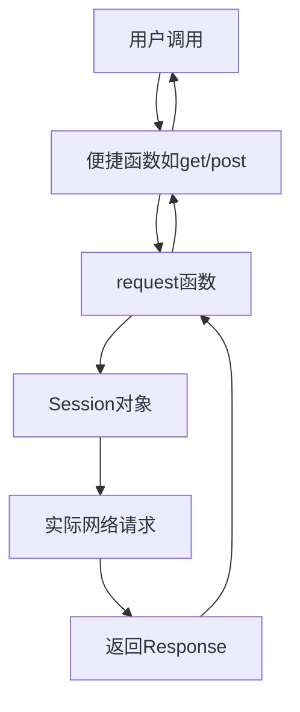
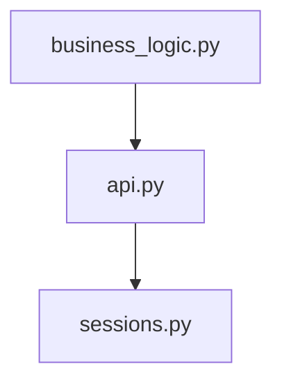

# 📦 📦 API 模块文档


## 📋 模块概述

### 模块信息
- **模块名称**: `api`
- **完整路径**: `src/requests/api.py`
- **版本**: 基于 Kenneth Reitz 2012 年版本 (Apache2 许可)

### 核心功能
提供用户友好的 HTTP 请求接口，封装了常见的 HTTP 方法（GET、POST 等），简化 HTTP 请求的发送和响应处理。

### 架构角色
作为 HTTP 请求的核心接口层，该模块是用户与底层网络通信之间的桥梁，提供了简洁易用的 API 来发送各种 HTTP 请求。

### 适用场景
- 需要发送 HTTP 请求与 Web 服务交互
- 构建 RESTful API 客户端
- 网页抓取和数据采集
- 微服务间通信
- 任何需要 HTTP 协议通信的场景

## 🏗️ 架构设计

### 设计思路
模块采用"门面模式"(Facade Pattern)设计，通过简洁的顶级函数封装底层复杂的 HTTP 请求处理逻辑，提供统一的请求接口。

### 核心组件
| 组件类型 | 名称 | 描述 |
|---------|------|------|
| 核心函数 | `request()` | 所有 HTTP 请求的基础实现 |
| 便捷函数 | `get()`, `post()` 等 | 针对特定 HTTP 方法的快捷方式 |
| 依赖组件 | `sessions.Session` | 底层会话管理 |

### 数据流向


## 🔧 详细API文档

### 核心函数: `request()`

```python
def request(method, url, **kwargs)
```

#### 功能描述
构造并发送 HTTP 请求，是所有其他便捷方法的基础实现。

#### 参数说明
| 参数 | 类型 | 必需 | 默认值 | 描述 |
|------|------|------|--------|------|
| method | str | 是 | 无 | HTTP 方法: GET, POST, PUT 等 |
| url | str | 是 | 无 | 请求的目标 URL |
| params | dict/list/bytes | 否 | None | 查询字符串参数 |
| data | dict/list/bytes/file | 否 | None | 请求体数据 |
| json | object | 否 | None | JSON 可序列化的请求体 |
| headers | dict | 否 | None | HTTP 头信息 |
| cookies | dict/CookieJar | 否 | None | Cookie 信息 |
| files | dict | 否 | None | 文件上传数据 |
| auth | tuple | 否 | None | 认证信息 |
| timeout | float/tuple | 否 | None | 超时设置 |
| allow_redirects | bool | 否 | True | 是否允许重定向 |
| proxies | dict | 否 | None | 代理设置 |
| verify | bool/str | 否 | True | SSL 验证 |
| stream | bool | 否 | None | 是否流式传输 |
| cert | str/tuple | 否 | None | SSL 客户端证书 |

#### 返回值
返回 `requests.Response` 对象，包含服务器响应信息。

#### 异常处理
可能抛出以下异常：
- `requests.exceptions.RequestException`: 所有请求异常的基类
- `requests.exceptions.Timeout`: 请求超时
- `requests.exceptions.SSLError`: SSL 错误
- `requests.exceptions.TooManyRedirects`: 重定向过多

#### 使用注意
- 使用 `with` 语句确保会话正确关闭
- 大文件上传应使用 `stream=True` 避免内存问题
- 敏感数据应通过 `auth` 参数传递

### 便捷方法

所有便捷方法(`get`, `post`等)都共享以下特性：
- 第一个参数为 `url`
- 支持 `**kwargs` 传递额外参数
- 返回 `Response` 对象

#### `get()`
```python
def get(url, params=None, **kwargs)
```
专门用于 GET 请求，支持查询参数。

#### `post()`
```python
def post(url, data=None, json=None, **kwargs)
```
专门用于 POST 请求，支持表单和 JSON 数据。

#### 其他方法
- `options()`: 发送 OPTIONS 请求
- `head()`: 发送 HEAD 请求（默认不允许重定向）
- `put()`: 发送 PUT 请求
- `patch()`: 发送 PATCH 请求
- `delete()`: 发送 DELETE 请求

## 💡 实用示例

### 基础用法

```python
import requests

# GET 请求示例
response = requests.get('https://api.example.com/data')
print(response.status_code)
print(response.json())

# POST 请求示例
data = {'key': 'value'}
response = requests.post('https://api.example.com/post', json=data)
```

### 进阶用法

```python
# 带认证和超时的请求
response = requests.get(
    'https://api.example.com/secure',
    auth=('user', 'pass'),
    timeout=3.5
)

# 文件上传
files = {'file': open('report.xls', 'rb')}
response = requests.post('https://api.example.com/upload', files=files)

# 使用会话保持 (底层实现方式)
with requests.Session() as s:
    response = s.get('https://api.example.com/session')
```

### 最佳实践
1. **重用会话**：频繁请求同一主机时，应创建 Session 对象重用
2. **异常处理**：总是捕获和处理请求异常
3. **超时设置**：永远不要使用无超时的请求
4. **资源清理**：使用 `with` 语句或手动关闭响应

```python
try:
    response = requests.get('https://api.example.com', timeout=5)
    response.raise_for_status()  # 检查HTTP错误
    data = response.json()
except requests.exceptions.RequestException as e:
    print(f"请求失败: {e}")
finally:
    if 'response' in locals():
        response.close()
```

### 常见错误
1. 忘记检查响应状态码 (`response.status_code`)
2. 未处理 JSON 解析错误
3. 在读取响应内容后再次访问 (`response.content` 只能读取一次)
4. 忽略 SSL 证书验证警告

## 🔗 依赖关系

### 上游依赖
- `sessions` 模块：用于底层会话管理

### 下游使用
该模块通常作为项目的基础HTTP客户端被其他业务模块调用。

### 依赖图


## ⚠️ 注意事项与最佳实践

### 性能考虑
- 连接池：默认启用连接池，重用 TCP 连接
- 流式传输：大文件应使用 `stream=True` 避免内存问题
- 会话重用：高频请求应使用 Session 对象

### 安全考虑
- 总是验证 SSL 证书 (`verify=True`)
- 敏感信息不应放在 URL 中
- 使用 HTTPS 而非 HTTP
- 及时更新库版本修复安全漏洞

### 兼容性
- 兼容 Python 3.6+
- 保持向后兼容的 API 设计

### 调试技巧
1. 启用调试日志：
```python
import logging
logging.basicConfig(level=logging.DEBUG)
```
2. 检查请求详情：
```python
print(response.request.headers)
print(response.request.body)
```
3. 使用代理工具（如 Charles）捕获实际网络请求

## 🎨 总结
`api` 模块提供了简洁强大的 HTTP 客户端接口，通过合理封装底层细节，让开发者能专注于业务逻辑而非网络通信细节。正确使用时，它既安全又高效，是 Python 生态中最受欢迎的 HTTP 客户端实现之一。