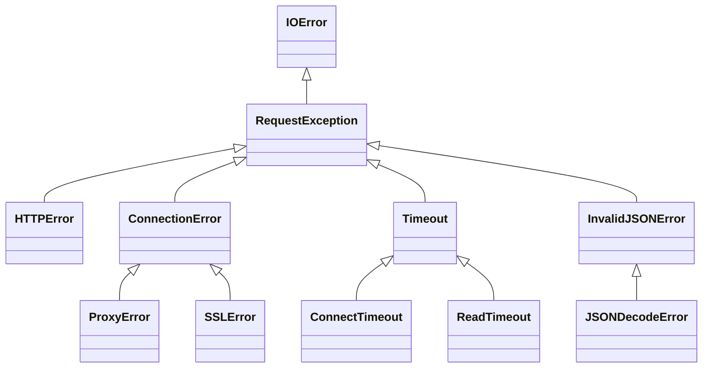

# 📦 📋 requests.exceptions 模块文档


## 1. 模块概述

### 📌 基本信息
- **模块名称**: `requests.exceptions`
- **完整路径**: `src/requests/exceptions.py`
- **核心功能**: 定义 Requests 库中使用的所有异常类和警告类
- **重要性**: ⭐⭐⭐⭐⭐ (5/5)

### 🏛️ 架构角色
该模块是 Requests 库的错误处理核心，为整个库提供统一的异常体系。所有与 HTTP 请求相关的错误都会通过这些异常类抛出，使开发者能够精确捕获和处理不同类型的请求错误。

### 🎯 适用场景
- 当需要捕获和处理 HTTP 请求过程中的各种错误时
- 需要区分不同类型的请求错误（如连接错误、超时、无效URL等）
- 需要自定义异常处理逻辑时

## 2. 🏗️ 架构设计

### 🧠 设计思路
模块采用层次化的异常设计，基础异常 `RequestException` 继承自 Python 的 `IOError`，其他异常都继承自它或其子类。这种设计：
1. 保持了与 Python 标准异常体系的兼容性
2. 提供了细粒度的错误分类
3. 支持多重继承以组合异常特性

### 📦 核心组件


## 3. 🔧 详细API文档

### 🚨 基础异常类

#### `RequestException(IOError)`
**功能**: 所有 Requests 异常的基类，表示处理请求时发生的模糊异常。

**参数**:
- `*args`: 异常消息参数
- `**kwargs`: 可包含:
  - `response`: 关联的响应对象 (可选)
  - `request`: 关联的请求对象 (可选)

**属性**:
- `response`: 关联的响应对象
- `request`: 关联的请求对象

**示例**:
```python
try:
    response = requests.get('https://example.com')
    response.raise_for_status()
except RequestException as e:
    print(f"请求失败: {e}")
    if e.response is not None:
        print(f"状态码: {e.response.status_code}")
```

### 🔗 连接相关异常

#### `ConnectionError(RequestException)`
**功能**: 连接错误发生时抛出。

#### `ProxyError(ConnectionError)`
**功能**: 代理错误发生时抛出。

#### `SSLError(ConnectionError)`
**功能**: SSL 错误发生时抛出。

### ⏱️ 超时相关异常

#### `Timeout(RequestException)`
**功能**: 请求超时的基类。

#### `ConnectTimeout(ConnectionError, Timeout)`
**功能**: 连接超时时抛出，可安全重试。

#### `ReadTimeout(Timeout)`
**功能**: 服务器在指定时间内未发送任何数据。

### 🌐 HTTP 相关异常

#### `HTTPError(RequestException)`
**功能**: HTTP 错误发生时抛出。

### 📦 JSON 相关异常

#### `InvalidJSONError(RequestException)`
**功能**: JSON 错误发生时抛出。

#### `JSONDecodeError(InvalidJSONError, CompatJSONDecodeError)`
**功能**: 无法将文本解码为 JSON 时抛出。

**特殊方法**:
- `__reduce__`: 确保 pickle 序列化时使用正确的实现

### 🔗 URL 相关异常

#### `URLRequired(RequestException)`
**功能**: 缺少必要 URL 时抛出。

#### `MissingSchema(RequestException, ValueError)`
**功能**: URL 缺少 scheme (如 http/https) 时抛出。

#### `InvalidSchema(RequestException, ValueError)`
**功能**: URL scheme 无效或不支持时抛出。

#### `InvalidURL(RequestException, ValueError)`
**功能**: URL 无效时抛出。

### ⚠️ 警告类

#### `RequestsWarning(Warning)`
**功能**: Requests 警告的基类。

#### `FileModeWarning(RequestsWarning, DeprecationWarning)`
**功能**: 文件以文本模式打开但检测到二进制内容时警告。

#### `RequestsDependencyWarning(RequestsWarning)`
**功能**: 导入的依赖项版本不匹配时警告。

## 4. 💡 实用示例

### 基础用法
```python
import requests
from requests.exceptions import RequestException, HTTPError, Timeout

try:
    response = requests.get('https://example.com', timeout=5)
    response.raise_for_status()
except HTTPError as http_err:
    print(f"HTTP错误: {http_err}")
except Timeout as timeout_err:
    print(f"请求超时: {timeout_err}")
except RequestException as err:
    print(f"其他请求错误: {err}")
```

### 处理 JSON 解码错误
```python
import requests
from requests.exceptions import JSONDecodeError

try:
    response = requests.get('https://example.com/invalid-json')
    data = response.json()
except JSONDecodeError as json_err:
    print(f"JSON解码失败: {json_err}")
    print(f"错误位置: {json_err.pos}")
    print(f"错误行: {json_err.lineno}")
    print(f"错误列: {json_err.colno}")
```

### 自定义重试逻辑
```python
import requests
from requests.exceptions import ConnectTimeout, RetryError

def make_request_with_retry(url, max_retries=3):
    for attempt in range(max_retries):
        try:
            return requests.get(url, timeout=5)
        except ConnectTimeout:
            if attempt == max_retries - 1:
                raise RetryError(f"在{max_retries}次重试后仍然失败")
            continue
    return None
```

## 5. 🔗 依赖关系

### 上游依赖
- `urllib3.exceptions.HTTPError`: 用于 `ContentDecodingError` 的多重继承
- `.compat.JSONDecodeError`: 用于 `JSONDecodeError` 的多重继承

### 下游使用
该模块的异常被整个 Requests 库使用，特别是:
- `requests.api`
- `requests.sessions`
- `requests.adapters`

## 6. ⚠️ 注意事项与最佳实践

### 🚦 异常处理建议
1. **从特定到通用捕获异常**:
   ```python
   try:
       response = requests.get(url)
   except ReadTimeout:
       # 处理读取超时
   except Timeout:
       # 处理其他超时
   except RequestException:
       # 处理其他请求错误
   ```

2. **检查响应对象**:
   ```python
   except RequestException as e:
       if hasattr(e, 'response') and e.response is not None:
           print(f"响应状态码: {e.response.status_code}")
   ```

### 🔒 安全考虑
- 捕获 `SSLError` 时要谨慎，不要简单地忽略 SSL 验证错误
- 处理敏感信息时，确保异常消息不会泄露敏感数据

### ⚡ 性能考虑
- 异常处理会有性能开销，避免在关键循环中使用宽泛的异常捕获

### 🔄 兼容性
- 异常类结构在 Requests 主要版本中保持稳定
- `JSONDecodeError` 兼容不同 Python 版本的 JSON 解码错误

### 🐞 调试技巧
- 使用 `response` 和 `request` 属性获取更多上下文信息
- 对于连接问题，检查异常的具体类型 (`ProxyError`, `SSLError` 等)

## 🎉 总结

`requests.exceptions` 模块提供了完善的异常体系，使开发者能够精确处理 HTTP 请求中的各种错误情况。通过层次化的设计，它既保持了使用的灵活性，又提供了足够的错误分类粒度。合理使用这些异常类可以显著提高代码的健壮性和可维护性。