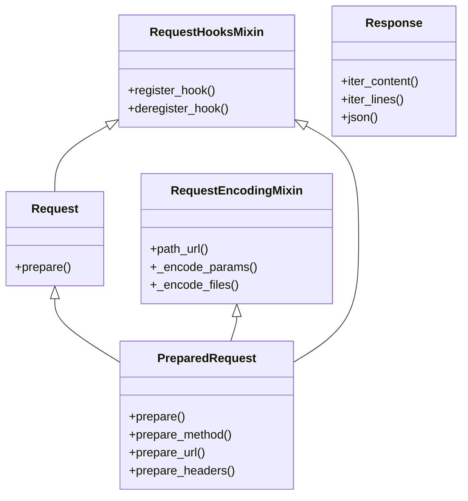
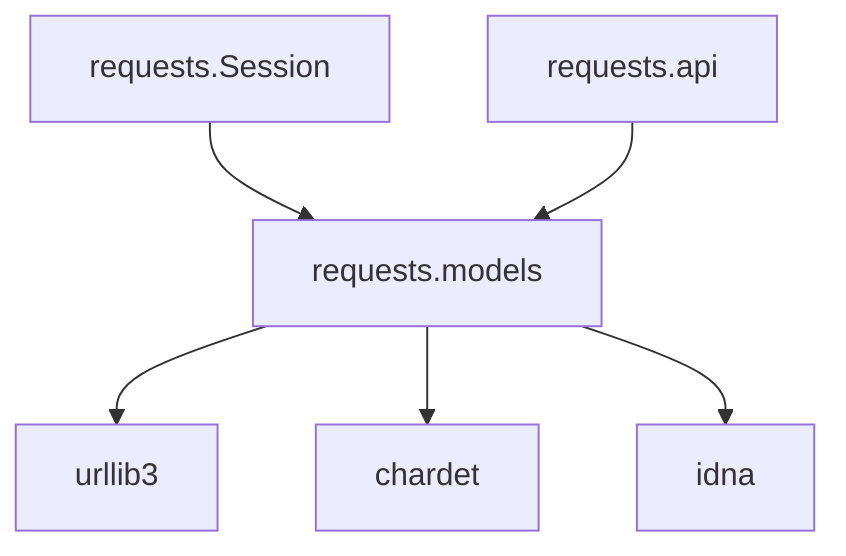

# 📦 📋 `requests.models` 模块文档


## 1. 模块概述

### 模块信息
- **模块名称**: `requests.models`
- **路径**: `src/requests/models.py`
- **重要性**: 7/10 (核心模块)

### 核心功能
该模块定义了HTTP请求和响应的核心数据结构，包括`Request`、`PreparedRequest`和`Response`类，是Requests库处理HTTP通信的基础。

### 架构角色
作为Requests库的核心模块，它：
- 提供HTTP请求的构建和准备功能
- 处理HTTP响应的解析和封装
- 实现请求/响应生命周期中的关键逻辑

### 适用场景
- 构建自定义HTTP请求
- 处理HTTP响应数据
- 扩展Requests库的功能

## 2. 🏗️ 架构设计

### 设计思路
模块采用分层设计：
1. **Mixin类**：提供可复用的功能组件
2. **核心类**：组合Mixin功能实现完整请求/响应处理
3. **工具函数**：支持核心类的辅助功能

### 核心组件


## 3. 🔧 详细API文档

### RequestEncodingMixin 类

#### `path_url()`
- **功能**: 构建请求的路径URL
- **返回**: `str` - 完整的路径URL(包含查询参数)
- **示例**:
```python
mixin = RequestEncodingMixin()
mixin.url = "http://example.com/path?query=1"
print(mixin.path_url)  # 输出: "/path?query=1"
```

#### `_encode_params(data)`
- **功能**: 编码请求参数
- **参数**:
  - `data`: 可以是字典、列表或字符串
- **返回**: 编码后的参数字符串
- **异常**: 无显式异常，但可能抛出底层编码错误

### Request 类

#### 构造函数
```python
def __init__(
    self,
    method=None,
    url=None,
    headers=None,
    files=None,
    data=None,
    params=None,
    auth=None,
    cookies=None,
    hooks=None,
    json=None,
)
```
- **参数说明**:
  | 参数名 | 类型 | 默认值 | 描述 |
  |--------|------|--------|------|
  | method | str | None | HTTP方法(GET/POST等) |
  | url | str | None | 请求URL |
  | headers | dict | {} | 请求头 |
  | files | dict | [] | 上传文件 |
  | data | dict/list | [] | 请求体数据 |
  | json | dict | None | JSON格式请求体 |

#### `prepare()`
- **功能**: 准备请求，返回PreparedRequest对象
- **返回**: `PreparedRequest`实例
- **示例**:
```python
req = Request('GET', 'https://httpbin.org/get')
prepared = req.prepare()
```

### PreparedRequest 类

#### `prepare_url(url, params)`
- **功能**: 准备请求URL
- **参数**:
  - `url`: 基础URL
  - `params`: URL查询参数
- **异常**:
  - `MissingSchema`: URL缺少协议头
  - `InvalidURL`: URL格式无效

#### `prepare_headers(headers)`
- **功能**: 准备请求头
- **参数**:
  - `headers`: 原始头信息字典
- **处理**:
  - 验证头有效性
  - 转换为大小写不敏感字典

### Response 类

#### `json(**kwargs)`
- **功能**: 解析响应体为JSON
- **参数**:
  - `**kwargs`: 传递给json.loads的选项
- **返回**: 解析后的Python对象
- **异常**:
  - `RequestsJSONDecodeError`: JSON解析失败

#### `raise_for_status()`
- **功能**: 检查HTTP状态码，失败时抛出异常
- **异常**:
  - `HTTPError`: 状态码>=400时抛出

## 4. 💡 实用示例

### 基础用法
```python
from requests.models import Request

# 创建请求
req = Request(
    method='POST',
    url='https://httpbin.org/post',
    data={'key': 'value'},
    headers={'Content-Type': 'application/x-www-form-urlencoded'}
)

# 准备请求
prepared = req.prepare()
print(prepared.method)  # 输出: POST
print(prepared.url)     # 输出: https://httpbin.org/post
```

### 处理响应
```python
from requests.models import Response
import io

# 模拟响应
resp = Response()
resp.status_code = 200
resp.raw = io.BytesIO(b'{"success": true}')
resp.headers['Content-Type'] = 'application/json'

# 解析JSON
data = resp.json()
print(data)  # 输出: {'success': True}
```

### 最佳实践
1. 总是使用`prepare()`方法获取PreparedRequest
2. 检查响应状态码时使用`raise_for_status()`
3. 处理大响应时使用`iter_content()`

## 5. 🔗 依赖关系

### 上游依赖
- `urllib3`: 用于底层HTTP通信
- `chardet`: 字符编码检测
- `idna`: 国际化域名处理

### 下游使用
- `requests.Session`: 使用本模块处理请求/响应
- `requests.api`: 对外API的基础



## 6. ⚠️ 注意事项与最佳实践

### 性能考虑
- 大文件上传使用流式处理
- 避免重复解析JSON响应

### 安全考虑
- 敏感数据不应放在URL参数中
- 验证所有响应头

### 常见错误
1. 忘记调用`prepare()`
   ```python
   # 错误方式
   req = Request('GET', 'https://example.com')
   # 正确方式
   prepared = req.prepare()
   ```

2. 多次读取响应内容
   ```python
   # 错误方式
   content = resp.content
   text = resp.text  # 可能失败
   
   # 正确方式
   content = resp.content
   text = content.decode('utf-8')
   ```

### 调试技巧
- 使用`PreparedRequest`的`__repr__`检查请求细节
- 检查`Response`对象的`request`属性查看原始请求