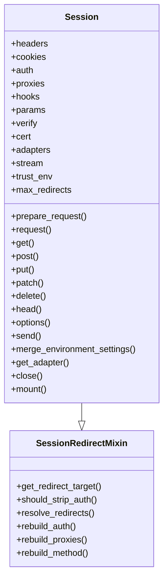
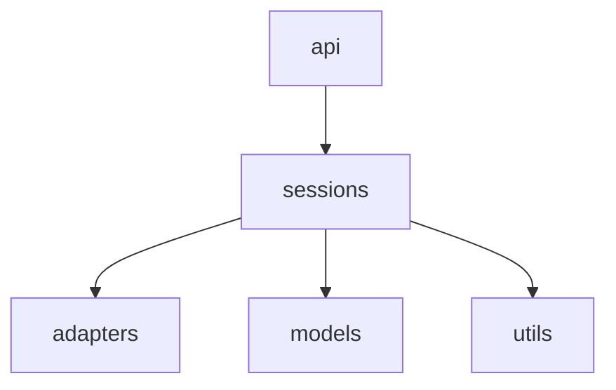

# 📦 📋 requests.sessions 模块文档


## 1. 模块概述

### 模块信息
- **模块名称**: `sessions`
- **完整路径**: `src/requests/sessions.py`
- **核心功能**: 提供 Session 类来管理和持久化跨请求的设置（如 cookies、认证、代理等）
- **重要性**: 10/10（核心模块）

### 核心价值
`requests.sessions` 模块是 Requests 库的核心组件之一，它实现了会话管理功能，允许用户在多个请求之间保持状态（如 cookies、认证信息等），同时提供连接池和配置管理功能。

### 适用场景
- 需要保持会话状态（如登录状态）的连续请求
- 需要重用 TCP 连接的场景（提高性能）
- 需要统一管理请求配置（如 headers、代理等）

## 2. 架构设计

### 设计思路
该模块采用面向对象设计，通过 `Session` 类封装所有与会话相关的功能，并混入 `SessionRedirectMixin` 来处理重定向逻辑。设计上遵循了单一职责原则，将不同功能分离到不同方法中。

### 核心组件


## 3. 详细 API 文档

### 主要类

#### `Session` 类

**功能描述**: 主会话类，用于管理跨请求的持久设置和连接池。

**属性**:
| 属性名 | 类型 | 描述 |
|--------|------|------|
| headers | CaseInsensitiveDict | 每个请求发送的默认头部 |
| cookies | RequestsCookieJar | 当前会话的 cookies |
| auth | tuple | 默认认证信息 |
| proxies | dict | 代理配置 |
| hooks | dict | 事件处理钩子 |
| params | dict | 查询参数 |
| verify | bool/str | SSL 验证设置 |
| cert | str/tuple | SSL 客户端证书 |
| stream | bool | 是否流式传输响应内容 |
| trust_env | bool | 是否信任环境设置 |
| max_redirects | int | 最大重定向次数 |

**主要方法**:

##### `request(method, url, **kwargs)`
发送请求的核心方法。

**参数**:
| 参数 | 类型 | 默认值 | 描述 |
|------|------|--------|------|
| method | str | 必填 | HTTP 方法 |
| url | str | 必填 | 请求 URL |
| params | dict | None | 查询参数 |
| data | dict/list/tuple/bytes | None | 请求体数据 |
| json | dict | None | JSON 请求体 |
| headers | dict | None | 请求头 |
| cookies | dict/CookieJar | None | cookies |
| files | dict | None | 上传文件 |
| auth | tuple | None | 认证信息 |
| timeout | float/tuple | None | 超时设置 |
| allow_redirects | bool | True | 是否允许重定向 |
| proxies | dict | None | 代理设置 |
| hooks | dict | None | 钩子函数 |
| stream | bool | None | 是否流式传输 |
| verify | bool/str | None | SSL 验证 |
| cert | str/tuple | None | SSL 客户端证书 |

**返回值**: `Response` 对象

**示例**:
```python
s = Session()
response = s.request('GET', 'https://example.com', params={'key': 'value'})
```

##### `prepare_request(request)`
准备请求对象。

**参数**:
| 参数 | 类型 | 描述 |
|------|------|------|
| request | Request | 要准备的请求对象 |

**返回值**: `PreparedRequest` 对象

##### `send(request, **kwargs)`
发送已准备的请求。

**参数**:
| 参数 | 类型 | 默认值 | 描述 |
|------|------|--------|------|
| request | PreparedRequest | 必填 | 准备好的请求 |
| stream | bool | None | 是否流式传输 |
| timeout | float/tuple | None | 超时设置 |
| verify | bool/str | None | SSL 验证 |
| cert | str/tuple | None | SSL 客户端证书 |
| proxies | dict | None | 代理设置 |
| allow_redirects | bool | True | 是否允许重定向 |

**返回值**: `Response` 对象

#### `SessionRedirectMixin` 类

**功能描述**: 处理 HTTP 重定向逻辑的混合类。

**主要方法**:

##### `get_redirect_target(response)`
获取重定向目标 URL。

**参数**:
| 参数 | 类型 | 描述 |
|------|------|------|
| response | Response | 响应对象 |

**返回值**: str 或 None（如果没有重定向）

##### `should_strip_auth(old_url, new_url)`
判断是否应该移除认证头。

**参数**:
| 参数 | 类型 | 描述 |
|------|------|------|
| old_url | str | 原始 URL |
| new_url | str | 重定向 URL |

**返回值**: bool

##### `resolve_redirects(response, request, **kwargs)`
处理重定向链。

**参数**:
| 参数 | 类型 | 默认值 | 描述 |
|------|------|--------|------|
| response | Response | 必填 | 初始响应 |
| request | PreparedRequest | 必填 | 原始请求 |
| stream | bool | False | 是否流式传输 |
| timeout | float/tuple | None | 超时设置 |
| verify | bool | True | SSL 验证 |
| cert | str/tuple | None | SSL 客户端证书 |
| proxies | dict | None | 代理设置 |
| yield_requests | bool | False | 是否生成请求对象 |

**返回值**: 生成器，产生 `Response` 或 `Request` 对象

### 工具函数

#### `merge_setting(request_setting, session_setting, dict_class=OrderedDict)`
合并请求和会话的设置。

**参数**:
| 参数 | 类型 | 默认值 | 描述 |
|------|------|--------|------|
| request_setting | any | 必填 | 请求级别的设置 |
| session_setting | any | 必填 | 会话级别的设置 |
| dict_class | type | OrderedDict | 字典类型 |

**返回值**: 合并后的设置

#### `merge_hooks(request_hooks, session_hooks, dict_class=OrderedDict)`
合并请求和会话的钩子。

**参数**:
| 参数 | 类型 | 默认值 | 描述 |
|------|------|--------|------|
| request_hooks | dict | 必填 | 请求钩子 |
| session_hooks | dict | 必填 | 会话钩子 |
| dict_class | type | OrderedDict | 字典类型 |

**返回值**: 合并后的钩子

## 4. 实用示例

### 基础用法
```python
import requests

# 创建会话
s = requests.Session()

# 设置公共头部
s.headers.update({'User-Agent': 'MyApp/1.0'})

# 发送请求
response = s.get('https://api.example.com/data')

# 会话会自动处理 cookies
response = s.get('https://api.example.com/user/profile')
```

### 进阶用法
```python
# 使用会话保持登录状态
s = requests.Session()
login_data = {'username': 'user', 'password': 'pass'}
s.post('https://example.com/login', data=login_data)

# 后续请求会自动携带 cookies
profile = s.get('https://example.com/profile').json()

# 配置重试策略
from requests.adapters import HTTPAdapter
adapter = HTTPAdapter(max_retries=3)
s.mount('https://', adapter)
s.mount('http://', adapter)
```

### 最佳实践
1. **重用会话**：对于多个请求，始终重用 Session 对象以获得性能优势
2. **资源清理**：使用上下文管理器或手动调用 `close()` 方法
3. **配置集中管理**：在 Session 级别设置公共配置（如 headers、auth 等）

```python
# 使用上下文管理器
with requests.Session() as s:
    s.auth = ('user', 'pass')
    s.get('https://api.example.com/data')
    # 会话会自动关闭
```

## 5. 依赖关系

### 上游依赖
- `adapters`: 用于 HTTP 适配器实现
- `models`: 提供 Request/Response 模型
- `utils`: 各种工具函数

### 下游使用
- 被 `requests.api` 模块使用
- 被直接导入使用 Session 功能的代码使用



## 6. 注意事项与最佳实践

### 性能考虑
- **连接池**：Session 会自动重用 TCP 连接，显著提升性能
- **资源释放**：确保调用 `close()` 或使用上下文管理器释放资源

### 安全考虑
- **认证信息**：注意重定向时可能泄露认证信息，默认会安全处理
- **SSL 验证**：除非测试环境，否则不要禁用 SSL 验证 (`verify=False`)

### 常见问题
1. **内存泄漏**：未关闭会话可能导致连接泄漏
   - **解决方案**：使用上下文管理器或手动关闭

2. **重定向循环**：配置合理的 `max_redirects` 值

3. **Cookie 处理**：自定义 CookieJar 可能需要特殊处理

### 调试技巧
- 启用日志记录查看请求/响应详情：
```python
import logging
logging.basicConfig(level=logging.DEBUG)
```

- 检查请求历史：
```python
response = s.get('https://example.com', allow_redirects=True)
print(response.history)  # 查看重定向链
```