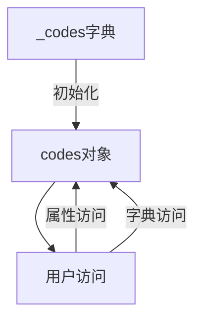

# 📦 📋 HTTP状态码模块文档


## 1. 模块概述

### 模块名称
`status_codes` (`src/requests/status_codes.py`)

### 核心功能
提供HTTP状态码的常量映射，允许通过多种名称(大小写不敏感)访问标准HTTP状态码。

### 架构角色
作为HTTP请求/响应处理的基础设施组件，为整个请求库提供统一的状态码引用方式。

### 适用场景
- 需要检查HTTP响应状态码时
- 需要比较HTTP状态码时
- 需要可读性更好的状态码表示时

## 2. 🏗️ 架构设计

### 设计思路
模块采用字典映射和动态属性访问的设计模式，将HTTP状态码与其多种常见名称关联起来，提供灵活的访问方式。

### 核心组件
1. `_codes` 字典 - 存储状态码与名称的映射关系
2. `codes` 对象 - `LookupDict`实例，提供属性式访问
3. `_init()` 函数 - 初始化映射关系

### 数据流向


## 3. 🔧 详细API文档

### `codes` 对象
类型: `LookupDict`

#### 功能描述
提供HTTP状态码的多种访问方式，包括属性访问和字典访问。

#### 访问方式
1. **属性访问**: `codes.ok`, `codes.NOT_FOUND`
2. **字典访问**: `codes['ok']`, `codes['not_found']`

#### 特性
- 大小写不敏感
- 支持状态码的多种别名
- 支持特殊字符名称(如`\o/`)

### `_codes` 字典
内部数据结构，存储状态码与名称的映射关系。

#### 结构
```python
{
    HTTP状态码: ("名称1", "名称2", ...),
    ...
}
```

## 4. 💡 实用示例

### 基础用法
```python
from requests import codes

# 属性访问
print(codes.ok)        # 输出: 200
print(codes.NOT_FOUND) # 输出: 404

# 字典访问
print(codes['ok'])     # 输出: 200
print(codes['\o/'])    # 输出: 200
```

### 进阶用法
```python
# 检查响应状态
response = requests.get('https://example.com')
if response.status_code == codes.ok:
    print("请求成功")
    
# 使用多种别名
print(codes.teapot)          # 输出: 418
print(codes.i_am_a_teapot)   # 输出: 418
print(codes.IM_A_TEAPOT)     # 输出: 418
```

### 最佳实践
1. 优先使用属性访问方式，可读性更好
2. 对于常用状态码，使用最简短的名称(如`ok`而不是`all_ok`)
3. 在团队中统一命名风格(全大写或全小写)

### 常见错误
```python
# 错误: 使用未定义的名称
print(codes.not_exist)  # AttributeError

# 正确: 先检查是否存在
if hasattr(codes, 'not_exist'):
    print(codes.not_exist)
```

## 5. 🔗 依赖关系

### 上游依赖
- `LookupDict` (来自`structures`模块)

### 下游使用
- 被requests库的响应处理部分使用
- 被需要检查HTTP状态码的代码使用

## 6. ⚠️ 注意事项与最佳实践

### 性能考虑
- 属性访问和字典访问性能相当
- 初始化(_init)只会在模块加载时执行一次

### 兼容性
- 模块保持向后兼容
- 308状态码的`resume`和`resume_incomplete`别名将在3.0版本移除

### 调试技巧
- 使用`dir(codes)`查看所有可用属性
- 使用`vars(codes)`查看内部字典

## 📌 完整状态码列表

| 状态码 | 可用名称 |
|--------|----------|
| 100 | `continue` |
| 101 | `switching_protocols` |
| 102 | `processing`, `early-hints` |
| 103 | `checkpoint` |
| 122 | `uri_too_long`, `request_uri_too_long` |
| 200 | `ok`, `okay`, `all_ok`, `all_okay`, `all_good`, `\\o/`, `✓` |
| ... | ... (完整列表见代码) |

> 注: 完整列表包含所有HTTP标准状态码及其常见别名，详见模块源代码。