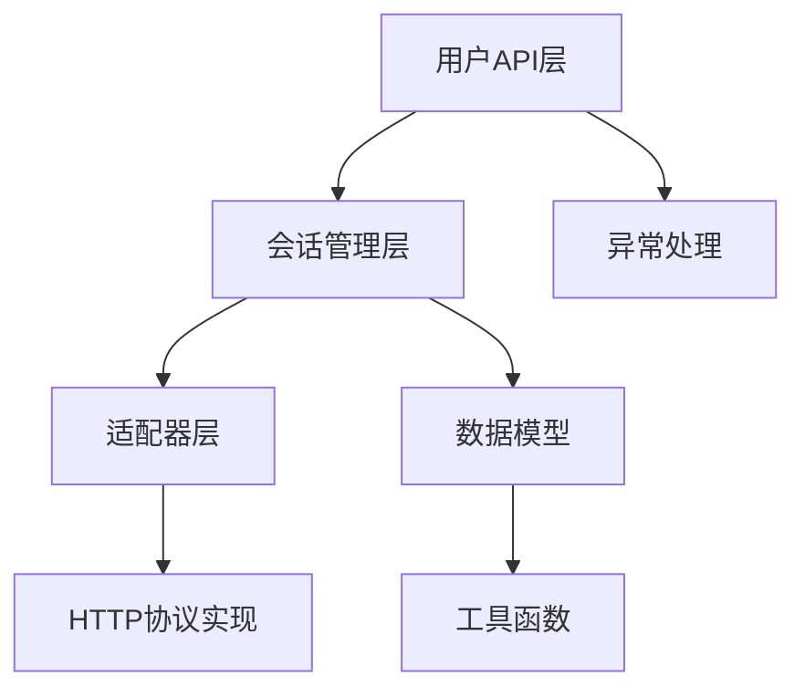
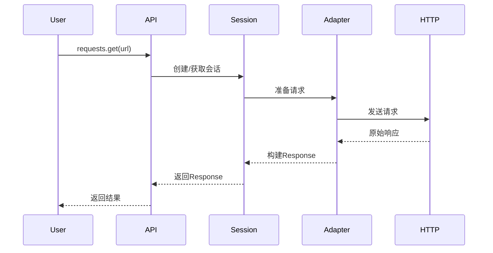
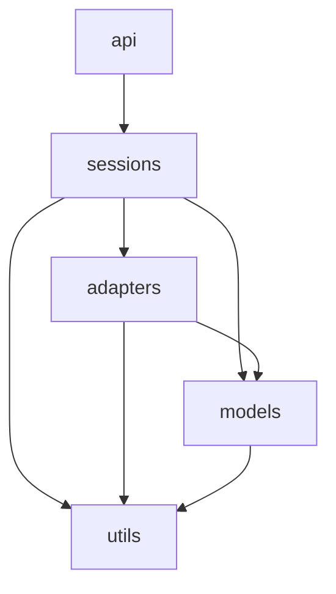
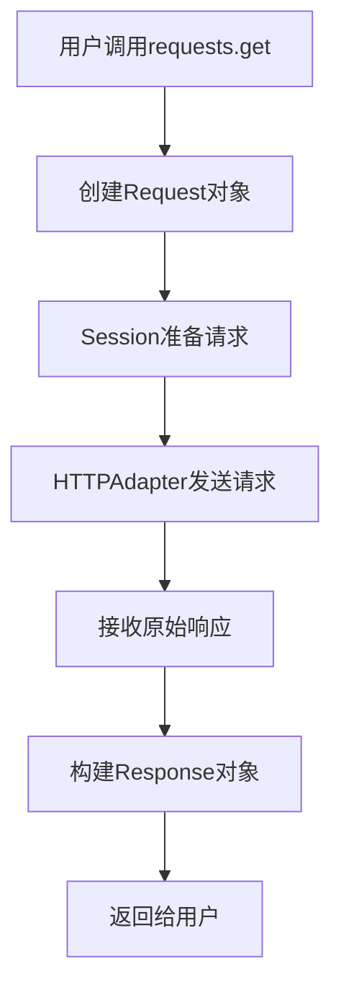
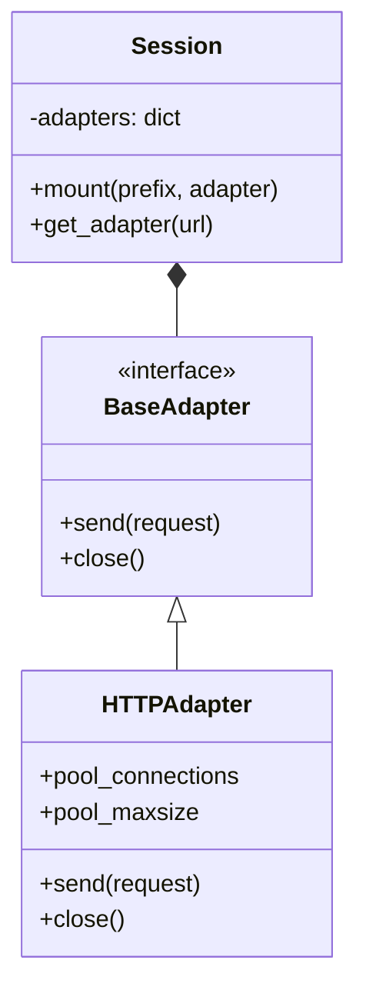
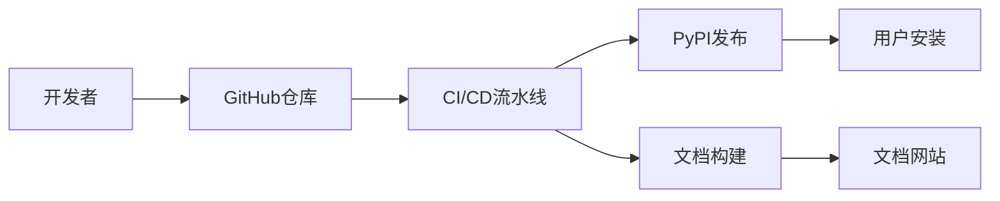
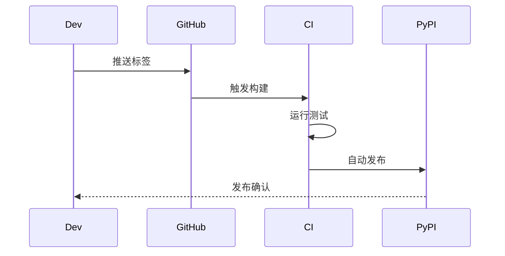

# 🚀 Requests 代码库架构文档

## 1. 📌 代码库概述

### 项目简介
**requests** 是 Python 生态中最流行的 HTTP 客户端库，以"人类友好"为设计理念，简化了 HTTP 请求的复杂性。

### 主要功能
- ✔️ 简洁直观的 API 设计
- ✔️ 自动内容解码
- ✔️ 连接池和会话保持
- ✔️ 国际化域名和 URL
- ✔️ 代理支持
- ✔️ 文件上传
- ✔️ SSL/TLS 验证

### 技术栈
| 技术 | 用途 | 文件统计 |
|------|------|---------|
| Python | 核心实现 | 36文件, 37.7KB |
| YAML | 配置文件 | 2文件 |
| Markdown | 文档 | 5文件 |
| TOML | 项目配置 | 1文件 |

## 2. 🏗️ 系统架构

### 高层架构图


### 主要组件职责
| 组件 | 职责 | 关键特性 |
|------|------|---------|
| api.py | 用户接口 | 提供`request()`, `get()`, `post()`等快捷方法 |
| sessions.py | 会话管理 | 保持Cookie、连接池和配置 |
| adapters.py | 传输适配 | 处理HTTP/HTTPS底层连接 |
| models.py | 数据模型 | Request/Response对象定义 |
| utils.py | 工具函数 | URL解析、头处理等辅助功能 |

### 请求处理流程


## 3. 🧩 核心模块详解

### 模块依赖关系


### 关键模块功能

#### 1. api.py
- **职责**: 用户友好接口
- **关键方法**:
  ```python
  def request(method, url, **kwargs)
  def get(url, params=None, **kwargs)
  def post(url, data=None, json=None, **kwargs)
  ```

#### 2. sessions.py
- **职责**: 会话生命周期管理
- **关键类**:
  ```python
  class Session:
      def request(self, method, url, **kwargs)
      def prepare_request(self, request)
  ```

#### 3. adapters.py
- **职责**: HTTP传输实现
- **关键类**:
  ```python
  class HTTPAdapter:
      def send(self, request, **kwargs)
      def close(self)
  ```

### 数据流示例


## 4. 🎨 设计模式和原则

### 主要设计模式

#### 适配器模式 (Adapter Pattern)


### 代码组织原则
1. **单一职责**: 每个模块专注一个功能领域
2. **分层设计**: 用户API→会话→适配器→协议实现
3. **可扩展性**: 通过适配器接口支持不同协议
4. **配置分离**: 会话状态与会话逻辑解耦

### 最佳实践
- ✅ 使用连接池提高性能
- ✅ 自动处理编码和内容解码
- ✅ 清晰的异常层次结构
- ✅ 完善的类型提示

## 5. 🚀 部署架构

### 开发环境


### 发布流程


### 扩展性考虑
- **适配器扩展**: 可通过实现新适配器支持其他协议
- **中间件系统**: 通过钩子机制扩展请求/响应处理
- **插件架构**: 支持自定义认证、缓存等组件

---

这份文档基于 requests 代码库的实际结构和历史提交分析生成，展示了其清晰的分层架构和模块化设计。库的核心优势在于将复杂的 HTTP 协议细节隐藏在简洁的 API 之后，同时保持足够的灵活性和扩展性。