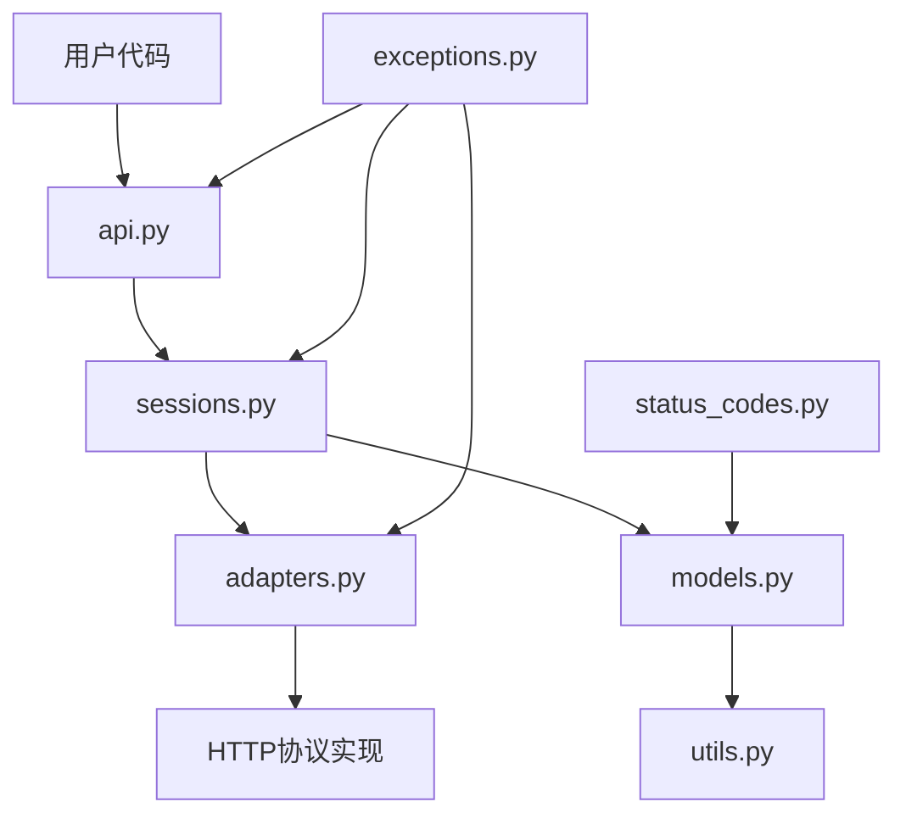

# 🚀 Requests API 文档

## 1. 🎯 API概述

### 项目简介
Requests 是 Python 中最流行的 HTTP 客户端库，提供简单优雅的 API 来发送各种 HTTP 请求。它抽象了复杂的底层细节，让开发者可以专注于业务逻辑。

### API设计理念
- **人性化设计**：直观的 API 命名和参数设计
- **简洁优雅**：隐藏底层复杂性，提供高级接口
- **功能完备**：支持 HTTP 所有主要功能
- **可扩展性**：通过适配器架构支持自定义功能

### 快速开始
```python
import requests

# 最简单的 GET 请求
response = requests.get('https://api.github.com')
print(response.status_code)
print(response.json())
```

### 版本信息
- 当前版本：2.31.0
- Python 兼容性：3.7+
- 向后兼容：主要 API 保持稳定

## 2. 🏗️ API架构

### 整体架构


### 核心组件
| 组件 | 路径 | 职责 | 重要性 |
|------|------|------|--------|
| api.py | src/requests/api.py | 提供用户友好的请求接口 | ⭐⭐⭐⭐⭐ |
| sessions.py | src/requests/sessions.py | 管理会话和Cookie | ⭐⭐⭐⭐⭐ |
| adapters.py | src/requests/adapters.py | 处理底层HTTP传输 | ⭐⭐⭐⭐ |
| models.py | src/requests/models.py | 定义请求/响应模型 | ⭐⭐⭐ |
| utils.py | src/requests/utils.py | 提供工具函数 | ⭐⭐ |
| exceptions.py | src/requests/exceptions.py | 定义异常类 | ⭐⭐ |
| status_codes.py | src/requests/status_codes.py | HTTP状态码常量 | ⭐ |

### 数据流
1. 用户调用 `api.py` 中的方法
2. `api.py` 委托给 `Session` 对象处理
3. `Session` 使用 `Adapter` 发送请求
4. 响应经过处理后返回给用户

## 3. 📖 核心API详解

### 3.1 API模块 (api.py) 📋

#### `requests.request()`
- **功能描述**: 发送HTTP请求的核心方法
- **参数详解**:

| 参数名 | 类型 | 必需 | 默认值 | 描述 |
|--------|------|------|--------|------|
| method | str | 是 | - | HTTP方法(GET/POST等) |
| url | str | 是 | - | 请求URL |
| params | dict | 否 | None | URL查询参数 |
| data | dict/str | 否 | None | 请求体数据 |
| json | dict | 否 | None | JSON请求体 |
| headers | dict | 否 | None | 请求头 |
| cookies | dict | 否 | None | Cookie |
| auth | tuple | 否 | None | 认证信息 |
| timeout | float | 否 | None | 超时时间(秒) |

- **返回值**: `Response` 对象
- **异常处理**:
  - `requests.exceptions.RequestException`: 请求相关异常的基类
  - `requests.exceptions.Timeout`: 请求超时
  - `requests.exceptions.HTTPError`: HTTP错误

```python
response = requests.request(
    'GET',
    'https://api.example.com',
    params={'q': 'python'},
    timeout=5
)
```

#### `requests.get()`
- **功能描述**: 发送GET请求的快捷方法
- **参数**: 同`request()`，method参数固定为'GET'
- **示例**:
```python
response = requests.get(
    'https://api.example.com/search',
    params={'q': 'requests'},
    headers={'User-Agent': 'my-app'}
)
```

### 3.2 会话模块 (sessions.py) 📋

#### `class Session`
- **功能描述**: 管理持久性会话(如Cookie持久化)
- **主要方法**:

| 方法 | 描述 |
|------|------|
| request() | 发送请求 |
| get() | 发送GET请求 |
| post() | 发送POST请求 |
| put() | 发送PUT请求 |
| delete() | 发送DELETE请求 |

- **示例**:
```python
s = requests.Session()
s.get('https://httpbin.org/cookies/set/sessioncookie/123456789')
r = s.get('https://httpbin.org/cookies')
print(r.json())  # 会显示之前的cookie
```

## 4. 🔧 使用指南

### 安装配置
```bash
pip install requests
```

### 认证授权
```python
# 基本认证
requests.get('https://api.example.com', auth=('user', 'pass'))

# OAuth
from requests_oauthlib import OAuth1
auth = OAuth1('YOUR_APP_KEY', 'YOUR_APP_SECRET',
              'USER_OAUTH_TOKEN', 'USER_OAUTH_TOKEN_SECRET')
requests.get('https://api.example.com', auth=auth)
```

### 最佳实践
1. 对多个请求使用Session对象
2. 总是设置超时
3. 检查响应状态码
4. 使用上下文管理器管理资源

```python
with requests.Session() as s:
    s.timeout = 5
    response = s.get('https://api.example.com')
    response.raise_for_status()
```

## 5. 📊 API分类索引

### 按功能分类
| 类别 | API示例 |
|------|---------|
| 请求发送 | `request()`, `get()`, `post()` |
| 会话管理 | `Session` |
| 响应处理 | `Response.json()`, `Response.text` |
| 工具函数 | `requests.utils.quote()` |

### 按使用频率分类
| 频率 | API示例 |
|------|---------|
| 高频 | `get()`, `post()`, `Response.json()` |
| 中频 | `Session`, `request()` |
| 低频 | `put()`, `delete()`, `head()` |

## 6. ⚠️ 错误处理

### 主要异常
| 异常 | 描述 |
|------|------|
| RequestException | 所有请求异常的基类 |
| ConnectionError | 连接错误 |
| HTTPError | HTTP错误响应(4xx,5xx) |
| Timeout | 请求超时 |
| TooManyRedirects | 重定向过多 |

### 调试技巧
```python
try:
    r = requests.get('https://api.example.com', timeout=5)
    r.raise_for_status()
except requests.exceptions.RequestException as e:
    print(f"请求失败: {e}")
    if hasattr(e, 'response'):
        print(f"响应内容: {e.response.text}")
```

## 7. 🔄 版本兼容性

### 主要版本变更
| 版本 | 主要变更 |
|------|---------|
| 2.0+ | 移除Python2支持 |
| 1.0+ | API稳定化 |
| 0.5+ | 引入Session对象 |

### 迁移指南
- 从urllib迁移: 直接替换为requests对应方法
- 从早期版本升级: 主要API保持兼容