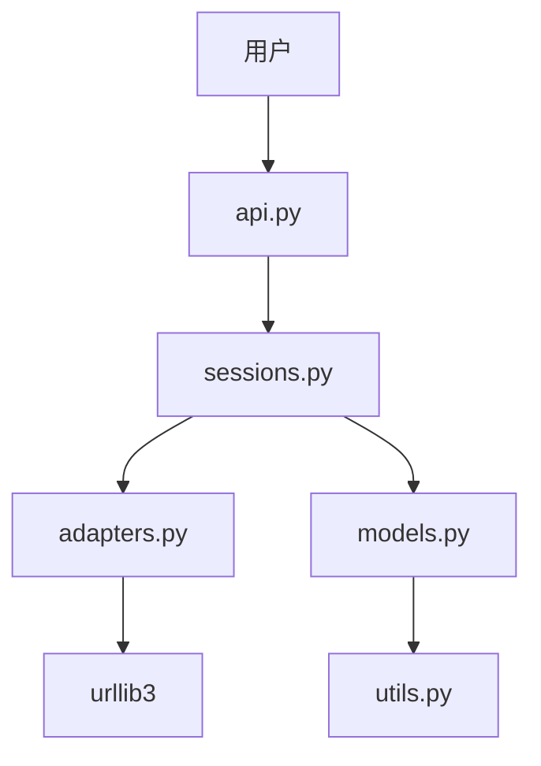

# 🚀 Requests 代码库速览

## 1. 📌 项目概述
Requests 是 Python 生态中最流行的 HTTP 客户端库，提供简洁优雅的 API 发送 HTTP/1.1 请求。核心价值在于隐藏底层复杂性，让开发者专注于业务逻辑。广泛应用于爬虫、API 调用、微服务通信等场景。

## 2. ✨ 关键特性
- **人性化 API** - `requests.get()`/`post()` 等直观方法
- **会话管理** - 保持 cookies 和连接池的 Session 对象
- **自动编码** - 智能处理响应内容编码
- **SSL 验证** - 开箱即用的 HTTPS 支持
- **连接适配** - 可扩展的 HTTP/HTTPS 传输适配器
- **超时控制** - 请求超时自动处理
- **国际化** - 完整的 Unicode 支持

## 3. 🛠️ 技术栈概览
- 语言: Python (100% 核心代码)
- 依赖: urllib3、chardet、idna 等
- 工具: pytest、tox、GitHub Actions

## 4. 🏗️ 架构速览


## 5. 🏃 快速上手
1. 安装: `pip install requests`
2. 发送 GET 请求:
```python
import requests
r = requests.get('https://api.example.com')
print(r.json())
```
3. 使用会话:
```python
s = requests.Session()
s.get('https://example.com/login', auth=('user','pass'))
```