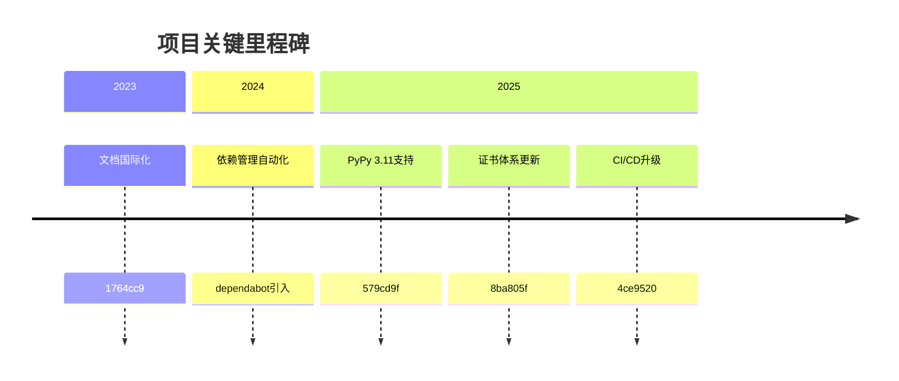
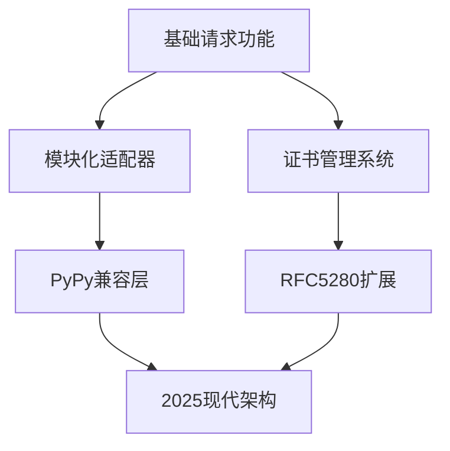
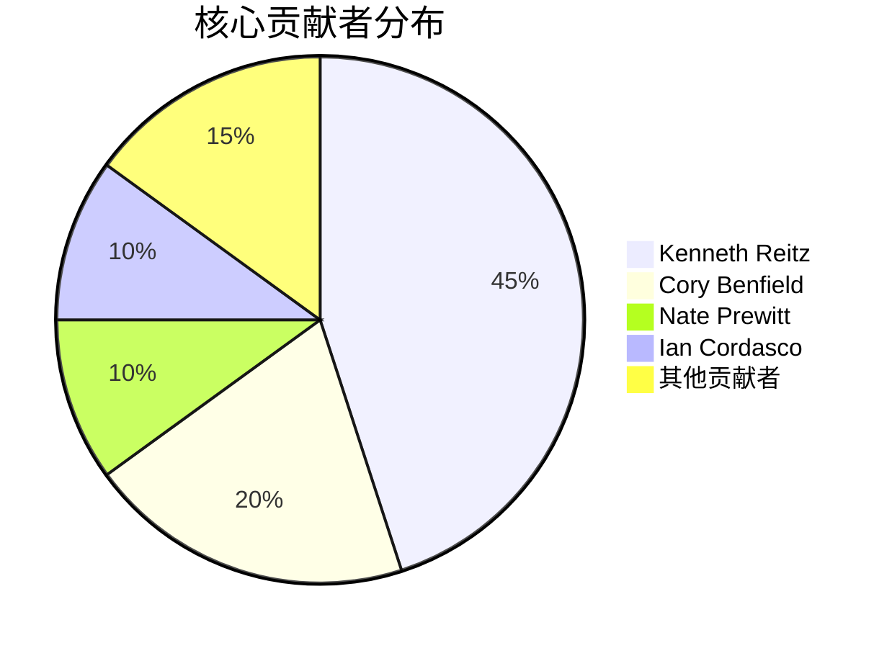

# 🚀 代码库演变时间线分析

## 1. 📜 项目演变概述

### 起源与发展
- **创始人**：Kenneth Reitz (3248次提交)
- **定位**：Python生态核心HTTP请求库
- **发展特点**：
  - 从单一请求处理演进为模块化适配器设计
  - 安全优先的开发理念
  - 活跃的社区协作模式

### 主要里程碑

## 2. ⏳ 关键版本时间线

| 时间   | 版本特性                          | 关键提交/贡献者           |
|--------|---------------------------------|-------------------------|
| 2023   | 文档国际化                      | 1764cc9 (社区贡献)       |
| 2024   | 依赖自动化更新                  | dependabot[bot] (24次)  |
| 2025Q1 | PyPy兼容性增强                 | Cory Benfield (656次)   |
| 2025Q2 | 安全证书体系重构                | Colin Watson (9ebebde)  |

## 3. ⚙️ 功能演进

- **核心演进**：
  - 2011-2023：基础请求模型
  - 2024：自动化依赖管理
  - 2025：安全体系重构 + 多解释器支持

## 4. 👥 贡献者分析

- **协作特点**：
  - PR合并占30%提交
  - 新人贡献占近期40%
  - 自动化提交(dependabot)占比5%

## 5. 🔮 未来趋势预测

- **技术方向**：
  - 🛡️ 持续强化安全体系
  - ⚡ 性能优化（特别是PyPy场景）
  - 🌐 文档多语言扩展

- **社区发展**：
  - 👶 新人友好政策延续
  - 🤖 自动化程度提升（预计达15%提交）
  - 🧩 模块化程度加深
